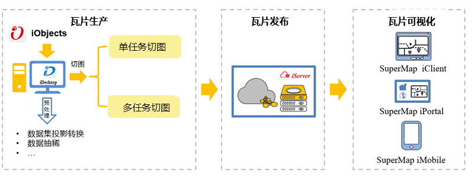

随着 Web
GIS的发展，用户对地图显示与传输有了更高的需求，地图瓦片是一种非常有效的提高地图服务访问效率的方式，为改善用户体验，提高运行效率，节省工作时间而出现的一门技术，是目前主流地理信息系统中普遍采用的一种图形显示技术手段。该技术的出现，大大缩短了用户的等待时间，同时提高了工作效率，使图形数据的浏览过程变得高效流畅。

地图瓦片，是指是包含了一系列比例尺、一定地图范围内的地图切片文件。地图瓦片按照金字塔结构组织，每张瓦片都可通过级别、行列号唯一标记。在平移、缩放地图时，浏览器根据金字塔规则，计算出所需的瓦片，从瓦片服务器获取并拼接。地图瓦片金字塔结构示意图如下：

    
  
SuperMap 提供了从制图、切图到使用地图服务等全流程的地图瓦片技术方案，帮助您简单快捷地通过缓存机制提升地图服务的效率。通过SuperMap iDesktop 实现 GIS 数据的分析、处理和制图及地图切图等工作，同时支持将瓦片的发布为iServer；通过SuperMap iClient、SuperMap iMobile、SuperMap iPortal实现瓦片数据的可视化展示。SuperMap 瓦片技术方案如下图：

   
  
为方便您了解地图瓦片的相关知识、更有效地使用 SuperMap iDesktop 地图瓦片的相关功能，本专题就桌面地图瓦片的相关内容进行详细阐述，按照章节划分为五大部分：

* 地图瓦片使用指南章节您将了解SuperMap iDesktop 支持的[地图瓦片类型](TilesType)，[瓦片的存储类型](MapCacheType)、[瓦片目录结构](MapCacheFolder)及[使用地图瓦片建议](AdviceAboutMapCache)。
* 生成地图瓦片章节您将了解生成地图瓦片的不同方式，包含[单任务生成地图瓦片](MapTilesSingle)、[多任务生成地图瓦片](MultiTaskStep)及[生成多版本瓦片](MultiversionTile)等内容。
* 在矢量瓦片章节对[创建矢量瓦片](VectorTiles)及其注意事项进行了单独描述。
* 在生成地图瓦片之后您还可对瓦片进行[续传](RecoverTiles)、[更新](UpdateTiles)、[检查](CheckTlies)及[加载 MongoDB 瓦片](AddMongoDBTiles)等管理瓦片的操作。
* 最后，支持将已有的瓦片直接发布服务，包含[发布本地瓦片](PublishTiles)、[发布 MongoDB 瓦片](PublishMongoDBTile)。

详细功能请参看下表：
<table border="1" cellspacing="0" width="50%">
<thead>
<tr width="100%">
<td width="10%">序号</td>	
<td width="20%">章节分类</td>
<td width="70%">相关功能</td>
</tr>
</thead>
<tr>
<td>1</td>
<td>地图瓦片使用指南</td>
<td><ul>
	<li><a href="TilesType">瓦片类型</a></li>
	<li><a href="MapCacheType">瓦片存储类型</a></li>
	<li><a href="MapCacheFolder">地图瓦片目录结构</a></li>
	<li><a href="AdviceAboutMapCache">使用地图瓦片建议</a></li>
</ul></td>
</tr>
<tr>
<td>2</td>
<td><a href="MapTileMode">生成地图瓦片</a></td>
<td><ul>
	<li><a href="MapTilesSingle">单任务生成地图瓦片</a></li>
	<li><a href="MultiTaskStep">多任务生成地图瓦片</a></li>
	<li><a href="MultiTaskSuggest">多任务切图效率比对</a></li>
	<li><a href="MultiversionTile">生成多版本瓦片</a></li>
</ul></td>
</tr>
<tr>
<td>3</td>
<td>矢量瓦片</td>
<td>
	<ul>
		<li><a href="VectorTiles">创建矢量瓦片</a></li>
		<li><a href="VectorTilesNotice">矢量瓦片制图最佳实践</a></li>
		<li><a href="MultiversionTile">矢量瓦片常见问题解答</a></li>
	</ul>	
</td>
</tr>
<tr>
<td>4</td>
<td>管理地图瓦片</td>
<td>
	<ul>
		<li><a href="RecoverTiles">续传瓦片</a></li>
		<li><a href="UpdateTiles">更新瓦片</a></li>
		<li><a href="CheckTlies">瓦片检查</a></li>
		<li><a href="MongoDBTilesManger">瓦片管理</a></li>
		<li><a href="AddMongoDBTiles">加载 MongoDB 瓦片</a></li>
	</ul>
</td>
</tr>
<tr>
<td>5</td>
<td>发布地图瓦片</td>
<td>
	<ul>
		<li><a href="PublishTiles">发布本地瓦片</a></li>
		<li><a href="PublishMongoDBTile">发布 MongoDB 瓦片</a></li>
	</ul>
</td>
</tr>
</table>