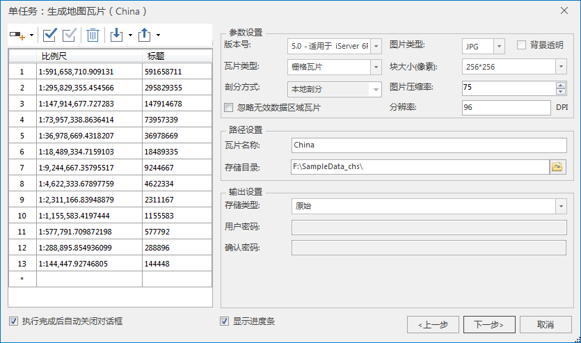
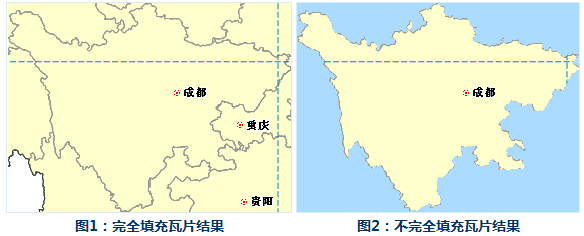
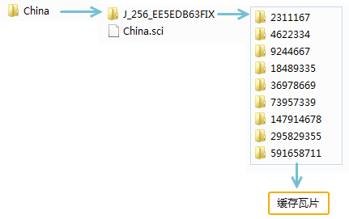

### 使用说明

SuperMap 桌面支持单任务生成地图瓦片，即在一台计算机上只启动单个进程完成切图任务，适用于数据量较小的切图情况。

在生成地图瓦片前，应用程序会对数据集进行索引检查，当数据对象数大于2000且无空间索引时将提示用户创建空间索引，建议您预先对地图数据集创建地图索引，可提升地图瓦片的生成速率。

### 功能入口

* 在工作空间管理器->“地图”节点->选择需要生成地图瓦片的地图，右键选择“ **生成地图瓦片（单任务）** ”项。
* 打开待切地图，在地图窗口右键选择“ **生成地图瓦片（单任务）** ”项。
* 打开待切地图，单击 **地图** 选项卡-> **制图** 组-> **单任务** 按钮。

### 操作说明

1. **新建切图任务** ：在“生成地图瓦片（单任务）”对话框中，可选择三种单任务切图方式：新建切图任务、更新/追加瓦片、续传/恢复瓦片。此处选择 **新建切图任务** 项。
2. **设置切图参数** ：在 **单任务：生成地图瓦片** 对话框中设置生成瓦片的比例尺、图片参数、路径、存储、范围等参数。具体说明如下：  **注** ：支持用户导入已有地图瓦片配置文件（\*.sci）。地图瓦片配置文件（\*.sci）保存了生成地图瓦片的比例尺以及诸多相关设置参数。   
3. **比例尺设置** ：程序会按照地图数据自动生成比例尺列表，您可手动输入固定比例尺。同时支持通过“导入比例尺”命令，导入*.xml 格式的比例尺配置文件。  **注** ：支持将设置好的比例尺参数导出为 *.xml 格式的比例尺配置文件，便于再次使用或者应用于其他制图场景。例如地图瓦片导出的比例尺文件可以与分级配图工具中的比例尺文件通用。
4. **参数设置** ： 
  * **版本号** ：用来对生成地图瓦片的版本进行设置。不同版本的地图瓦片，需要与相应版本的服务器版本匹配，以方便地图切片在服务端进行发布。系统提供了六种版本的地图瓦片生成方式。只有在选择5.0版本的时候才能激活 **剖分方式**。剖分方式分为两种：本地剖分和全球剖分。全球剖分方式生成的瓦片为三维地图瓦片，可加载到场景中。默认情况使用本地剖分。 由于5.0版本的瓦片采用了高精度校准方式，对于首次生成地图瓦片的用户， 推荐使用5.0版本的瓦片方案。
    * 2.0版本适用于 IS .NET。
    * 2.1版本适用于 IS .NET 使用新的瓦片图片生成方案。
    * 3.0版本适用于 iServer 2.0。
    * 3.1版本适用于 iServer 2.0 使用新的瓦片图片生成方案。
    * 4.0版本适用于 iServer 6R。
    * 5.0版本适用于 iServer 6R(2012) SP1及以上版本。
  * **剖分方式** ：只有在选择5.0版本的时才可设置剖分方式。剖分方式分为两种：本地剖分和全球剖分。 **注意** ：全球剖分只有在地图坐标系为WGS 1984时才可用。
  * **瓦片类型** ：提供栅格瓦片和矢量瓦片两种格式。栅格瓦片即生成的瓦片格式为栅格图片，显示效率高但占用服务器空间。生成矢量瓦片格式的数据量少，占用的服务器资源较少，传输更方便且显示更灵活。有关栅格瓦片和矢量瓦片的 更多详细信息请参看[瓦片类型](TilesType)。
  * **忽略无效数据区域瓦片** ：无效数据即不包含任何内容的地图区域，勾选该复选框，程序将忽略无效区域，不生成相对位置的瓦片。
5. **图片参数** ：当生成栅格瓦片时，需设置图片参数。 
  * **图片类型** ：支持JPG，PNG，DXTZ，GIF，JPG_PNG ，PNG8和 WEBP  七种图片格式，默认为 JPG 格式。5.0版本的瓦片支持 JPG_PNG 和 PNG 8两种图片类型。  

说明 | 数据类型  
---|---  
JPG  | 全名 JPEG 图片以 24 位颜色存储单个光栅图像。JPEG 格式是与平台无关的格式，支持最高级别的压缩，不过，这种压缩是有损耗的。渐进式 JPEG 格式文件支持交错。  
PNG | PNG（Portable Network Graphics）的原名称为“可移植性网络图像”，是常用的图像文件格式。PNG 能够提供长度比 GIF小 30% 的无损压缩图像文件。同时提供 24 位和 48 位真彩色图像支持以及其他诸多技术性支持。  
DXTZ  | 该类型是针对 DDS 格式图片的压缩格式。DDS 图片格式是 DirectDraw Surface 格式的缩写，是 DirectX 纹理压缩格式。使用该类型的纹理压缩格式，能够大幅降低纹理内存的消耗。  
GIF | GIF(Graphics Interchange Format） 图像互转换格式。GIF 文件的数据是一种基于 LZW 算法的连续色调的无损压缩格式。其压缩率一般在 50% 左右。  
JPG_PNG  | JPG_PNG 混合类型。若图片类型设置为 JPG_PNG 格式，则切片文件为 JPG 或者 PNG 格式，具体为哪种格式需根据该切片中是否包含无效数据像元来确定（无效数据像元是指不包含任何数据内容的瓦片）。对于包含无效数据像元的切片，其文件格式为 PNG，否则为 JPG 格式。采用混合类型，在数据边界处采用 PNG 格式，在不含无效数据的地方采用JPG格式，这将大大减少缓存数据的大小，从而优化数据下载时间。使用 JPG_PNG 图片类型时，会默认勾选背景透明选项。  
PNG8 | 256色的 PNG 格式，不支持背景透明，存储空间更小，约为 PNG 图片大小的二分之一；生成的结果为颜色更少、对比更强烈的简单图像。  
[ WEBP ](WEBPTileType) | WEBP 格式是 Google 于2010年提出了一种新的图片压缩格式 ，优势在于： ①它具有更优的图像数据压缩算法，在拥有肉眼无法识别差异的图像质量前提下，带来更小的图片体积； ②WEBP 支持 Alpha 透明和 24位颜色数，不存在 PNG8 色彩不够丰富和毛边问题;   ③比同等 JPEG 格式缩小文件体积 40%，以此提高了页面载入速度，降低了存储需求，帮助加速网站图形效果。   常用于生成三维场景缓存在保证数据质量的同时，极大的缩小了数据的体积。同时也广泛应用于移动端及 Web 端，浏览器中应用的网页是使用WebP 格式，可提升加载渲染速度，且不考虑兼容。能够节省用户流量，提升访问速度等。  不足的是，WEBP 格式图像的编码时间“比 JPEG 格式图像长8倍”。因此在相同条件下，采用 WEBP 格式生成栅格瓦片耗时相较其他格式长。  

  * **背景透明** ：当地图设置了背景色时，勾选此项，在生成地图瓦片的时候，会自动将背景色设置为透明；否则将保留地图的背景色。
  * **块大小（像素）** ：获取瓦片预处理后生成的每个瓦片分块文件的采样尺寸，单位为像素。应用程序提供了 2048*2048，1024*1024，512*512，256*256，128*128，64*64 六种尺寸共用户选择，默认大小为 256*256。
  * **图片压缩率** ：瓦片图片被压缩的百分率。图片压缩率的范围为0-100，默认为75。其中，不同图片类型，支持的图片压缩率的情况不同。 **注意**:压缩率越大， 图片质量被压缩，因此造成瓦片数据变模糊，根据需求合理设置图片压缩率。
    * 当图片类型为 DXTZ、GIF、WEBP时，不支持设置图片压缩率;
    * 当图片类型为 PNG、PNG8、JPG_PNG 时，图片压缩率的取值范围是：(0,90];
    * 当图片类型为 JPG 时，图片压缩率的取值范围是:[10,100];
  * **分辨率** ：支持设置瓦片分辨率，使用户能够自定义瓦片的输出精度。默认分辨率为96DPI。
6.**路径设置** : 
  * **瓦片名称** ：生成瓦片文件夹的名称。
  * **存储目录** ：即生成瓦片的存储路径，可以为本地路径，也可以为远程网络路径。
7.**存储设置** : 
  * **存储类型** ：程序提供3种瓦片类型：紧凑、原始、MongoDB。有关存储类型的详细描述，请参见[地图瓦片存储类型](MapCacheType)。 
    * 紧凑型表示采用一定的压缩和加密机制，在建立瓦片时对数据进行压缩和加密； 
    * 原始表示不对数据进行压缩，保留模型数据的原始信息。 
    * MongoDB 型是将生成的瓦片切片文件，以分布式格式存储在服务器的数据库中，地图切片的存取速度较快，便于数据分享与发布。当选择 MongoDB 类型时，需先启动 MongoDB 服务，支持检查当前服务是否可用。 **注意** ：MongoDB 2.0 版本的认证模式，不支持生成地图瓦片。有关MongDB 数据库使用，请参看“[MongDB 使用说明](../../Features/TechDocument/MongoDBDatabaseGuide)”。
    * **设置密码** ：当存储类型设置为“紧凑”时，可以为地图瓦片设置密码进行加密以保证数据安全；当加载该地图瓦片时，需要输入密码。
8.**瓦片范围** ：对瓦片处理的地图数据的地理范围进行设置。应用程序提供了以下四种设置方式：
  * 单击“ **整幅地图** ”按钮，使用整幅地图的范围作为瓦片范围，左下右上四个文本框用来显示所设置的处理范围。
  * 单击“ **当前窗口** ”按钮，使用当前窗口的范围作为瓦片范围。
  * 应用程序地图窗口中有打开的地图时，“ **自定义范围** ”按钮可用。单击下拉按钮，可选择“选择对象”、“绘制矩形”或“自定义表达式”。 
    * 点击“ **选择对象** ”程序切换到当前地图窗口，在窗口中选择鼠标单击一个对象作为瓦片的处理范围。如果需要选择多个对象，则可按住 Shift 键依次选择对象，选择完成后单击鼠标右键，结束选择状态，返回“生成地图瓦片”对话框。
    * 点击“ **绘制矩形** ”程序切换到当前地图窗口，在窗口中选择鼠标绘制矩形范围，绘制完成后单击鼠标右键，结束选择状态，返回“生成地图瓦片”对话框。
    * 点击“ **自定义表达式** ”程序将弹出“SQL表达式”对话框，支持设置SQL表达式的方式确定瓦片范围，表达式查询结果的最小外接矩形即为生成瓦片范围。 (iDesktopX) 
    * 单击“ **复制** ”按钮可复制当前设置的范围，在支持粘贴的范围设置处单击“粘贴”按钮，即可将复制范围的左、下、右、上值设置到当前范围。
  * **完全填充瓦片** ：可设定瓦片范围（或者索引范围）内生成的瓦片是否完全填充。勾选该项，表示瓦片范围内会完全填充瓦片，不勾选该项，表示只输出选中的对象的范围与瓦片范围交集部分，其他部分不填充，输出为空白。例如，当用户选中某市范围面对象作为生成瓦片的范围时，使用和不使用完全填充瓦片的效果如下图所示：   
  * **过滤选择对象所在图层** ：应用范围参数中“选择对象”的方式时，可根据选中对象的范围确定生成瓦片范围。勾选该项，应用程序在生成瓦片时，会自动过滤该对象所在图层；否则不会进行过滤。该功能仅在地图中存在多个图层时有效。 

9.**索引范围** ：是地图瓦片切分规则的依据。当索引范围确定时，瓦片的切分规则即可以确定。具有相同索引范围的地图瓦片可以进行合并。 

系统提供了四种建立索引范围的方式：整幅地图、当前窗口、鼠标绘制、绘制范围、复制粘贴。具体操作见瓦片范围的设置方法。  
注意：只有索引范围相同的地图瓦片，才能追加成功。

10.设置完成后，单击“确定”按钮，执行地图瓦片切图操作。切图完成后在设置的工作目录下生成一个以瓦片名称命名的文件夹，其中包含一个*.sci 文件和瓦片结果文件。如下图所示，瓦片分别保存在对应的比例尺文件夹中，生成的“*.sci”为瓦片配置文件。可以采用打开数据源的方式直接打开，有关如何打开数据源的更多内容，请参见[打开数据源](../DataProcessing/DataManagement/OpenDatasource)。

   

### 注意事项

1. 若在执行切图过程中操作意外中断，支持[续传瓦片](RecoverTiles)或在使用地图瓦片的过程中，遇到地图服务数据变更，可通过[更新瓦片](UpdateTiles)功能更新地图服务中变更的数据。
2. 瓦片范围设置时的相关事项： 
  * 应用“选择对象”的范围按钮时，当所要选择的对象图层为不可选择状态时，可以直接在“图层管理器”中将该图层设为可选择状态，然后选择对象。
  * 在当前地图窗口中单击鼠标右键，即可重新弹出“生成瓦片对话框”，关闭该对话框再进行必要的设置。
3. 生成地图瓦片时，如果专题图开启了流动显示， 应用程序会弹框提示"地图开启了流动显示，请先关闭流动显示，再生成瓦片！"，同时输出窗口输出开启了流动显示的图层，用户需手动在专题图属性中关闭这些图层的流动显示再生成瓦片。
4. 关于图片背景透明的说明： 
  * 当瓦片版本为2.0、3.0、3.1、4.0版本时，当用于生成瓦片的地图未使用反走样，且生成的图片格式为 png 格式时，将瓦片作为数据源打开时，支持背景透明的效果。
  * 当瓦片版本为2.0、3.0、3.1、4.0版本时，当生成的瓦片图片为 gif 格式时，该瓦片作为数据源打开时，不支持背景透明的效果。
  * 当瓦片版本为5.0时，生成的瓦片均支持背景透明效果。
  * 各个版本的瓦片，加载到场景中显示时，均支持背景透明效果。
5. 不推荐对生成的瓦片地图直接进行旋转。如想得到较佳的旋转效果，建议先配好地图，对地图进行旋转，然后再生成瓦片文件。

### 备注

关于全球剖分规则的介绍可以参照[瓦片目录其他层级结构构建基础](../ApplicationTheme/CacheBuild/ImageCache4Base)中的简介。

###  相关主题

  [生成地图瓦片](MapTileMode)

  [多任务切图](MultiTaskStep)

  [多任务切图效率比对](MultiTaskSuggest)

  [生成多版本瓦片](MultiversionTile)
