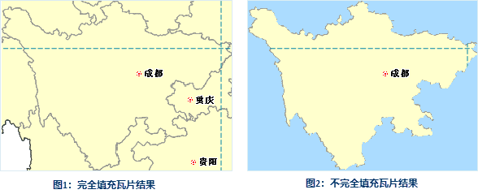

### 使用说明

支持单任务生成地图瓦片，是在一台机器上只启动单个进程完成切图任务，适用于数据量较小的切图情况。

若在执行切图过程中意外中断切图，支持续传地图瓦片。并且在使用地图瓦片的过程中，您可能遇到地图服务数据变更，可通过更新/追加功能更新地图服务中变更的数据。

为了提升地图瓦片的生成速率，可预先对地图数据集创建地图索引。在生成地图瓦片前，应用程序会对数据集进行索引检查，当数据对象数大于2000且无空间索引时将提示用户创建空间索引。

### 操作说明

1. **新建切图任务** ：在工作空间管理器中选择需要生成地图瓦片的地图，右键鼠标，在右键菜单中选择“ **生成地图瓦片（单任务）** ”项。弹出“生成地图瓦片（单任务）”对话框。可选择三种单任务切图方式：新建切图任务、更新/追加瓦片、续传/恢复瓦片。此处选择“ **新建切图任务** ”项。
2. **设置切图参数** ：在“ **单任务：生成地图瓦片** ”对话框中设置生成瓦片的比例尺、名称、存储类型、瓦片范围、索引范围等参数。具体说明如下： 

**注** ：支持用户导入已有地图瓦片配置文件（*.sci）。地图瓦片配置文件（*.sci）保存了生成地图瓦片的比例尺以及诸多相关设置参数。

  

* **比例尺设置** ：程序会按照地图数据自动生成比例尺列表，您可手动输入固定比例尺。同时支持通过“导入比例尺”命令，导入*.xml 格式的比例尺配置文件。 

**注** ：支持将设置好的比例尺参数导出为为 *.xml 格式的比例尺配置文件。便于再次使用或者在别的地方使用。如地图瓦片导出的比例尺文件可以与分级配图工具中的比例尺文件通用。

* “ **版本号** ”用来对生成地图瓦片的版本进行设置。不同版本的地图瓦片，需要与相应版本的服务器版本匹配，以方便地图切片在服务端进行发布。系统提供了六种版本的地图瓦片生成方式。

只有在选择5.0版本的时候才能激活“**剖分方式**”。剖分方式分为两种：本地剖分和全球剖分。全球剖分方式生成的瓦片为三维地图瓦片，可加载到场景中。默认情况使用本地剖分。

由于5.0版本的瓦片采用了高精度校准方式，对于首次生成地图瓦片的用户， 推荐使用5.0版本的瓦片方案。

* 2.0版本适用于 IS .NET。
* 2.1版本适用于 IS .NET 使用新的瓦片图片生成方案。
* 3.0版本适用于 iServer 2.0。
* 3.1版本适用于 iServer 2.0 使用新的瓦片图片生成方案。
* 4.0版本适用于 iServer 6R。
* 5.0版本适用于 iServer 6R(2012) SP1及以上版本。
* **剖分方式** ：只有在选择5.0版本的时才可设置剖分方式。剖分方式分为两种：本地剖分和全球剖分。 **注意** ：全球剖分只有在地图坐标系为WGS 1984时才可用。
* **瓦片类型** ：提供栅格瓦片和矢量瓦片两种格式。栅格瓦片即生成的瓦片格式为栅格图片，显示效率高但占用服务器空间。生成矢量瓦片格式的数据量少，占用的服务器资源较少，传输更方便且显示更灵活。
* **图片类型** ：瓦片图片保存的类型。应用程序支持 PNG，DXTZ，GIF，JPG、JPG_PNG 和 PNG 8 六种图片格式。默认为 JPG 格式。5.0版本的瓦片支持 JPG_PNG 和 PNG 8两种图片类型。 

当地图瓦片格式为 JPG_PNG
混合形式的瓦片，应用程序可根据瓦片是否包含无效数据像元来自动判断使用哪种格式。无效数据像元是指不包含任何数据内容的瓦片。对于包含无效数据像元的切片（地图边界处），其文件格式为
PNG，否则为 JPG 格式。使用 JPG_PNG 图片类型时，会默认勾选背景透明选项。采用混合图片类型，可以大大减少瓦片数据的大小，从而优化数据下载时间。

PNG 8是256色的 PNG 格式，不支持背景透明，存储空间更小，约为 PNG 图片大小的二分之一；生成的结果为颜色更少、对比更强烈的简单图像。

* **背景透明** ：当地图设置了背景色时，勾选此项，在生成地图瓦片的时候，会自动将背景色设置为透明；否则将保留地图的背景色。
* **块大小（像素）** ：获取瓦片预处理后生成的每个瓦片分块文件的采样尺寸，单位为像素。应用程序提供了 2048*2048，1024*1024，512*512，256*256，128*128，64*64 六种尺寸共用户选择，默认大小为 256*256。
* **图片压缩率** ：瓦片图片被压缩的百分率。图片压缩率的范围为0-100，默认为75。其中，图片压缩率的设置与瓦片的存储类型没有关系。且不同图片类型，支持的图片压缩率的情况不同: 
* 当图片类型为DXTZ、GIF时，不支持设置图片压缩率;
* 当图片类型为PNG、PNG8、JPG_PNG时，图片压缩率的取值范围是：(0,90];
* 当图片类型为JPG时，图片压缩率的取值范围是:[10,100];
* **分辨率** ：支持设置瓦片分辨率，使用户能够自定义瓦片的输出精度。默认分辨率为96DPI。
* **输出设置** :
* **存储目录** ：即为地图瓦片的存储路径，可以为本地路径，也可以为远程网络路径。
* **存储类型** ：系统提供了3种瓦片类型：紧凑、原始、MongoDB。有关存储类型的详细描述，请参见[地图瓦片存储类型](../../Features/ApplicationTheme/CacheBuild/MapCacheType.htm)。 
  * 紧凑型表示采用一定的压缩和加密机制，在建立瓦片时对数据进行压缩和加密； 
  * 原始表示不对数据进行压缩，保留模型数据的原始信息。 
  * MongoDB 型是将生成的瓦片切片文件，以分布式格式存储在服务器的数据库中，地图切片的存取速度较快，便于数据分享与发布。当选择 MongoDB 类型时，需先启动 MongoDB 服务，支持检查当前服务是否可用。 **注意** ：MongoDB 2.0 版本的认证模式，不支持生成地图瓦片。有关MongDB 数据库使用，请参看“[MongDB 使用说明](../../Features/TechDocument/MongoDBDatabaseGuide.htm)”。
* **设置密码** ：当存储类型设置为“紧凑”时，可以为地图瓦片设置密码进行加密以保证数据安全；当加载该地图瓦片时，需要输入密码。
* **范围参数设置** ：单击下一步，对瓦片处理的地图数据的地理范围进行设置。应用程序提供了以下四种设置方式：
* 单击“ **整幅地图** ”按钮，使用整幅地图的范围作为瓦片范围，左下右上四个文本框用来显示所设置的处理范围。
* 单击“ **当前窗口** ”按钮，使用当前窗口的范围作为瓦片范围。
* 应用程序地图窗口中有打开的地图时，“ **绘制范围** ”按钮可用。单击下拉按钮，可选择”选择对象“或”绘制范围“，点击”选择对象“程序切换到当前地图窗口，在窗口中选择鼠标单击一个对象作为瓦片的处理范围。如果需要选择多个对象，则可按住 Shift 键依次选择对象，选择完成后单击鼠标右键，结束选择状态，返回“生成地图瓦片”对话框。点击”绘制范围“程序切换到当前地图窗口，在窗口中选择鼠标绘制矩形范围，绘制完成后单击鼠标右键，结束选择状态，返回“生成地图瓦片”对话框。 
* **完全填充瓦片** ：可设定瓦片范围（或者索引范围）内生成的瓦片是否完全填充。勾选该项，表示瓦片范围内会完全填充瓦片，不勾选该项，表示只输出选中的对象的范围与瓦片范围交集部分，其他部分不填充，输出为空白。例如，当用户选中某市范围面对象作为生成瓦片的范围时，使用和不使用完全填充瓦片的效果如下图所示：  
    
 |   
 ---|---  
图1：完全填充瓦片结果 | 图2：不完全填充瓦片结果

* **过滤选择对象所在图层** ：应用范围参数中“选择对象”的方式时，可根据选中对象的范围确定生成瓦片范围。勾选该项，应用程序在生成瓦片时，会自动过滤该对象所在图层；否则不会进行过滤。该功能仅在地图中存在多个图层时有效。 
* 单击“ **复制** ”按钮可复制当前设置的范围，在支持粘贴的范围设置处单击“粘贴”按钮，即可将复制范围的左、下、右、上值设置到当前范围。
* **“索引范围”** 索引范围是地图瓦片切分规则的依据。当索引范围确定时，瓦片的切分规则即可以确定。具有相同索引范围的地图瓦片可以进行合并。 系统提供了四种建立索引范围的方式：整幅地图、当前窗口、鼠标绘制、绘制范围、复制粘贴。具体操作见瓦片范围的设置方法。  
注意：只有索引范围相同的地图瓦片，才能追加成功。

3. 设置完成后，单击“确定”按钮，执行地图瓦片切图操作。切图完成后在设置的存储目录下生成一个以瓦片名称命名的文件夹，其中包含一个*.sci 文件和瓦片结果文件。如下图所示，瓦片分别保存在对应的比例尺文件夹中，生成的“*.sci”为瓦片配置文件。可以采用打开数据源的方式直接打开，有关如何打开数据源的更多内容，请参见[打开数据源](../../DataProcessing/DataManagement/OpenDatasource.htm)。    
  

### 注意事项

1. 瓦片范围设置时的相关事项： 
* 应用“选择对象”的范围按钮时，当所要选择的对象图层为不可选择状态时，可以直接在“图层管理器”中将该图层设为可选择状态，然后选择对象。
* 在当前地图窗口中单击鼠标右键，即可重新弹出“生成瓦片对话框”，关闭该对话框再进行必要的设置。
2. 生成地图瓦片时，如果专题图开启了流动显示， 应用程序会弹框提示"地图开启了流动显示，请先关闭流动显示，再生成瓦片！"，同时输出窗口输出开启了流动显示的图层，用户需手动在专题图属性中关闭这些图层的流动显示再生成瓦片。
3. 关于图片背景透明的说明： 
* 当瓦片版本为2.0、3.0、3.1、4.0版本时，当用于生成瓦片的地图未使用反走样，且生成的图片格式为 png 格式时，将瓦片作为数据源打开时，支持背景透明的效果。
* 当瓦片版本为2.0、3.0、3.1、4.0版本时，当生成的瓦片图片为 gif 格式时，该瓦片作为数据源打开时，不支持背景透明的效果。
* 当瓦片版本为5.0时，生成的瓦片均支持背景透明效果。
* 各个版本的瓦片，加载到场景中显示时，均支持背景透明效果。
4. 不推荐对生成的瓦片地图直接进行旋转。如想得到较佳的旋转效果，建议先配好地图，对地图进行旋转，然后再生成瓦片文件。

### 备注

关于全球剖分规则的介绍可以参照[瓦片目录其他层级结构构建基础](../../ApplicationTheme/CacheBuild/ImageCache4Base.htm)中的简介。

