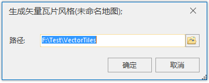

矢量瓦片的最大特点之一就是瓦片数据与风格独立，因此，能够通过修改瓦片的风格来改变矢量瓦片地图的显示效果，无需重新创建矢量瓦片。

在 中提供单独 **生成矢量瓦片风格** 入口，在不改变瓦片数据的基础上，单独生成对应地图的风格。具体操作如下:

  1. 打开矢量地图，在地图窗口右键菜单选择“生成矢量瓦片风格”项，弹出“生成矢量瓦片风格”对话框。
  
---  
图：重新生成矢量瓦片风格  
  2. 在对话框中设置生成风格的路径，即可生成新的矢量瓦片风格。
  3. 结果文件包含三个文件夹，包括： **fonts** （矢量瓦片使用的字体文件）、 **sprites** （矢量瓦片图标相关风格内容资源）、 **styles** （矢量瓦片风格描述文件）。
  4. 最后，将新创建的矢量瓦片风格内容替换到待更新风格的矢量缓存目录，即可将当前矢量瓦片按照新生成的瓦片风格进行显示。

