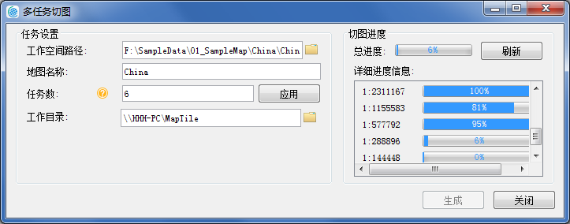

在  桌面软件中进行多任务切图的流程，可简单的分为4步： **1.新建切图任务** ； **2.设置瓦片参数** ； **3.设置多任务参数** ；
**4.执行多进程切图**

  

多任务切图可使用“**单机多任务切图**”和“**多机多任务切图**”两种切图方式。单机多任务即在一台计算机开启多个进程执行切图任务。多机多任务切图即为多个机器同时开启多个进程协同切图。使用以上两种切图方式对示例数据
China.smwu 中的 China 地图切图，具体切图步骤如下。   
**注**：流程中的进程是系统进行资源分配和调度的一个独立单位，一个进程调取一个任务进行切图。

为了提升地图瓦片的生成速率，可预先对地图数据集创建地图索引。在生成地图瓦片前，应用程序会对数据集进行索引检查，当数据对象数大于2000且无空间索引时将提示用户创建空间索引。

###  单机多任务切图

1. **新建切图任务** ：打开待切示例地图数据 China.smwn 工作空间，将数据源设置为只读并保存工作空间。打开 China 地图,在“地图”选项卡“制图”分组中，单击“多任务”，在弹出的对话框中选择“新建多任务切图”。

**注** ：如若切图数据存储在远程服务器中，请在此处以打开远程服务器中的共享切图数据。

2. **设置瓦片参数** ： 
* 在“多任务：设置地图瓦片参数”对话框中，设置切图比例尺，块大小，瓦片名称，工作路径，存储类型，以及瓦片范围等基本参数,有关地图瓦片参数的具体描述，请参见“[生成地图瓦片（单任务）](MapTilesSingle.htm)”。

**注** ：其中路径设置的“工作目录”，即为存储地图切图任务的路径，路径既可以是本地路径，也可以远程服务器路径。

* 完成参数设置，单击下一步程序将自动执行切图任务拆分，并在工作目录下生成一个以瓦片名称命名的文件夹。即为工作目录文件。

**工作目录文件**

任务拆分完成后，在工作目录下会生成一个以瓦片名称命名的文件夹，如下图中的 China
文件夹，用于存放瓦片配置文件（*.sci），切完瓦片之后直接打开该*.sci文件，即可查看 china
地图瓦片；该路径还会生成一个“CacheTask”文件夹，其中包含check、task两个文件夹，文件夹中的存放内容如下：

**check** ：存放了check.udb、check.udd，用于缓存检查，检查切图后是否存在白图和空文件等情况。

**task** ：用于存放地图缓存拆分后的子任务文件（*.sci）。

  

3. **设置多任务参数** ：完成拆分后会弹出多任务切图对话框，在对话框中，检查或设置工作空间路径、地图的名称，以及任务数等参数。 
* **工作空间路径** :选择待切地图所在的工作空间。 **注意** ：用户需确保该工作空间中的待切地图与拆分任务时的地图一致，若不一致，会导致结果无法正确浏览，此时建议用户对更新后的地图重新拆分任务后，再切瓦片。
* **地图名称** :设置待切的地图名称。
* **任务数** :设置切图的任务数，即在当前机器上开启几个进程来执行切图任务。进程数需要根据机器的配置和进程使用情况来设置。进程数可根据机器使用情况，随时进行调整，若输入的进程数比当前进程数多，单击“应用”按钮，即可及时增加一条进程执行切图；若输入的进程数比当前进程数少，单击“应用”按钮，即可及时减少一条正在执行切图的进程。 
* **工作目录** :设置为拆分任务对话框中所设置的工作路径，若要执行多机多进程切图，需要将该文件设置为共享工作目录，确保其他机器对该共享目录有读写权限，便于其它切图机器上的进程从该目录中获取切图子sci，也方便切图结果的存放和汇总。  

  

4. **执行切图** ：参数确认无误后，点击生成，执行切图任务。地图切图完成后，会弹出此次切图的用时统计，方便了解切图耗时。切好的地图瓦片会保存在总 sci 文件同级目录文件夹中，瓦片结果分别保存在对应的比例尺文件夹中，切图成功后通过加载 China.sci 瓦片配置文件即可查看所有切好的瓦片。

**执行切图原理**

执行多进程切图时，会在 CacheTask 目录下生成一个 doing 文件夹，每个进程获取到的子任务会从 task 移至 doing
文件夹中。当子任务切图完成后，会将该任务从 doing 文件夹移至同级的 build 文件夹中，如若切图过程中有切图失败的子任务，会新生成一个 failed
文件放置失败的子任务，若中途终止切图，doing 文件夹中仍然有*.sci 文件，程序会自动将其中的*sci 文件移至 task 中重新再切。

  

###  多机多任务切图

1. **拆分任务** ：多台机器协同切图首先需要在一台主机上完成“ **新建切图任务** ”和“ **设置瓦片参数** ”两个步骤，操作方式同“单机多任务”。如上操作得到的拆分任务后的文件目录 Multi-task。
2. **文件目录设置共享** ：将目录文件 “Multi-task”设置为共享文件，确保其他机器对该共享目录有读写权限，以便其它切图机器上的进程从该目录中获取切图子sci 任务。文件权限设置可通过文件夹属性面板中的共享设置，赋予其他机器有读取、写入权限。如下图所示，共享工作目录可设置密码访问权限，切图机器只要成功访问过一次这个目录，就可以正常切图了。   
   

3. 对执行切图任务的 **每台机器** 分别进行以下操作： 
* 向执行切图任务的机器中拷贝切图数据和桌面软件，启动桌面软件并打开待切地图数据。若切图数据存放于其他服务器中，则无需拷贝切图数据，直接打开远程服务器中的切图数据即可。
* 验证每台机器是否能连接 host 主机中的共享目录，如可以通过资源文件夹中输入 \\\198.168.1.20（主机ip），进入共享目录。
* 若切图类型为 MongoDB 型时，还需要验证每台机器是否能够连接存储瓦片的MongDB 数据库。
* **启动多任务切图程序** ：在“地图”选项卡“制图”分组中，单击“多任务”，在弹出的对话框中选择“执行多任务切图”，启动多任务切图程序。
* **设置多任务参数** ：在弹出的“多任务切图”对话框中，设置工作空间路径、地图的名称，以及任务数等参数，其中工作目录即共享工作目录的地址。程序通过目录路径调取地图瓦片文件（总sci）和子任务（sci）。
* 每台切图机器会按照设置的任务数，在共享目录Task 文件夹领取拆分的子任务，不同的机器领取不同的任务，被领取的子任务会从 task 移至 doing 文件夹中。当子任务切图完成后，会将该任务从 doing 文件夹移至同级的 build 文件夹中。例如同时部署三台机器，进程数分别设置为6、8、10，则有24个子任务sci同时执行切图，切图完成的进程会再在 task 中领取任务，直到无任务可领，则执行切图完成。
4. 完成切图任务，程序将给出完成提示对话框，多进程切图完成，并给出缓存结果路径和耗费时间。切好的缓存瓦片会保存在总 sci 文件同级目录文件夹中。若为 MongDB 的缓存类型，瓦片存储在 MongoDB 数据库中。
