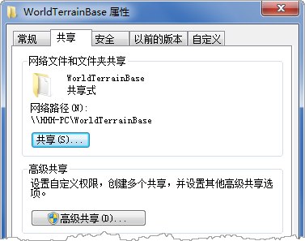
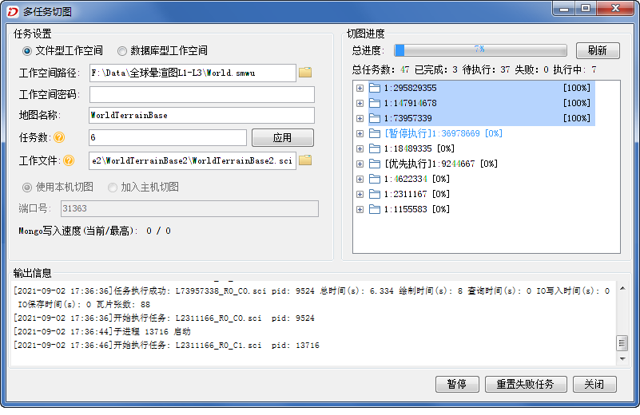

### 功能说明

SuperMap iDesktop/iDesktopX 提供多任务切图功能，多任务切图又分为“单机多任务切图”和“多机多任务切图”两种方式。

  * [单机多任务切图](MapTileMode.html#2):是指在一台计算机开启多个进程执行切图任务。
  * [多机多任务切图](MapTileMode.html#2):是指多台计算器同时开启多个进程实现多台机器并行高效切图。

### 多任务切图原理

多任务切图是根据地图的比例尺和地理范围等将地图切图任务拆分成多个子任务，然后将拆分后的任务部署在共享目录中从而实现多机同时访问。多机同时开启多条进程，每条进程会到指定的目录获取并执行切图任务，并将切图结果保存到同一个文件夹中，从而实现多任务并行切图。多任务切图方式能充分利用机器的硬件资源，综合利用多个节点并行切图，极大提升切图的效率。

### **多任务切图要点**

在使用多任务切图功能前，您需要了解以下多任务切图的要点，从而能更好的理解和使用此功能。

  * **数据源只读** ：并行切图要求 UDB 型数据源都是只读的，是由于多任务切图时每条进程会同时访问地图中图层所在的数据源，此时数据源就会存在被占用的问题，将数据源设置为只读，避免了数据源被占用而无法执行的问题。UDBX 型数据源本身支持多进程同时访问，不需要设置为只读。
  * **拆分任务** ：多任务切图前需先将预生成的地图拆分为多个切图任务。程序会根据用户设置的瓦片比例尺、瓦片范围等参数生成一个总的地图瓦片配置文件（总 sci文件），基于总的sci 瓦片配置文件拆分得到的多个子sci文件，便于多个进程获取独立、不重复的任务。
  * **共享工作目录** ：拆分任务后会得到一个工作文件目录，该文件用于存储地图瓦片的总 sci 及 拆分后的子sci。若要执行多机多进程切图，需要将该文件设置为共享工作目录，确保其他机器对该共享目录有读写权限，便于其它切图机器上的进程从该目录中获取切图子sci，也方便切图结果的存放和汇总。
  * **执行切图任务** ：若要执行多机任务切图，需检查其他机器是否能连接host主机，如可以通过资源文件夹中输入 \\\198.168.1.20（主机ip），进入共享目录。

### **多任务切图流程**

根据多任务的切图要点，将多任务切图的流程简单的分为4步： **1.新建切图任务** ； **2.设置瓦片参数** ； **3.设置多任务参数** ；
**4.执行多进程切图**

  

注：流程中的进程是系统进行资源分配和调度的一个独立单位，一个进程调取一个任务进行切图。  
  
使用多机多任务切图方式对全球晕渲图进行切图，对切图步骤及参数进行详细描述。

#### **1. 数据准备**

  * **矢量数据** ：若切图数据为矢量数据，数据量不太大且方便拷贝，则将矢量数据分别拷贝至每台切图机器中。若为大体量数据，可将其设为共享数据，确保其他切图机器可访问。
  * **栅格数据** ： 
    * **数据位置** ：若切图数据中包含大体量的影像栅格数据，不方便拷贝，可将数据目录设置为共享，其他机器通过访问共享目录读取切图数据。
    * 若切图数据为只包含影像数据，没有叠加任何矢量数据的影像地图，可先通过创建镶嵌数据集管理影像数据，基于镶嵌数据集制作影像地图，再基于该影像地图生成栅格瓦片，镶嵌数据集是针对海量影像数据管理的最佳方式。同理，镶嵌数据集管理的影像文件体量巨大，不方便拷贝，将影像数据目录设置为共享，其他机器通过访问共享目录读取切图数据。
  * **UDB 数据源设置为只读** ：若切图数据为 UDB 型数据源，先将数据源重新以只读方式打开，通过数据源右键菜单中的“重新只读打开”选项，将数据源设置为只读打开，并保存工作空间。若为 UDBX 型数据源可忽略此步。
  * **创建空间索引** ：应用程序会对数据集进行索引检查，当数据对象数大于2000且无空间索引时将提示用户创建空间索引，创建地图索引，可提升地图瓦片的生成效率。

以切栅格地图为例，详细介绍多任务切图的流程：

切图前先检查执行多任务的每台机器是否能够访问到共享切图数据。可直接通过数据存放机器的 IP 地址或是计算机名称访问：点击“开始”->
“运行”，在弹出的窗口中输入\\\IP地址 （例如：\\\192.168.1.247） 或者
\\\计算机名称，然后选择确定，以确认是否能查看到共享数据文件夹。

#### **2.拆分任务**

多任务切图需要将一个完整的切图任务拆分成过个子任务，以便让多台机器能够协同工作。首先在一台主机上将地图拆分为多个切图任务。

**(1) 新建多任务切图任务**
：在主机中启动桌面，打开待切地图，在地图窗口右键选择“生成地图瓦片（多任务）”项，在弹出的对话框中选择“新建多任务切图”。

**(2) 设置瓦片参数** ：在“多任务：设置地图瓦片参数”对话框中，设置切图比例尺，瓦片类型、图片类型、工作目录、存储类型以及瓦片范围等参数。

  * **瓦片类型** ：选择瓦片类型。栅格瓦片即生成的瓦片格式为栅格图片，显示效率高但占用服务器空间。生成矢量瓦片格式的数据量少，占用的服务器资源较少，传输更方便且显示更灵活。有关栅格瓦片和矢量瓦片的详细描述请参看[地图瓦片类型](TilesType)。
  * **比例尺** ：程序会按照地图数据自动生成比例尺列表，栅格瓦片可手动输入固定比例尺。同时支持通过“导入比例尺”命令，导入*.xml 格式的比例尺配置文件。矢量瓦片与栅格比例尺有所不同，矢量瓦片采用的是全球剖分层级，有关全球剖分比例尺详细描述请参看[矢量瓦片->全球剖分](VectorTiles)。 

为了充分利用瓦片数据，同时实现多级缩放，可以对地图设置多个比例尺。多级比例尺可在浏览过程中比较顺畅，不会出现比较大的跳跃。在地图制作的过程中要考虑要素在不同的比例尺下是否需要显示。

  * **图片类型** ：支持JPG，PNG，DXTZ，GIF，JPG_PNG ，PNG8和 WEBP 七种图片格式，默认为 JPG 格式。5.0版本的瓦片支持 JPG_PNG 和 PNG 8两种图片类型。有关图片类型的详细描述请参看[瓦片类型](MapTilesSingle)。 

栅格、影像数据建议使用 WebP 格式，在保证图像质量前提下，瓦片体积会更小。

  * **工作目录** ：存储拆分任务的文件目录，该文件用于存储地图瓦片的总 sci 及拆分后的子sci。需要将该文件设置为共享工作目录，确保其他机器对该共享目录有读写权限，便于其它切图机器上的进程从该目录中获取切图子sci。
  * **存储类型** ：程序提供3种瓦片类型：紧凑、原始、MongoDB。有关各存储类型的详细描述及选型建议请参看[瓦片存储选型建议](MapCacheType)，选择合适的存储类型。

**(3) 拆分任务** ：参数确认无误后，点击生成，执行拆分任务。任务拆分完成后，在工作目录下会生成一个以瓦片名称命名的文件夹，，如下图中的
WorldTerrainBase文件夹，用于存放瓦片配置文件（*.sci）；该路径还会生成一个“CacheTask”文件夹，其中包含check、task两个子文件夹，文件夹中的存放内容如下：

  * **check** ：存放了check.udb、check.udd，用于瓦片检查，检查切图后是否存在白图和空文件等情况。
  * **task** ：用于存放地图瓦片拆分后的子任务文件（*.sci）。
  
---  

  
**注** ：拆分任务完成之后，会弹出“多任务切图”对话框，可在本机继续后续切图步骤，也可关闭对话框，选择其他时间或其他计算机重新启动多任务切图程序。

#### **3.执行多机多任务切图**

**(1) 文件目录设置共享** ：将拆分任务目录文件设置为共享文件，确保其他机器对该共享目录有读写权限，以便其它切图机器上的进程从该目录中获取切图子sci
任务。文件权限设置可通过文件夹属性面板中的共享设置，赋予其他机器有读取、写入权限。如下图所示，共享工作目录可设置密码访问权限，切图机器只要成功访问过一次这个目录，就可以正常切图了。

**(2) 配置切图机器** ：对执行切图任务的每台机器分别进行以下操作：

  * 向执行切图任务的机器中拷贝桌面软件，启动桌面软件并打开待切地图数据。待切地图若存放于其他服务器或共享目录中，则无需拷贝切图数据，直接打开远程服务器中的切图数据即可。有关切图地图和瓦片存储位置来自本地目录还是共享目录可参考[本地和远程路径切图效率比对](MultiTaskSuggest)。 
    * 若瓦片类型为原始型瓦片，建议将地图数据拷贝至本地，同时将瓦片存储在本地，此时效率最高，大规模切图应用推荐此场景。
    * 若瓦片类型为紧凑瓦片，建议将地图数据拷贝至本机，瓦片也保存在本机效率最高。
    * MongoDB 瓦片，受数据来源和存储位置影响不大。
  * 验证每台机器是否能连接 host 主机中的共享目录，如可以通过资源文件夹中输入 \\\198.168.1.20（主机ip），进入共享目录。
  * 若切图类型为 MongoDB 型时，还需要验证每台机器是否能够连接存储瓦片的MongDB 数据库。

**(3) 启动多任务切图程序**
：在地图窗口右键选择“生成地图瓦片（多任务）”项，在弹出的对话框中选择“执行多任务切图”；启动多任务切图程序，在“多任务切图”对话框中设置相关切图参数。

  
-
  
**任务设置** ：在对话框左侧面板中设置切图任务的相关信息。支持添加文件型工作空间和数据库型工作空间中地图执行切图。

  * **设置切图工作空间** ：支持添加文件型工作空间和数据库型工作空间中地图执行切图。当选择文件型工作空间时，只需指定工作空间路径； 当选择数据库型工作空间，需选择工作空间类型、输入数据库连接信息，有关数据库连接信息的详细描述可参看[打开数据库型数据源](../DataProcessing/DataManagement/OpenDatasource)。
    * **工作空间路径** ：该路径为待切地图所在的工作空间路径。若切图数据为 **注意** ：用户需确保该工作空间中的待切地图与拆分任务时的地图一致，若不一致，会导致结果无法正确浏览，此时建议用户对更新后的地图重新拆分任务后，再切瓦片。
    * **地图名称** ：设置待切的地图名称。
  * **任务数** ：设置切图的任务数，即在当前机器上开启几个进程来执行切图任务。进程数需要根据机器的配置和进程使用情况来设置，默认任务数为计算机 CPU 线程数*1.5倍，切图时CPU 利用率为100%。进程数可在切图过程中随时进行调整，若输入的进程数比当前进程数多，单击“应用”按钮，即可及时增加对应进程执行切图；若输入的进程数比当前进程数少，单击“应用”按钮，即可及时减少对应正在执行切图的进程。 
  * **工作文件** ：指定至瓦片工作目录下以瓦片名称命名的文件夹中的sci文件，如上图中一级目录的 WorldTerrainBase 文件夹下的WorldTerrainBase.sci文件。 
  * **使用本机切图** ：使用本机执行切图任务。 
    * **端口号** ：用于唯一标识主机上的一个应用进程，方便不同应用进程之间的通信，指定端口可以提供可靠的数据传输，程序默认端口号为31363，若在执行切图时该端口提示被占用，请检查端口使用情况，指定其他端口。
  * **加入主机切图** ：放置拆分任务的工作目录即为主机，其他机器调取主机任务协同执行切图时，选择该项。 
    * **主机名** ：输入主机的 IP 地址。
    * **端口号** ：主机执行切图的端口。

**切图进程** ：在对话框右侧面板中可实时查看切图进度，包括总进度、总任务数、已完成任务数、待执行任务数、失败任务数及
执行中的任务数，便于实时掌握切图进度。

  * 列表框中可实时查看每个切图比例尺下子任务的详细进度信息。
  * 支持调整某个切图比例尺的优先级以及暂停该比例尺的相关切图任务，操作方式为选择待调整比例尺右键，在右键菜单中设置暂停执行或优先执行 。
  * 支持进度和日志的实时刷新显示。

**输出信息** ：在对话框下侧的实时显示切图过程中的输出信息。

**重置失败任务**
：在多任务切图对话框，提示有失败任务数，可通过“重置失败任务”，对失败的任务进行重新切图。若仍提示有失败任务，请进一步检查地图数据或拆分的任务，再重启多任务切图程序。

**执行切图** ：参数确认无误后，点击生成，执行切图任务，在“多任务切图”对话框的右侧，可查看切图的总进度信息以及每个子任务的详细进度信息。

  * 执行多任务切图时，会在 CacheTask 目录下生成一个 doing 文件夹，每个进程获取到的子任务会从 task 移至 doing 文件夹中。当子任务切图完成后，会将该任务从 doing 文件夹移至同级的 build 文件夹中，如若切图过程中有切图失败的子任务，会新生成一个 failed 文件放置失败的子任务，若中途终止切图，doing 文件夹中仍然有*.sci 文件，程序会自动将其中的*sci 文件移至 task 中重新再切。
  
---  

  * 每台切图机器会按照设置的任务数，在共享目录Task 文件夹领取拆分的子任务，不同的机器领取不同的任务，被领取的子任务会从 task 移至 doing 文件夹中。当子任务切图完成后，会将该任务从 doing 文件夹移至同级的 build 文件夹中。例如同时部署三台机器，进程数分别设置为6、8、10，则有24个子任务sci同时执行切图，切图完成的进程会再在 task 中领取任务，直到无任务可领，则执行切图完成。
  * 地图切图完成后，会弹出此次切图的用时统计，方便了解切图耗时。切好的地图瓦片会保存在总 sci 文件同级目录文件夹中，瓦片结果分别保存在对应的比例尺文件夹中，切图成功后通过加载 China.sci 瓦片配置文件即可查看所有切好的瓦片。若为 MongDB 的缓存类型，瓦片存储在 MongoDB 数据库中。

###  相关主题

 [生成地图瓦片](MapTileMode)

 [单任务切图](MapTilesSingle)

 [多任务切图效率比对](MultiTaskSuggest)

 [生成多版本瓦片](MultiversionTile)

