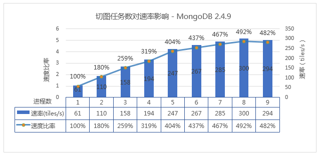
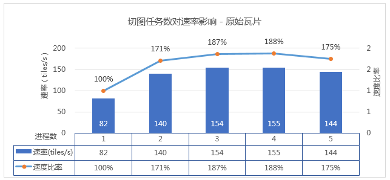
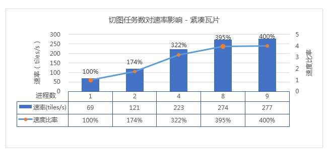
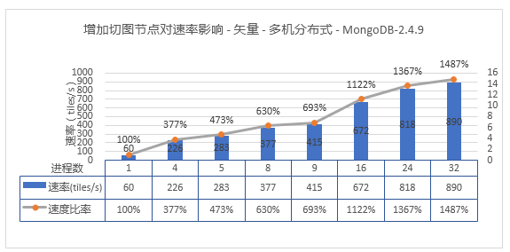
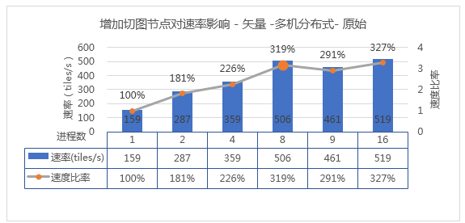
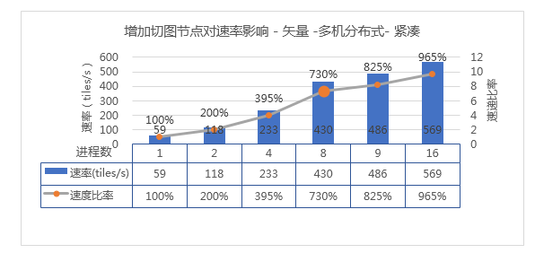
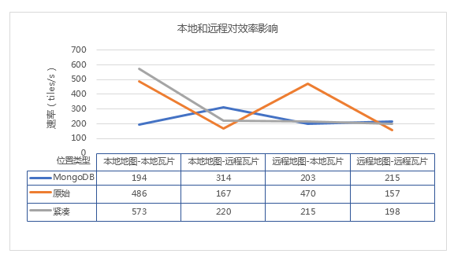
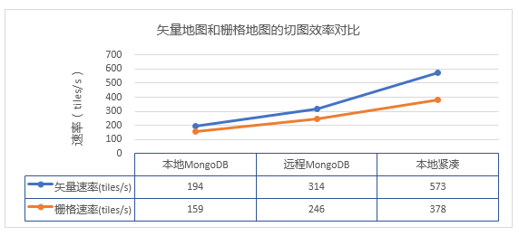

由于多任务切图过程中不同的缓存类型（原始、紧凑或 MongoDB）、切图数据和瓦片的存储位置（本地或共享）、切图方式（单机多任务或多机多任务）等多种因素均会对切图效率产生一定影响，为使用户配置出适合自己当前环境的最优切图方案，通过反复多次的测试验证，整理出来四类测试场景，通过以下场景切图效率对比，分析总结得出合理的**结论** ，为用户部署多任务切图提供参考和建议。

**1.单机多任务切图** ：比对单机多任务切原始、紧凑或 MongoDB 型瓦片的切图效率。

**2.多机多任务切图** ：比对用多机多任务切原始、紧凑或 MongoDB 型瓦片的效率切图效率。

**3.本地和远程路径切图** ：比对切图数据和瓦片存储在本地和远程对切图速率的影响。

**4.矢量/栅格地图切图** ：比对多任务切矢量地图和栅格地图的切图效率。

 **测试数据与环境**

以上四类场景分别使用了相同矢量地图数据、切图范围、切图比例尺以及瓦片参数均相同，具体信息如下：

* **测试数据** ：选取矢量地图，矢量数据集最大对象个数为8324287，文件大小为12.4G，图层数：326个。
* **切图范围** ：[左:11427641.47674698,下:2817774.6107045934,右:12993071.816027392,上:4383204.9499850012]，拆封为100个子任务数，总计产生1638400张瓦片。
* **切图比例尺** ：1:18,055.9909335062(仅1个比例尺)；
* **设置瓦片参数** ：所有测试场景设置的地图瓦片关键参数，均为：版本号是5.0；图片类型是JPG；块大小(像素)是256*256；图片压缩率是75。

 **单机多任务切图效率**

* **MongoDB 型瓦片** : 瓦片存储为本地存储；地图本地地图；测试机器：64位，4核CPU。增加进程数得到如下效率对比图：(单机多任务切 MongoDB 型瓦片)
  
* **原始型瓦片** : 瓦片存储为本地存储；地图本地地图；测试机器：32位，2核CPU。增加进程数得到如下效率对比图：
  
---  

  * **紧凑型瓦片** : 瓦片存储为本地存储；地图本地地图；测试机器：64位，4核CPU。增加进程数得到如下效率对比图：
  
---  

  * **结果分析** ： 

① 对于原始型、紧凑型、MongoDB 型瓦片，相对于单机上的单进程切图，单机上的多进程切图都可以显著提高切图效率。

② 每个切图机器最适合的进程数是CPU核数*2，即双核CPU开4个进程，4核开8个以此类推。

③ MongoDB 瓦片存储方式，提升的效率最高，普通4核PC机平均提升4-5倍，测试中最高可提升到近6倍。MongoDB 型>紧凑型>原始型。

**多机多任务切图效率**

  * **MongoDB 型瓦片** : 瓦片存储为远程存储；地图本地地图；测试过程：逐步增加主切图节点的进程，从单个进程(single)逐渐增加到8，然后再增加其他机器补充总的进程数。    
---  

  * **原始型瓦片** : 瓦片存储为本地存储；地图本地地图；测试过程：逐步增加主切图节点的进程，从单个进程(single)逐渐增加到8，然后再增加其他机器补充总的进程数。
  
---  
 
  * **紧凑型瓦片** : 瓦片存储为本地存储；地图本地地图；测试过程：逐步增加主切图节点的进程，从单个进程(single)逐渐增加到8，然后再增加其他机器补充总的进程数。
  
---  

  * **结果分析** ： 

① MongoDB
瓦片，在单机开满切图进程（详见单机多进程测试结论）的基础上，通过继续增加新的切图节点（即额外的切图机器），切图效率可持续提升。使用5个节点时，矢量效率提升15倍。

② 原始瓦片，在单机开满进程的基础上，再增加新的节点，效率基本没有提升。建议使用场景是单台高性能的机器多任务并行。

③ 紧凑瓦片，在单机开满进程的基础上，再增加新的节点，效率有提升，但是效率提升不明显。建议使用场景是单台高性能的机器多任务并行。

**本地和远程路径切图效率**

切图地图和瓦片存储位置来自本地目录还是共享目录，形成了4种切图场景。

  * **本地地图-本地瓦片** ：即切图数据放在本地，切好的瓦片也存储在本地。
  * **本地地图-远程瓦片** ：即切图数据放在本地，切好的瓦片也存储在远程机器中。
  * **远程地图-本地瓦片** ：即切图数据放在远程，切好的瓦片也存储在本地。
  * **远程地图-远程瓦片** ：即切图数据放在远程，切好的瓦片也存储在远程。

每台机器开启四个切图子任务,得到如下效率对比图：

  
---  

  * **结果分析** ： 

① 原始型瓦片，地图来自本地并且本地存储瓦片的时候，效率最高。大规模切图应用推荐此场景。

② 紧凑型瓦片，数据来自共享目录时效率略低，不过也跟MongoDB效率相当。

③ MongoDB 瓦片，受数据来源和存储位置影响不大。

 **矢量/栅格地图切图效率**

矢量和栅格地图均来自本地，其中栅格地图为镶嵌数据集，含822张分辨率为90米的 img 影像，单张影像行列数为6000*6000；文件大小：44.7G；切图得到的瓦片数与矢量地图切得的瓦片数相同，总计产生1638400张瓦片；且切图比例尺相同。

分三种场景：本地 MongDB，远程 MongDB 和本地紧凑。使用一个切图节点，每个节点开启4个切图进程。 得到如下效率比对图：(矢量/栅格地图)

   
  
**结果分析** ：

  * 栅格地图的切图时间，明显比矢量地图长。

### **结论**

通过上述四个场景的可总结得到如下结论：

  * **结论1** ：单机多进程能有效提升切图速度，效率提升为本机CPU核数的倍数。例如4核CPU的机器可提升到4倍左右，16核CPU的机器可提升到16倍左右。
  * **结论2** ：每个切图节点，建议开启CPU*2个切图任务。
  * **结论3** ：切MongoDB类型的瓦片，可以支撑更多的切图节点并行工作。更大规模的切图任务，建议部署为多机分布式切MongoDB类型的瓦片。物理资源不受限的情况下，最高可以达到每秒生产并写入5000张瓦片的性能。
  * **结论4** ：紧凑瓦片，建议地图数据部署在本机，瓦片也保存在本机效率最高。原始类型的瓦片不适合数据迁移，这里不做结论。
  * **结论5** ：相同进程数的切图任务，紧凑型瓦片效率最高，在瓦片任务量不是特别大的情况下，推荐部署方案为使用一台较高性能的物理机采用单机多进程切图。
  * **结论6** ：紧凑和原始类型的瓦片，推荐使用单机多进程。多机分布式效率提升不明显。
  * **结论7** ：MongoDB 型的瓦片，建议 MongoDB 服务部署在非切图节点的机器上。MongoDB 比较吃内存，部署在切图节点上，会影响切图速度。

通过上述结论，用户可根据自身切图数据情况，瓦片类型，以及计算机性能合理选择切图方式。切图过程中，根据机器资源，增加/减少进程数，做到合理有效地利用计算机资源，最大限度的提升切图效率。

###  相关主题

  [生成地图瓦片](MapTileMode)

  [单任务切图](MapTilesSingle)

  [多任务切图](MultiTaskStep)

  [生成多版本瓦片](MultiversionTile)
