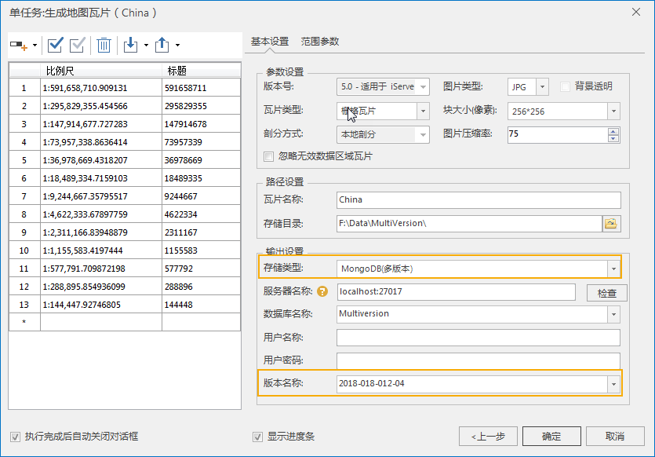

###  功能说明

多版本瓦片，一般是同一区域的不同时刻不同内容的瓦片，应用于多时态数据，即通过生成多版本瓦片的方式来管理不同时刻不同内容的瓦片。通过版本控制当前只显示一个瓦片内容，从而展现一个地理空间数据随时间变化的动态效果。

传统瓦片只是研究某一个区域空间数据当下的空间信息，只反应数据当前的一个情况，是静态的，不能回看历史，也不能预测未来。多版本瓦片加入了时间的元素，可以展示地理实体或者现象的空间、属性随时间的变化而变化。研究该地理实体和现象的发展过程，以及分析其变化规律。

**多版本瓦片特征**

  * 多版本瓦片的重要特征之一是具有版本标识，在生成瓦片的同时要为该瓦片指定一个对应的版本名称，用以标识该瓦片。
  * 生成多版本瓦片，瓦片只支持存储在 MongoDB 数据库中。

###  多版本瓦片的生成

多版本瓦片的生成同生成传统瓦片的操作方式相同，提供单任务和多任务两种切图方式。以单任务方式为例对操作进行描述：

  1. 选择需要进行多版本瓦片管理的地图，右键鼠标，单击“ **生成地图瓦片(单任务)** ”，在“生成地图瓦片(单任务)”对话框，选择新建切图任务，进入“生成地图瓦片”对话框。
  2. 在打开的“ **生成地图瓦片** ”对话框中，对瓦片文件输出及存储路径、范围参数、图片存储进行设置，详细参数说明请参见[单任务生成地图瓦片](MapTilesSingle.html)。需要特别注意以下参数的设置：
    * **存储类型** ：在生成多版本瓦片中，需设置存储类型为“MongoDB（多版本）”；
    * **版本名称** ：为当前输出的瓦片指定一个版本名称，用来标识该瓦片。关于版本名称的写法完全由用户的需求而定，这里不做限制。如果在版本名称下拉框中选择已有瓦片版本名称，则可以对该版本已有瓦片进行更新。
    * 若要放到一个多版本瓦片中管理，接下来的瓦片生成设置中，每个版本必须使用相同的瓦片配置文件名称和相同数据库名称，各版本的瓦片名称及数据库名称必须保持一致。
    * 多个版本瓦片之间，需要比例尺和地图瓦片索引范围保持一致。如果用户设置上不保持一致，可能导致瓦片出现问题。
  
---  
图：生成地图瓦片  
    * 设置完成后，单击“生成”按钮，执行地图瓦片生成操作。
    * 上述步骤是完成多版本中一个版本的瓦片。重复第1到第3步骤，生成多个版本瓦片。

**应用实例**

将某区域不同时段的道路数据生成不同版本的瓦片，添加了该区域不同时间道路交通变化情况的背景透明瓦片，通过时间控制当前只显示一个版本瓦片，从而展现一个交通变化的动态效果，如下图所示。

  
---  
图：多版本瓦片显示  
  
###  相关主题

  [生成地图瓦片](MapTileMode.html)

  [单任务切图](MapTilesSingle.html)

  [多任务切图](MultiTaskStep.html)

  [多任务切图效率比对](MultiTaskSuggest.html)

  

* * *

  
  
---

