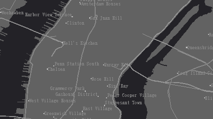

多版本瓦片，包含了多个瓦片，这些瓦片一般是同一区域的不同内容的瓦片，因此，多版本瓦片还可以应用于多时态数据，即同一区域不同时相的数据，通过生成多版本瓦片的方式以便管理和展示。

如下图所示，基于地图底图，叠加一个多版本瓦片图层，图层中添加了该区域不同时间道路交通变化情况的背景透明瓦片，通过时间控制当前只显示一个瓦片，从而展现一个交通变化的动态效果。

  

**多版本瓦片特征**

多版本瓦片的重要特征之一是具有版本标识，在生成瓦片的同时要为该瓦片指定一个对应的版本名称，用以标识该瓦片。版本通过瓦片版本名称进行唯一标识。

**多版本瓦片的存储**

在生成多版本瓦片时，瓦片要存储在 MongoDB 数据库中。

**多版本瓦片的主要内容包括：**

  [生成多版本瓦片](MultiversionCacheBuildStep1.htm)

  [加载 MongoDB 瓦片](AddMongoDBTiles.htm)
