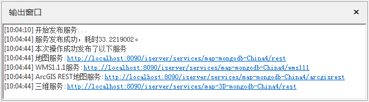
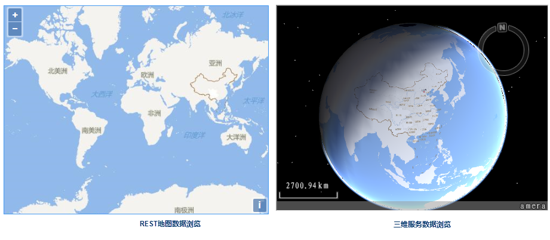

### 使用说明

支持将 MongoDB 存储的瓦片作为数据来源直接发布为地图服务、 REST 服务、OGC 服务、三维服务以及其他服务等，支持发布栅格瓦片和矢量瓦片。

发布MongoDB 瓦片前，需要完成以下工作：

* 生成 MongoDB 存储的地图瓦片，生成地图瓦片的详细说明请参看 “[地图瓦片](MapTiles.htm)"。
* 启动 iServer 服务，默认在 SuperMap iServer的bin 目录下运行 startup.bat/startup.sh 之后处于启动的状态。
* 启动 MongoDB 服务，请参看“[MongDB 使用说明](../../Features/TechDocument/MongoDBDatabaseGuide.htm)”启动服务。注：目前支持 MongoDB 3.2版本。

### 操作步骤

1\. 在“ **在线** ”选项卡的“ **发布iSever服务** ”组中，单击“ **MongoDB 瓦片** ”按钮，弹出“
**发布MongoDB瓦片** ”对话框。

2\. **iSever 服务地址** :输入发布服务的iServer 地址。单击组合框下拉按钮，选择“新建连接”，弹出“登录SuperMap
iServer”对话框，输入服务地址、管理员账户及密码，即可登录。登录成功后程序会自动保存连接过的地址，用户后续登录时可选择历史记录实现快速登录。

注：若未启动iServer 服务或管理员账号、密码输入错误，将无法正常登录，请确认链接信息是否正确再重新登录。

3\. **连接到MongoDB** :该区域设置 MongoDB 服务器和数据库的相关信息，在使用该功能前，需先启动 MongoDB
服务，有关MongoDB 的详细信息，请参考“[MongDB
使用说明](../../Features/TechDocument/MongoDBDatabaseGuide.htm)”。有关参数说明如下：

* **服务器名称** ：用于输入存储地图瓦片的 MongoDB 服务器的地址。
* **数据库名称** ：用于输入存储地图瓦片的数据库名称。 若MongoDB 服务启动成功，程序会自动读取当前连接地址下的数据库名称，用户可点击下拉菜单选择当前MongDB 中的 数据库。
* **用户名称/密码** ：若数据库设置了用户名和密码，则需输入该数据库对应的用户名称和密码；若数据库未设置用户和密码，则可不填写。 

4\. **发布地图服务** ：支持的地图服务包括REST 地图服务、OGC 服务以及其他服务。有关服务类型的详细介绍请参看[Web
服务类型介绍](../TechDocument/WebDatasets/AboutWebDataset.htm)。

* **地图** ：选择要发布的地图的瓦片。一个 MongoDB 服务中可能包含多次切图得到的多个地图的瓦片，同一幅地图还可能包含多个版本的瓦片，如果您：选择发布“全部”地图，则系统会发布全部地图的最新版本的瓦片，选择某一个地图，则系统会发布该地图的最新版本的瓦片。
* **REST 地图服务** ：支持发布为REST 地图服务，REST服务可选地图服务和矢量瓦片服务。有关REST 服务类型的详细介绍请参看[REST 服务](../Publish/PublishiserverProcess.htm#1)。
* **OGC 服务** ：包括 WMS1.1.1服务、WMS1.3.0服务、WMS1.0.0服务、WMTS-CHINA服务。有关OGC 服务类型的详细介绍请参看[OGC 服务](../TechDocument/WebDatasets/AboutWebDataset.htm#1)。
* **其他服务** ：包括 ArcGIS REST地图服务，Google REST 地图服务、Baidu REST 地图服务。

ArcGIS REST地图服务，提供了对地图和图层进行访问与相关操作功能，包括了：

* 获取地图和图层列表以及查看属性信息。
* 支持要素编辑，包含检索要素、添加要素、更新要素以及删除要素。
* 支持栅格查询、空间查询、范围查询以及SQL 查询。
* 支持出图，包含全幅地图、鹰眼地图、矢量切片等。
* 清除服务端缓存的地图图片。

5\. **发布三维服务** ：支持将瓦片发布为三维服务。勾选该复选框，在地图列表框中显示当前数据中的地图名称，用户勾选确定发布为三维服务的地图数据。

6\. 选择发布的服务类型后，单击“ **发布**
”按钮，输出窗口处会提示发布是否成功，若发布成功，输出窗口会显示所发布的服务类型和各服务链接，用户可点击链接地址，查看服务发布的结果。

  

* 点击发布成功的REST 地图服务链接，进入SuperMap iSever Rest服务根目录页面，单击下一级目录“maps”，即可查看发布的地图列表，选择一种浏览方式，即可在浏览器中浏览该瓦片数据。
* 点击发布成功的三维服务链接，进入SuperMap iSever 三维服务根目录页面，单击下一级目录“realspace”，进入三维服务根节点页面，单击下一级目录“datas”，即可在三维数据集列表中，以3D形式浏览数据。
  
