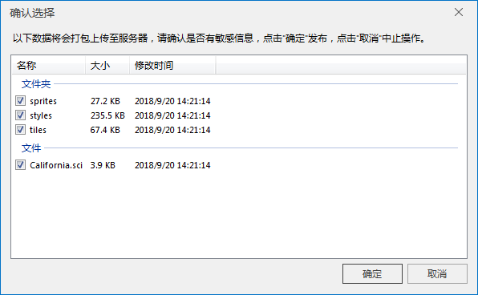
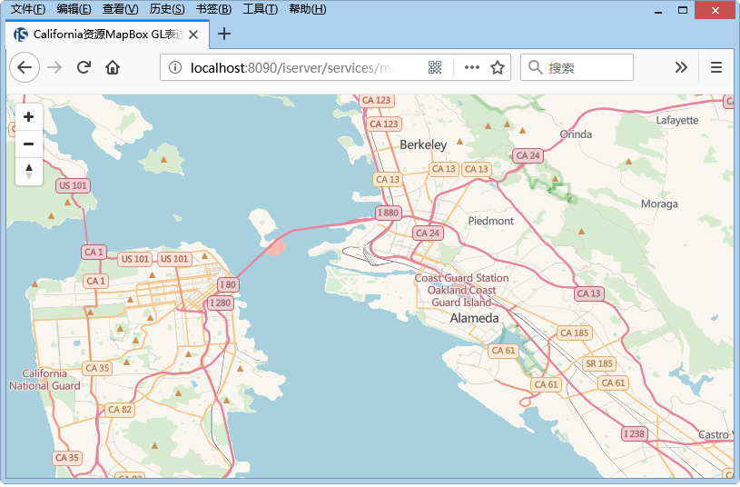

### 使用说明

支持将矢量瓦片和栅格瓦片作为数据来源直接发布为地图服务，以Web 形式进行浏览查看以达到资源共享。在发布瓦片服务之前，要确保在本地或远程启动了
iServer 服务，并有管理员账号，才可发布服务。

### 操作步骤

1. 启动 iServer 服务，默认在 SuperMap iServer的bin 目录下运行 startup.bat/startup.sh 之后处于启动的状态。
2. 在“ **在线** ”选项卡的“ **发布iSever服务** ”组中，单击“ **本地瓦片** ”按钮，弹出“ **发布本地瓦片** ”对话框。
3. **iSever 服务地址** :输入发布服务的iServer 地址。单击组合框下拉按钮，选择“新建连接”，弹出“登录SuperMap iServer”对话框，输入服务地址、管理员账户及密码，即可登录。登录成功后程序会自动保存连接过的地址，用户后续登录时可选择历史记录实现快速登录。服务地址支持输入自定义iServer安装目录/webapps/iserver文件夹名称后的服务地址，同时兼容了 localhost、http、https 三种 iServer 服务地址格式，格式如下：

    * localhost:8090
    * localhost:8090/iserver
    * localhost:8090/userdefine
    * http://localhost:8090
    * http://localhost:8090/iserver
    * http://localhost:8090/userdefine
    * https://localhost:8443
    * https://localhost:8443/iserver
    * https://localhost:8443/userdefine

注：若未启动iServer 服务或管理员账号、密码输入错误，将无法正常登录，请确认链接信息是否正确再重新登录。

4. **瓦片地址** ：在界面中选取要发布的缓存配置文件（*.sci），程序会根据缓存配置文件（*.sci）的路径，读取缓存数据。 

**上传本地瓦片文件** ：设置是否上传本地瓦片。如果不上传本地文件，当文件目录发生变更时会导致服务不可用。

5. **REST 服务** ：支持发布为REST 地图服务，有关REST 服务类型的详细介绍请参看[REST 服务](../TechDocument/WebDatasets/AboutWebDataset)。
6. **OGC 服务** ：包括 WMS1.1.1服务、WMS1.3.0服务、WMS1.0.0服务、WMTS-CHINA服务。有关OGC 服务类型的详细介绍请参看[OGC 服务](../TechDocument/WebDatasets/AboutWebDataset)。
7. **其他服务** ：包括 ArcGIS REST地图服务，Google REST 地图服务、Baidu REST 地图服务。
8. 完成参数设置，单击“ **发布** ”按钮，弹出“ **确认选择** ”对话框，对话框中显示缓存目录中的数据，用户通过勾选确认需要打包上传的数据。
    

    * 当发布数据为矢量瓦片时，用户可选择是否上传瓦片和瓦片风格文件。
    * 当发布数据为栅格瓦片时，用户可选择是否上传瓦片数据。  

9. 单击“确定”按钮，完成发布瓦片服务的操作。输出窗口处会提示发布是否成功，若发布成功，输出窗口会显示所发布的服务地址和浏览地址。用户可复制服务地址，在当前工作空间以 web 型数据源打开 iServerREST 服务查看；也可直接单击浏览地址查看服务发布的结果。
  

###  相关主题

 [地图瓦片](MapTiles)

 [发布 MongoDB瓦片](PublishMongoDBTile)

