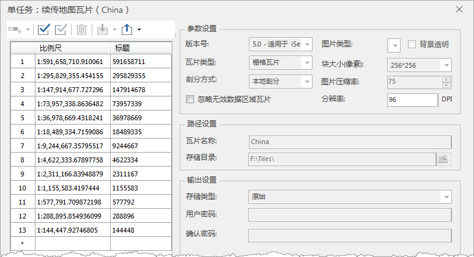

### 使用说明

当切图过程中遇到了断电、程序意外退出等导致切图中断时，往往需要重新开始切图，对于数据量大的情况，会非常耗费时间。

SuperMap 桌面提供续传/恢复地图瓦片功能，当您遇到程序意外中断时程序会在瓦片配置文件*.sci 的同级目录下，生成一个*.log
文件，该文件记录了切图中断时刻的切图信息，续切瓦片功能通过读取该文件继续瓦片配置文件*.sci 中未完成的切图任务，继续您的切图任务。

  * 续传瓦片只支持对栅格瓦片进行操作
  * 续传瓦片只支持单任务操作。

### 功能入口

  * 在工作空间管理器->“地图”节点->选择需要生成地图瓦片的地图，右键选择“ **生成地图瓦片（单任务）** ”项。
  * 打开待切地图，在地图窗口右键选择“ **生成地图瓦片（单任务）** ”项。
  * 打开待切地图，单击 **地图** 选项卡-> **制图** 组-> **单任务** 按钮。

### 操作说明

  1. 在弹出“ **生成地图瓦片（单任务）** ”对话框中选择“ **续传/恢复瓦片** ”，并在“地图瓦片配置文件”处选择需要续传的*.sci 文件。
  2. 通过瓦片配置文件（*.sci）文件路径，程序会自动判断同级目录下是否有 resume.log 文件，若没有则会弹出一个 massageBox 提示用户缺少 log 文件，不能进行瓦片续切；若存在则弹出“ **单任务：续传地图瓦片** ”对话框。
  
---  
图：续传瓦片  
  3. 程序通过瓦片配置文件（*.sci）读取切图比例尺，及相关瓦片参数，对话框的参数均默认不可修改，单击“生成”即可续切瓦片配置文件*.sci 中未完成的切图任务。

### 相关主题

  [地图瓦片](MapTiles)

  [更新瓦片](UpdateTiles)

  [瓦片检查](CheckTlies)

  [瓦片管理](MongoDBTilesManger)

  [加载 MongoDB 瓦片](AddMongoDBTiles)

  

