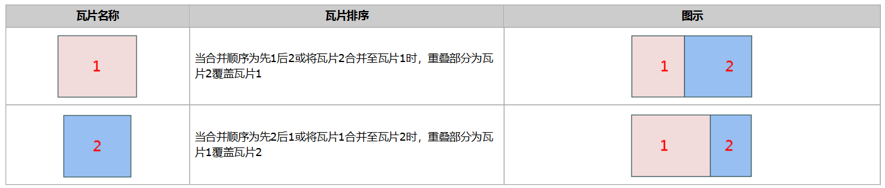

### 使用说明

SuperMap 桌面产品支持瓦片合并功能，是将分别存储在本地或 MongoDB 数据库中的瓦片进行合并，可合并至已有的MongoDB瓦片，或合并至新建
MongoDB 数据库。

可用于整合不同区域的数据或同一区域不同时期的数据，避免了用户重复切图，提升了工作效率。 例如同一地方每年的降水数据有一个MongoDB
库缓存，将每年的数据合并到一个 MongoDB 库里可做成多版本缓存。

**瓦片合并类型**

支持本地瓦片与 MongoDB 瓦片之间相互合并，瓦片合并类型有：

  * 支持本地瓦片与 MongoDB 瓦片之间进行合并；
  * 支持 MongoDB 瓦片与 MongoDB 瓦片之间进行合并；
  * 支持本地瓦片与本地瓦片合并。

**瓦片合并条件**

在进行 MongoDB 瓦片合并前需确保本机启动了 MongoDB 服务，同时合并的 **瓦片还需要具备以下条件** ：

  * 合并瓦片的坐标系一致。
  * 瓦片块大小一致。
  * 合并瓦片的源点坐标一致，源点坐标即索引范围一致，可在生成地图瓦片时对瓦片范围参数设置时调整成一致。
  * 合并瓦片的图片类型相同。

**注意** ：合并瓦片必须同时满足以上四个条件，合并才能成功，否则将提示合并失败。

### 功能入口

**数据** 选项卡-> **数据管理** -> **瓦片管理** 按钮，弹出 **瓦片管理** 窗口。

### 操作说明

1. **添加瓦片** ：添加 MongoDB 瓦片及本地瓦片，详细操作可查看加载瓦片。
2. **合并瓦片** ： 单击工具条中的“合并”按钮，弹出“ **合并 MongoDB 瓦片** ”对话框， 
    * 在对话框的左侧设置合并数据的存储方式，程序提供两种方式： 
      * 方式一： **合并至已有** ，即将多个版本的数据合并至已存在的某一版本的瓦片数据中，可单击右侧下拉框，在下拉列表中选择瓦片名称。
      * 方式二： **合并至新建** ，即设置新的 MongoDB 数据库作为合并后数据的存放位置。输入以下MongoDB 瓦片参数：服务器名称、数据库名称、及设置合并后瓦片的名称（即瓦片根目录的名称）。 
    * 在对话框右侧“ **设置** ”区域，设置参与合并的瓦片、合并顺序以及合并后的目标版本： 
      * 参与合并版本：在瓦片列表前勾选参与合并的瓦片;
      * 瓦片顺序：列表中瓦片的上下顺序影响合并结果，通过瓦片列表框上侧的顺序调整按钮，调整瓦片的合并顺序。合并操作顺序是由上到下依次进行。如下图以合并瓦片1和瓦片2为例：

  
  
**瓦片合并重叠部分处理：** ：

  * 当选择合并的瓦片图片类型为 PNG 且背景透明时，瓦片重叠区域程序会做融合处理,可用于处理数据合并接边的问题。 
  * 当选择合并的瓦片类型为 JPG_PNG 格式时，对于包含无效数据像元的切片（地图边界处），其文件格式为 PNG，否则为 JPG 格式，瓦片重叠区域程序可根据瓦片是否包含无效数据像元来自动判断使用哪种格式，可用于解决瓦片接边处的白图问题。 
  * 除上述两种瓦片类型，其他类型合并瓦片的重叠区域均按照瓦片合并顺序进行覆盖操作。
* 目标版本：支持将多版本合并为一个版本，同时支持合并至一个数据库下多个版本。 
  * 若要将多个版本合并为一个版本，此处目标版本的名称应设置为同一名称；例如将四川省和青海省两省的电子地图合并为一份数据，此处目标版本名称一致。
  * 若是将不同数据库的不同版本合并至当前数据库的多版本，则可保持不同版本的名称，即为同一数据库下不同版本。例如将分别在5个数据库的不同月份的降水数据合并到一个数据库下的不同版本，此处保持不同版本名称。
* **开启多进程合并** ：支持设置多进程进行瓦片合并，用户可根据机器资源合理设置进程数，提升合并性能。（仅iDesktop 支持） 
  3. ，单击“确定”按钮，执行合并操作，合并完成后，在输出窗口会给出合并成功的提示。可通过“加载 MongoDB 瓦片”查看合并后的瓦片数据。

### 应用实例

全球晕渲图栅格瓦片数据分为上、下两部分分别存储于本地和 MongoDB 中，现需要将两份数据合并为一份数据进行使用，通过瓦片合并功能得到如下图所示的结果：

  

  
### 注意事项

如若合并的瓦片数据，坐标系不一致，会提示合并失败。

  [瓦片管理](MongoDBTilesManger)

  [瓦片分发](DistributeTiles)

  [地图瓦片](MapTiles)

