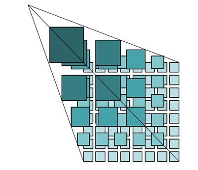

地图瓦片技术是将地图数据切分为多种格式、多种存储的瓦片，瓦片是地图瓦片的具体存储形态，提前切好的瓦片可以大大提高在线地图的访问效率。SuperMap
iDeaktop 提供的瓦片类型包括： 传统的栅格瓦片和矢量瓦片。

###  栅格瓦片

栅格瓦片是一种比较传统的模式，其本质上是将空间数据（栅格数据和矢量数据）分别渲染为不同缩放级别的地图图片，然后将各个级别的图片按照一定规则切分，按照一定的
“规则组织”，存储到硬盘或数据库中，构成一幅完整的地图。

随着Web
GIS的发展，用户对地图显示与传输要求提高，栅格瓦片技术很好的解决了这一问题，极大地降低服务器和网络带宽的负担，提升地图浏览速度。目前，国内的大多数在线地图应用，如百度地图、Bing
Maps、Google Maps等都采用了栅格瓦片技术加载地图底图。

  
---  
图：栅格瓦片结构示意  
  
有关生成栅格瓦片的内容，请参看[生成地图瓦片](MapTileMode)。

###  矢量瓦片

以图片为介质的栅格瓦片打开了互联网地图的大门，互联网地图得以迅速普及。但是，随着地图的移动化和应用的逐渐深入，栅格瓦片体积大、生成效率低等缺点愈加明显，已经无法满足应用的需求，矢量瓦片应运而生。矢量瓦片是将地图中的矢量图层以瓦片的形式进行切分和存储。

矢量瓦片在存储时，其相对于栅格瓦片体积小，生成效率高，适合地图中时效性要求较高的地物要素的表达，如POI信息、路线信息等。应用场景如在天地图中，POI图层采用矢量瓦片技术，满足数据的实时更新需求。同时，可以实现地图离线，大幅提升了移动端地图的浏览性能，提高了工作的可能性和有效性。

另外，矢量瓦片支持样式的修改，不再需要为不同的样式而反复进行制图、渲染、切片、更新服务等过程。应用场景如在国土等行业的应用中，涉及海量数据，当地图样式发生变化时，使用栅格瓦片需要重新切图，花费大量时间，而应用矢量瓦片，可以直接更改样式，省时省力。

有关生成矢量瓦片的内容，请参看[矢量瓦片](VectorTiles)。

###  瓦片格式对比

以下从瓦片体量、生成瓦片效率等9个方面对比栅格瓦片和矢量瓦片，您可根据数据情况，选择生成适合的瓦片类型。

  * **瓦片体量** ：矢量瓦片体积小，可高度压缩，占用的存储空间比栅格瓦片要小上千倍。一方面减小网络带宽消耗，另一方面使地图离线成为可能。
  * **生成瓦片效率** ：矢量瓦片相较栅格瓦片生成效率高，节约时间。
  * **瓦片更新** ：对于栅格瓦片而言，要重新渲染、切图，才能实现瓦片的更新；矢量瓦片样式和瓦片分开存储，当只有图层样式发生改变时，只需要更新风格样式即可。
  * **样式修改** ：矢量瓦片支持样式的修改，不再需要为不同的样式而反复进行制图、渲染、切片、更新服务等过程；栅格瓦片不支持修改样式。

现今，栅格瓦片广泛应用于在线地图服务中，成熟度较高；而矢量瓦片作为新兴技术，因成熟度不高，仍具有一些不足，如对前端技术的要求比较高，显示效果与源数据存在差异等问题。

对比项 | 矢量瓦片 | 栅格瓦片  
---|---|---  
瓦片体量 | 小 | 大  
生成瓦片效率 | 高 | 低  
更新瓦片 | 样式和瓦片分离，支持分开更新瓦片 | 重新切图  
样式修改 | 支持 | 不支持  
前端技术要求 | 高(HTML5) | 低  
显示差异 | 有差异 | 无差异  
成熟度 | 一般 | 高  
应用场景 | 特殊（移动端、风格修改） | 广泛  
  
### 相关主题

 [地图瓦片](MapTiles)

 [地图瓦片存储类型](MapCacheType)

 [地图瓦片目录结构](MapCacheFolder)

 [使用地图瓦片的建议](AdviceAboutMapCache)

