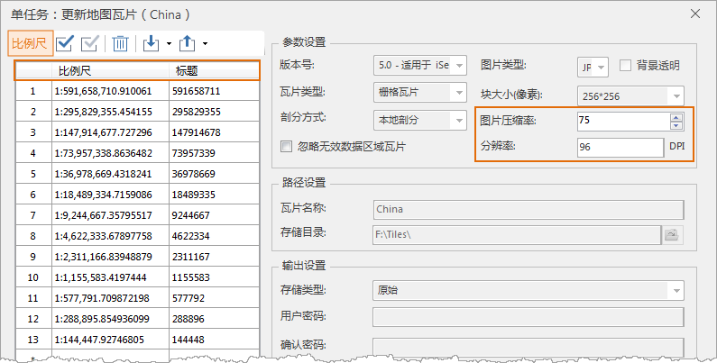

### 使用说明

更新瓦片功能是指更新特定比例尺、指定瓦片范围内的瓦片。适用于：某地区的地图已切好瓦片，其中，某一块区域内的地物要素有变更，需要更新该区域范围内的瓦片。此时，通过“更新瓦片”功能，设置更新的瓦片参数即可该区域的瓦片。

同时支持 **单任务** 和 **多任务** 两种方式进行瓦片更新。两种切图方式的入口不同，更新原理相同，都是通过设置的地图瓦片配置*.sci
文件，重新指定待更新的瓦片范围、比例尺、图片压缩率，对瓦片进行更新。

#### 更新瓦片入口

* **单任务更新瓦片** ：在“地图”选项卡的“制图”组中单击“单任务”按钮，在弹出”生成地图瓦片（单任务）“对话框中选择“更新/追加瓦片”。
* **多任务更新瓦片** ：在“地图”选项卡的“制图”组中单击“多任务”按钮，在弹出”生成地图瓦片（多任务）“对话框中选择“更新/追加瓦片”。

  

#### 设置更新瓦片参数

* **比例尺** ：在更新地图瓦片对话框中，可更新通过添加、删除比例尺的功能，设置需更新的瓦片比例尺。
* **图片压缩率** ：可重新指定瓦片的图片压缩率，图片压缩率的范围为0-100。
* **重新指定瓦片范围** ：在范围参数面板，设置待更新范围的即可。注意：索引范围不可更新，与原*.sci瓦片文件的索引范围一致，便于索引到指定范围内的瓦片。

#### **执行切图** ：

* **单任务更新瓦片** ：完成更新瓦片参数设置，单击“下一步”可直接进行单任务更新瓦片操作。
* **多任务更新瓦片** ：完成更新瓦片参数设置，单击“下一步”后，会弹出“多任务切图”对话框，用户需设置任务数，进行多任务更新瓦片，有关多任务切图的详细说明请参看：[多任务切图](MultiTaskStep.htm)。

