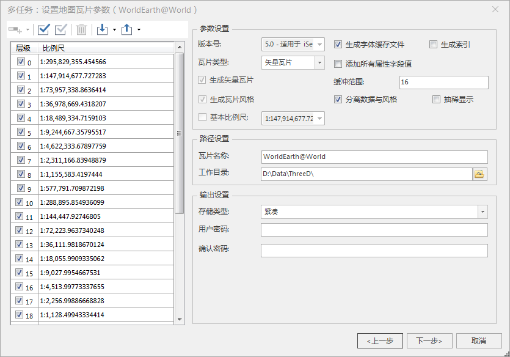
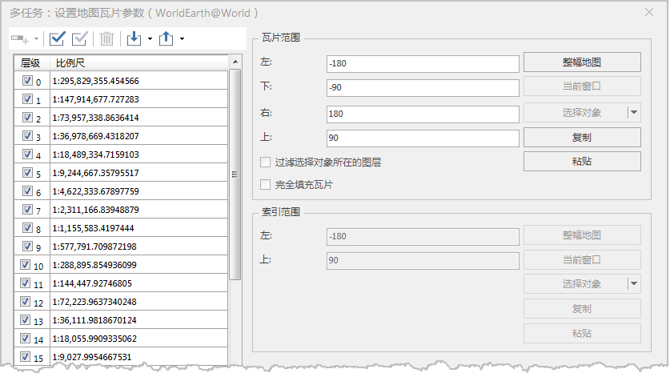

### 使用说明

桌面产品支持将矢量地图生成遵循 MapBox MVT规范的矢量瓦片，瓦片数据包含要素的几何形状与属性信息，而要素的风格样式由 MapBox
标准样式文件（style.json）描述。矢量瓦片相比栅格瓦片具有无级缩放，风格修改，数据量相对较小的优势，能更好满足灵活多样的 Web
地图应用。有关栅格瓦片和矢量瓦片的描述和对比，请参看[地图瓦片类型](TilesType)页面。在本章节您将了解到如下内容：

[ 矢量瓦片风格](VectorTiles)

[ 如何生成矢量瓦片？](VectorTiles)

[ 矢量瓦片结果目录](VectorTiles)

###  矢量瓦片风格

SuperMap 生成的矢量瓦片将基于 MapBox 样式文件在 SuperMap iClient 客户端进行显示，客户端使用 MapBox GL 或者
OpenLayers 渲染显示矢量瓦片。SuperMap
地图中的点、线、面、文本图层支持切分为矢量瓦片（如果地图中包含其他图层，如影像、栅格图层，切矢量瓦片时将忽略这些不支持的图层），图层风格等将根据
MapBox GL 版本8的样式规范生成瓦片风格文件。关于 MapBox 样式，请参见：[ https://www.mapbox.com/mapbox-
gl-style-spec](https://www.mapbox.com/mapbox-gl-style-spec)，随着 MapBox GL
版本升级，MapBox 样式也会有相应的更新。

  
---  
图：客户端使用 MapBox GL 渲染显示矢量瓦片  

###  生成矢量瓦片

生成矢量瓦片与生成栅格瓦片的操作大致相同，同时支持“ **单任务切图** ”和“ **多任务切图** ”。以下以多任务生成矢量瓦片为例，描述具体操作。

  1. 在地图右键菜单中，选择“ **生成地图瓦片（多任务）** ”。在 **“生成地图瓦片（多任务）”** 对话框中选择“ **新建切图任务** ”选项。
  
---  
图：设置矢量瓦片生成参数  
  2. **选择瓦片类型** ：在弹出的“多任务：设置地图瓦片参数”对话框右侧参数设置区域的“ **瓦片类型** ”处选择“ **矢量瓦片** ”。
  3. **选择比例尺** ：矢量瓦片采用的是全球剖分层级，通过勾选对话框左侧的比例尺层级复选框，选择要生成的比例尺级别。
  4. **参数设置** ：由于生成矢量瓦片时瓦片、瓦片风格、瓦片字体文件是分开存储的，因此可实现三者的独立生成和更新，通过“生成矢量瓦片”、“生成瓦片风格”、“生成字体缓存文件”三个复选框进行控制。需要注意的是生成字体缓存文件依赖生成瓦片风格，因此在选择“生成字体缓存文件”时需同时勾选“生成瓦片风格”；而“生成瓦片风格”不受“生成字体缓存文件”的限制，当用户只需要生成瓦片风格文件，建议可选择不生成字体文件，因为生成字体过程会比较耗时。 
    * **生成矢量瓦片** ：生成结果存储在 tiles 文件夹中。
    * **生成瓦片格式** ：生成包含地图转换对应风格的*.json 文件，生成结果存储在 sprites 和 styles 两个文件夹中。 
    * **生成字体缓存文件** ：生成地图的字体文件，当用户需要对字体风格单独更新的时候，勾选该选项，生成结果存储在 fonts 文件夹。
    * **添加所有属性字段值** ：生成的瓦片中，包含了对应数据集几何对象所带的全部非系统字段。
    * **缓冲范围** ：设置瓦片缓冲范围，每张瓦片按照设置的范围值向四周扩大，即生成的瓦片包含了缓冲区范围内的数据。设置缓冲范围的意义是在浏览瓦片时，相邻瓦片的边界可以无缝衔接。
    * **生成索引** ：默认勾选，在生成的矢量瓦片中若存在矢量面，那么会把矢量面三角化成三角网，将这个三角网索引生成出来，可加快在WebGL的加载速度。

**注意**

    * 在使用单任务生成矢量瓦片时，“生成矢量瓦片”、“生成瓦片格式”、“生成字体缓存文件”三者可分别独立选择是否生成对应结果。
    * 在使用多任务生成矢量瓦片时，程序默认勾选“生成矢量瓦片”和“生成瓦片格式”不可更改，用户可选择是否“生成字体缓存文件”。
    * 如果地图中的图层使用了过滤表达式或者标签带有背景，将不支持矢量瓦片数据和样式的独立生成和更新，否则，所生成的瓦片数据和风格对应有误。
  5. **路径设置** :设置瓦片名称和工作目录。
  6. **存储设置** ：支持原始、紧凑和 MongoDB 存储类型。有关存储类型的更多内容，请参见[地图瓦片存储类型](MapCacheType)。
  7. **设置瓦片生成范围** ：单击“下一步”，指定瓦片范围。
  
---  
图：设置矢量瓦片范围  
  8. 所有参数设置完成后，单击“生成”按钮，后台执行拆分任务完成后，将弹出“多任务切图”对话框，设置多任务切图的进程数，有关参数的具体描述请参看[多任务切图](MultiTaskStep)。
  9. 设置完成后，单击“生成”，开始多进程切图。

**注意事项** ：

  * 矢量瓦片不支持平面坐标系的地图。如果地图为非平面坐标系，但图层对应数据集为平面坐标系，需修改数据集的坐标系为非平面坐标系。
  * 矢量瓦片不支持“完全填充瓦片”设置。
  * 矢量瓦片不支持更新/追加瓦片，不支持续传/恢复瓦片。
  * 多任务切图，只支持生成5.0版本的瓦片。

###  矢量瓦片结果目录

执行切图任务完成，在输出窗口会提示地图生成平面地图瓦片成功。在输出路径下，将产生如下所示的文件夹和文件。

  
---  
图：矢量瓦片目录结构  
    * **fonts** ：矢量瓦片使用的字体文件。
    * **sprites** ：矢量瓦片图标相关风格内容资源。
    * **styles** ：矢量瓦片风格描述文件；
    * **tiles** ：矢量瓦片数据。当存储类型为原始型时，生成的瓦片格式为*.mvt文件；当存储类型为紧凑型时，生成的瓦片格式为*.cf文件。 

在tiles文件夹下，瓦片按照比例尺层级进行分文件夹存储，文件夹名称为全球剖分层级，级数从0开始计数。层级文件夹下的子文件夹命名为全球剖分的列号，文件名称为全球剖分的行号。

    * **sci文件** ：矢量瓦片的元信息描述文件，记录了数据的投影、地理范围、层级比例尺等信息。 

### 生成矢量瓦片风格

矢量瓦片的最大特点之一就是瓦片数据与风格独立，因此，能够通过修改瓦片的风格来改变矢量瓦片地图的显示效果，无需重新创建矢量瓦片。

SuperMap 桌面提供单独 **生成矢量瓦片风格** 入口，在不改变瓦片数据的基础上，单独生成对应地图的风格。具体操作如下:

  1. 打开矢量地图，在地图窗口右键菜单选择“生成矢量瓦片风格”项，弹出“生成矢量瓦片风格”对话框。
  2. 在对话框中设置生成风格的路径，即可生成新的矢量瓦片风格。
  3. 结果文件包含三个文件夹，包括： **fonts** （矢量瓦片使用的字体文件）、 **sprites** （矢量瓦片图标相关风格内容资源）、 **styles** （矢量瓦片风格描述文件）。
  4. 最后，将新创建的矢量瓦片风格内容替换到待更新风格的矢量缓存目录，即可将当前矢量瓦片按照新生成的瓦片风格进行显示。

###  相关主题

 [地图瓦片](MapTiles)

 [制图最佳实践](VectorTilesNotice)

 [矢量瓦片常见问题解答](VectorTilesFAQ)

