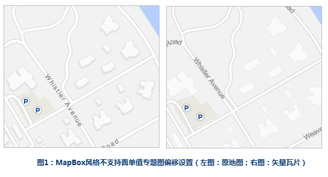
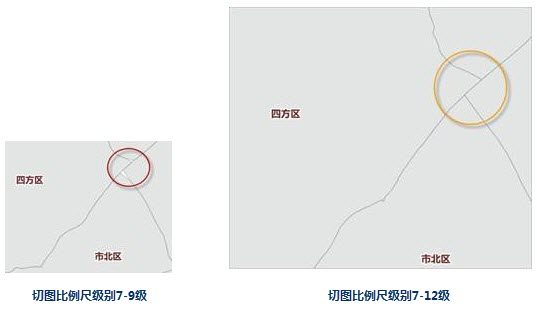

**关于数据坐标系问题：**

**问：** | **刚刚启动生成矢量瓦片，就提示生成失败。**  
---|---  
**答：** |
请检查地图数据，是否存在数据的坐标系无法转换到地图显示坐标系，或者数据的坐标系为平面坐标系。若存在，先对数据进行坐标系处理，使之可以正确转换到地图显示坐标系。  
  
**关于矢量瓦片缺失图层问题：**

  
---  
**问：** | **地图中使用面单值专题图，使用偏移设置来模拟建筑物立体阴影的图层，矢量瓦片中不见了，如上图1。**  
---|---  
**答：** |  目前，MapBox 不支持单值专题图的偏移设置。  
**问：** | **地图中的个别图层，在切出的矢量瓦片中不显示了。**  
**答：** |  这种情况大多是因为矢量瓦片基于 MapBox 风格显示，而 SuperMap 的一些符号或者图层设置 MapBox
风格不支持。所以，请您检查地图数据是否使用了某些不支持的风格等设置，例如：是否存在不支持的专题图、丢失的图层是否为CAD图层（矢量瓦片不支持CAD图层）等。  
  
**关于矢量瓦片要素变形问题：**

**问：** | **切出的矢量瓦片，要素出现变形，一般出现在行政界线和河流要素。**  
---|---  
**答：** |
要素变形主要原因在于：生成矢量瓦片时，矢量瓦片对节点密集的对象进行抽稀的结果，建议在小比例尺下，地图使用适宜复杂度的对象，例如，制图最佳实践中“降低数据复杂度”中列举了此种情况。
还有一种情况，如果这种情况出现在矢量瓦片放大浏览以后，那说明您切图的比例尺级别不够，您只需要增加切图比例尺级别就行，如下图所示。  
  
---  
  
###  相关主题

 [地图瓦片](MapTiles.html)

 [矢量瓦片](VectorTiles.html)

 [制图最佳实践](VectorTilesNotice.html)

* * *

  
  
---

