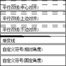
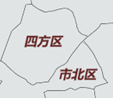
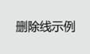

生成矢量瓦片，首先要准备一幅有效的矢量地图，SuperMap地图中的点、线、面、文本图层都支持生成矢量瓦片，并且SuperMap地图要素的符号化、图层设置等绝大多数都能被MapBox样式支持；但是，由于MapBox风格显示表达与SuperMap不同，所以矢量地图的制作存在一些局限性和注意事项，下文以地图制作的一般流程为主线，详细介绍您需要重点关注的制图内容，包括：数据坐标系、数据复杂度、地图符号化等风格设置以及图层可见比例尺范围等，以保证矢量瓦片创建的正确性和高效性。

 数据坐标系

 降低数据复杂度

 符号化地图

 文字的效果

 制作专题图

 限制可见比例尺

 瓦片与地图显示差异

###  数据坐标系

实际制图中，如果数据的坐标系与地图显示坐标系不同，可以开启动态投影实现正确显示，利用这种地图创建矢量瓦片，建议用户先将数据的坐标系转换为地图显示坐标系，再生成矢量瓦片。原因是：矢量瓦片数据的坐标系将使用地图显示坐标系，如果数据的坐标系与地图显示坐标系不同，在切矢量瓦片时，系统会对数据进行坐标系转换，转为地图显示坐标系；如果地图数据量很大，坐标系转换操作会占用较大的磁盘空间和切图时间，影响切图效率。

###  降低数据复杂度

在生成矢量瓦片时，为了提升瓦片生成和显示效率，切图时将对节点密集的对象进行抽稀，减少节点冗余，在大多情况下，这种抽稀在视觉上将不太明显，但也存在特殊情况，例如：小比例尺下河流使用了面状河流，如下图（左图）所示，河流面对象节点密集，形状复杂，经过抽稀后，矢量瓦片结果为下图（右图），对象发生明显变形。因此，建议用户在创建用于切矢量瓦片的地图时，确保不同显示比例尺下，地图对象具有合理的复杂度，这里建议小比例尺下河流采用线对象表达。

|   
---|---  
图 ：左图地图中的线型在右图矢量瓦片中的显示效果  
  
另外，如果地图要素包含了太多的子对象，在创建矢量瓦片时将影响切图速度，因此，建议对子对象进行拆分，以提高切图效率。

###  符号化地图

MapBox 支持几乎所有的 SuperMap
点符号、支持常用道路等线型符号、支持常用的面填充符号。用于创建矢量瓦片的地图应避免使用复杂的符号，它们可能在矢量瓦片中无法正确显示。另外，对于MapBox不支持的一些符号，可以通过下文的替代方案替换原有符号。

以下表格为 MapBox 样式不支持的 SuperMap 点、线符号及替代方案。

**符号类型**

|

**SuperMap** **符号**

|

**矢量瓦片显示效果**

|

**替代方案**  
  
---|---|---|---  
  
点

|

|

|

新建一个点符号，绘制方形几何对象获得方点符号。  
  
线

|

|

|

新建一个线型，添加短横线（系统线型）子线，调整子线的虚实模式获得需要的虚线线型。  
  
**符号类型**

|

**SuperMap** **符号**

|

**矢量瓦片显示效果**

|

**替代方案**  
  
线

|

包含下列子线的线型：

|

|

新建一个线型，添加短横线（系统线型）子线，调整子线的虚实模式获得需要的虚线线型。  
  
**以下表格为 MapBox 样式不支持的 SuperMap 面符号及替代方案。**

**符号类型**

|

**SuperMap** **符号**

|

**矢量瓦片显示效果**

|

**替代方案**  
  
---|---|---|---  
  
面

|

|

|

首先，将这些填充样式制作为图片；然后，新建填充符号，将图片作为图像填充子层添加进来。  
  
综上可知，MapBox 不支持的符号，根据符号类型，矢量瓦片显示为对应的圆点、实线、纯色填充。MapBox样式对于面符号轮廓线的支持与线型符号的完全一致。

**注意事项** ：

  * 矢量瓦片的显示不支持符号随图缩放。
  * 对于自定义线型，MapBox 样式支持包含多个子线的线型符号，但每个子线的类型必须是“短横线(系统线型)”。另外，MapBox 样式不支持子线的偏移设置和端头符号设置。
|   
---|---  
图 ：MapBox样式支持的子线类型 | 图 ：子线属性对话框  
  * 对于自定义填充符号，MapBox样式仅支持包含一个填充子层的填充符号，填充子层可以为图像填充或者符号填充类型。

###  文字的效果

MapBox 样式对 SuperMap 地图中文字效果的支持也存在局限性，因此，需要您关注地图中所有文字的风格设置，避免使用 MapBox
样式不支持的字体效果，具体情况如下：

**文字效果**

|

**地图**

|

**矢量瓦片**

|

**是否支持**  
  
---|---|---|---  
  
加粗

轮廓

|

|

|

**√**  
  
加粗

斜体

|

|

|

**√**  
  
阴影

|

|

|

**×**  
  
下划线

|

|

|

**×**  
  
删除线

|

|

|

**×**  
  
**注意事项** ：

  * 在生成矢量瓦片时，地图中的文本需要设置固定大小，否则，瓦片显示的文字效果与原地图可能存在差异。
  * 对于文本图层，矢量瓦片将使用图层中第一个文本对象的风格作为本图层所有文本的风格。
  * 文字使用了加粗和斜体效果时，需要保证计算机中有相应字体的粗体和斜体字库，这样生成的矢量瓦片中文字的加粗和斜体效果才有效，例如：文字使用了微软雅黑字体，并设置加粗和斜体，那么您的电脑中要同时具有微软雅黑粗体字库和微软雅黑斜体字库。
|  
---|---  

###  制作专题图

地图中一般会使用专题图来丰富地图表达的内容，如统计信息、分类信息等，但是，MapBox 样式只支持 SuperMap
部分类型的专题图，具体参见下面的表格。如果地图中包含了下面不支持的专题图，生成矢量瓦片时将忽略这些专题图层。

  
---  
图：MapBox 样式对 SuperMap 专题图支持情况  
|   
---|---  
图：矢量瓦片中面分段专题图| 图：矢量瓦片中面单值专题图  
  
**注意事项** ：

  * MapBox 样式不支持点、线、面单值专题图的偏移设置。
  * 对于标签专题图所使用的标注字段，目前只支持原生字段值，无法展示 SQL 的函数计算结果，如 name || ‘_’|| type。
  * 对同一点数据集，不支持基于该点数据集的专题图和标签的同时存在，否则会出现点专题图的点符号丢失的情况；可以使用点普通图层替代点专题图来解决该问题。
  * 对同一点数据集，同时存在点普通图层和基于该图层制作的标签专题图时，MapBox 不支持即设置点符号又设置标签背景；否则，点符号会丢失，标签虽然保留，但是，标签背景将偏离标签文字。
  * MapBox 样式只支持两种沿线显示方向（沿线的法线方向以及从上到下，从左到右），若地图设置了其他沿线显示方向，矢量瓦片将使用“从上到下，从左到右”的方向放置标签。

###  限制可见比例尺

通常为了提升地图显示性能，我们会为图层设置可见比例尺范围，这在矢量瓦片应用中，也可以提高矢量瓦片的绘制效率。矢量瓦片采用全球剖分比例尺创建，所以，可以参照全球剖分比例尺调整矢量地图中各个图层的可见比例尺范围。

###  瓦片与地图显示差异

由于 MapBox 风格显示表达与 SuperMap
不同，所以在一些地图显示细节方面，二者存在差异。下文为您展示两者主要的显示差异，帮您清楚地了解矢量瓦片的生成结果。下文截图都将使用 MapBox GL
渲染显示矢量瓦片。

  * **文字排版** ：MapBox 对于长标签的换行处理与 SuperMap 不同。当标签专题图应用了标签换行方面的设置以及多行文本排版的设置，生成矢量瓦片后，瓦片中的显示效果与地图有较大差异。 

**地图**

|

**矢量瓦片**  
  
---|---  
  

换行显示，单行文本字数为16，多行文本居中对齐

|

换行显示的位置不同于地图  
  

设置标签文本单行显示

|

换行显示  
  
  * **沿线标注** ：MapBox对于沿线标注的处理与SuperMap不同，因此，矢量瓦片显示的沿线标注效果与原始地图存在差异。 

**地图**

|

**矢量瓦片**  
  
---|---  
  

设置沿线标注字间距1.3倍

|

沿线标注字间距很小  
  

|

沿线标注的数量和标注出现的位置与地图不同  
  
  * **避让与压盖设置** ：MapBox 对地图中要素的避让处理与 SuperMap 不同，导致两者在标签显示的数量、标签与点对齐方式等方面存在差异。另外，SuperMap 地图的压盖设置，在矢量瓦片显示时无效。    
---  
图：矢量瓦片不支持地图压盖设置  

###  相关主题

 [地图瓦片](MapTiles.html)

 [矢量瓦片](VectorTiles.html)

 [矢量瓦片常见问题解答](VectorTilesFAQ.html)

* * *

  
  
---

