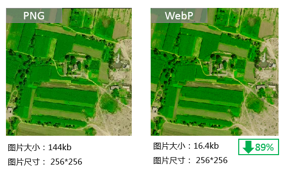
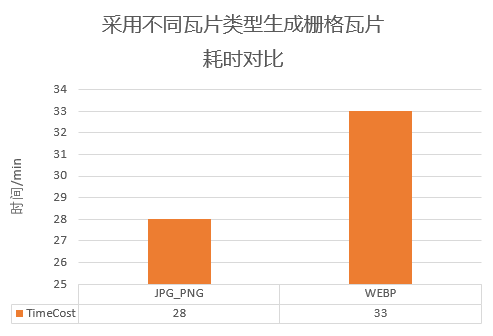
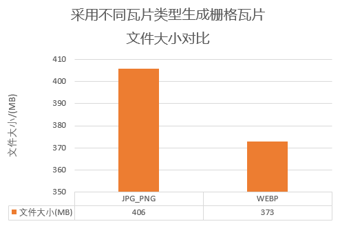
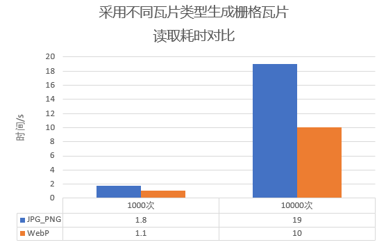
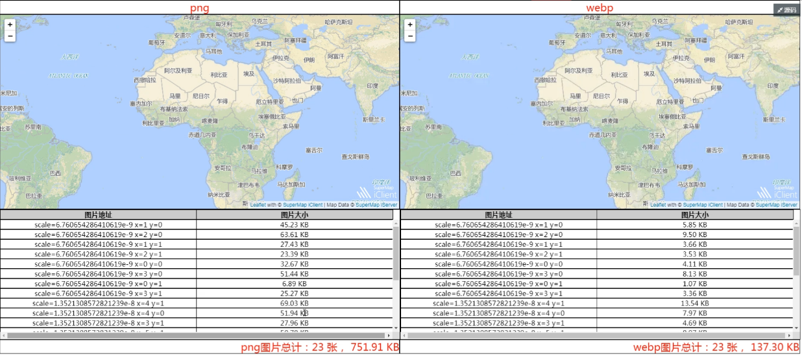

WebP是一种新的图片文件格式，由
Google于2010年推出，目标是减小文件大小，但达到和JPEG格式相同的图片质量。传统基于JPEG或PNG图片格式的网页，其图片资源加载往往都占据了页面耗时的主要部分，在保证图片质量的前提下缩小图片体积，是WebP格式相较于其他图片格式的主要优势。

以下将介绍WebP图片格式的优劣势以及应用WebP图片所提升的用户体验。

### WebP优势

下面以一张图片为例：

  
---  
  
WebP 格式相较于PNG格式拥有：

  1. 它具有更优的图像数据压缩算法，在拥有肉眼无法识别差异的图像质量前提下，带来更小的图片体积；
  2. WebP 支持 Alpha 透明和 24位颜色数，不存在 PNG8 色彩不够丰富和毛边问题。

  3. 比同等PNG格式缩小文件体积80%-90%，以此提高了页面载入速度，降低了存储需求，帮助加速网站图形效果。

### WebP劣势

WebP格式图像的编码时间“比JPEG格式图像长8倍”。因此在相同条件下，采用WEBP格式生成栅格瓦片耗时相较其他格式长。

### WebP 性能比对

SuperMap
桌面支持生成WebP格式的栅格瓦片，常用于生成三维场景缓存在保证数据质量的同时，极大的缩小了数据的体积。同时也广泛应用于移动端及Web端，浏览器中应用的网页是使用WebP
格式，可提升加载渲染速度，且不考虑兼容。能够节省用户流量，提升访问速度等。

为了解采用WebP格式作为栅格瓦片的结果的性能，对同一份地图数据分别生成瓦片类型为JPG_PNG和WebP两种格式，测试环境相同，存储类型为原始，切图范围、切图比例尺以及瓦片参数均相同。

得到如下的测试结论：

  1. **耗时对比** :相同条件下，采用WebP格式生成栅格瓦片耗时比JPG_PNG格式长，是JPG_PNG的117.86%。
  
---  
  2. **文件大小对比** ：相同条件下，采用WebP格式生成栅格缓存的文件大小比JPG_PNG格式小，是JPG_PNG的67.24%。
  
---  
  3. **读取测试对比** ：相同条件下，同一张图片WebP格式和JPG_PNG 格式，平均快40%；读取一千次，WebP 用时1.1s，JPG_PNG用时1.8s，WebP 比JPG_PNG 读取快39%；读取一万次，WebP用时10s，JPG_PNG用时19s，WebP格式比JPG_PNG读取快47%。
  
---  

SuperMap
桌面支持直接打开WebP图片格式的瓦片，同时支持将生成的WebP瓦片发布为iSever服务，在iSever端查看。以下为世界地图瓦片发布为iSever服务后，在浏览器中分别以PNG和WebP两种表述形式查看，得到以下结果：某一比例尺下，瓦片数为23张，PNG的图片大小为751.91KB,，WebP的图片大小为137.3KB。WebP比同等PNG格式缩小文件体积80%，以此提高了页面载入速度，降低了存储需求，帮助加速网站图形效果。

WebP
虽然会增加额外的解码时间，但由于减少了文件体积，缩短了加载的时间，页面的渲染速度加快了。同时，随着图片数量的增多，WebP页面加载的速度相对PNG页面增快了，所以，用户使用WebP瓦片浏览能直观体验到性能的提升。

**注意** ：WebP当前仅支持在谷歌浏览器上浏览。

  
---  
  
###  相关主题

  [生成地图瓦片](MapTileMode)

