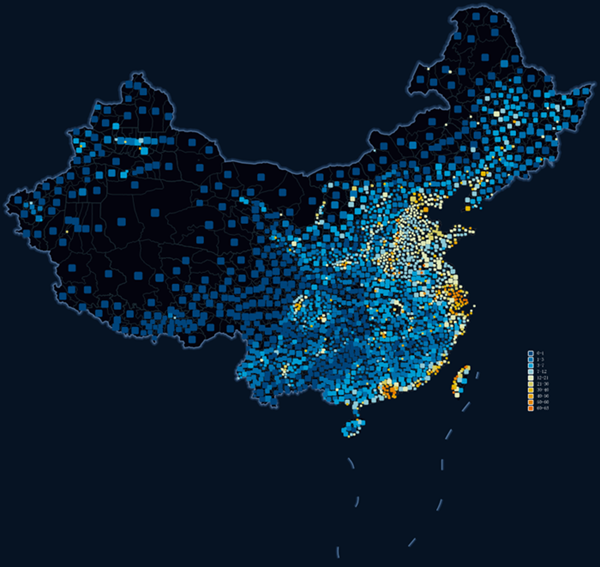

自定义专题图通过自定义属性字段来创建专题图，根据数值型字段的值对应风格设置表来设置显示风格，可以更自由的表达数据信息。

自定义专题图支持编辑功能。自定义专题图可基于任一点、线、面矢量图层制作。在制作自定义专题图时，首先将要制作专题图的矢量图层设置为当前图层，即在图层管理器中选中该矢量图层。

自定义专题图适合用户想要表达内容比较丰富，属性分类结构较多的复杂情况。下图是城市夜间灯光亮度图，将县级行政区的夜间灯光平均亮度统计到县级行政点中，对县级行政点制作自定义专题图，符号大小表示行政区面积，颜色表示灯光亮度。。

  

  

### 制作自定义专题图的两种途径

 [新建自定义专题图](CustomizeMapDefault)

 [修改自定义专题图](CustomizeMapGroupDia)

### 相关主题

 [编辑专题图](../EditingMap/EditingMap)
