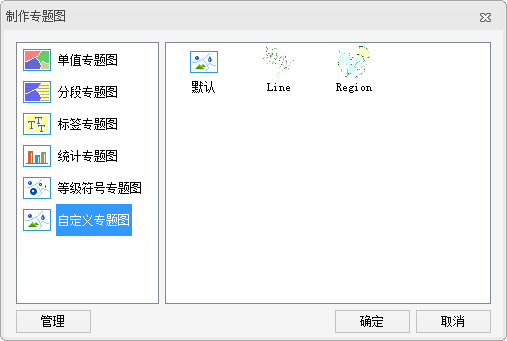

###  使用说明

在制作专题图时，可以基于自定义专题图模板制作专题图。基于专题图模板制作自定义专题图，不仅操作方便快捷，而且容易满足批量制图的需求，从而实现专题模板的重用。

###  操作步骤

1. 在“制作专题图”对话框“自定义专题图”分组中，选择一个题图模板，即可应用模板中的风格创建一幅自定义专题图。 **注意** ：应用程序并未提供相应的自定义专题图模板，下图中的模板仅为示意。
  
2. 基于模板创建的自定义专题图将自动添加到当前地图窗口中作为一个专题图层显示，同时在图层管理器中也会相应地增加一个专题图层。
3. 系统自带的专题图模板和用户自定义的专题图模板都会出现“模板”下拉菜单下，可以通过模板管理器统一进行管理，请参见：[“模板管理”](CustomizeTemplateManager.html)。

###  注意事项

“自定义”专题图的设置窗口对话框中显示了制作当前专题图的设置信息：如自定义专题图的填充方案，线性方案，符号方案等，用户可以在此基础上，对专题图的风格进行重新设置，通过局部修改基于模板生成的自定义专题图获得更符合用户需要的专题图效果。

###  相关主题

<!--  -->
[修改自定义专题图](CustomizeMapGroupDia.html)

<!--  -->
[保存到专题图模板库](../Methods/GURTheme2_SaveThemeTempl.html)