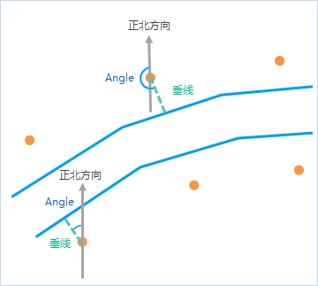
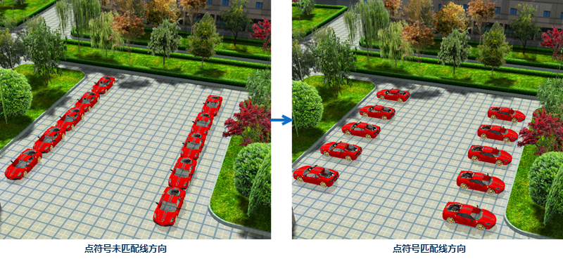

###  使用说明

设置点图层风格或基于点数据集制作自定义专题图时，可设置点符号的旋转角度， **点匹配线方向**
功能可计算点到最近线对象的垂线角度、距离等，计算结果会在点数据集属性表中，记录角度、距离、邻近线ID等信息，并根据指定的点风格和旋转角度，基于点数据集生成自定义专题图。

点数据集属性表中记录的结果说明如下：

  * **邻近线ID** （线数据集名_ID）：最近的线对象 ID；
  * **距离** (Distance)：表示点对象到最邻近线对象的距离，单位与数据集单位一致；
  * **垂点坐标** (ProjectPoint_X、ProjectPoin_Y)：表示垂点的X、Y坐标。
  * **线段索引** (SegmentIndex)：表示邻近线段的索引值；
  * **角度** (Angle)：表示点对象到最近线对象的垂线与正北方向的夹角，及点符号垂直指向线的旋转角度；

**计算原理**

角度计算原理为：点对象到最邻近线的垂线与正北方向的夹角（逆时针方向起算），如下图所示：

  
---  
  
###  应用场景

  * 水电站附属点符号需指向水电站，可通过 **点匹配线方向** 配置自定义专题图，使附属点符号指向水电站。
  * 三维场景中，可通过可通过 **点匹配线方向** 的计算结果，调整汽车符号的旋转角度，使停车场同侧的汽车停车方向一致。

###  功能入口

  * **专题图** -> **自定义** -> **点匹配线方向** ；
  * **地图** -> **制图** -> **点匹配线方向** ；
  * **数据** -> **数据处理** -> **地图制图** -> **点匹配线方向** ；

###  参数说明

  * **点数据集** ：设置需根据线数据旋转点符号方向的点数据集。
  * **参考线数据集** ：设置点数据的参考线数据， **注意** ：线数据集的坐标系需与点数据集一致。
  * **点风格** ：单击右侧点符号按钮，在弹出的 **点符号选择器** 对话框中，设置创自定义专题图中需使用的点符号及其风格，详细说明请参见[点符号选择器](../../SymManager/SymMarkerSelector)页面。单击 **恢复默认** 可将点风格恢复到默认风格。
  * **最大距离** ：点到最邻近线的垂距若大于该值，则该点不参与计算。

**点匹配线方向** 的结果如下图所示，线对象两侧的点符号根据计算的角度旋转后，点符号方向会指向线。

  

### 相关主题

 [新建自定义专题图](CustomizeMapDefault)

 [修改自定义专题图](CustomizeMapGroupDia)

