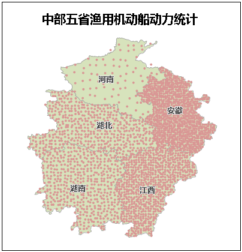

点密度专题图与分段专题图和等级符号专题图类似，同样将矢量图层的某一属性字段信息映射为不同等级，每一级别使用表现为密度形式的点符号表示，点符号分布在区域内的密度高低与该属性字段值成比例，属性值越大专题图上的点符号的分布就更为密集，反之亦同。此外，点密度专题图是
SuperMap
专题图中，唯一仅支持面图层的专题图，其它任何图层均不能创建点密度专题图。点密度专题图多用于具有数量特征的地图上，例如表示不同地区的粮食产量、GDP、人口等的分级。

点击“ **专题图**
”选项卡中的“点密度专题图”按钮，直接生成系统默认风格的点密度专题图。用户也可以通过点密度专题图窗口设置各个参数，自定义制作点密度专题图。下图所示为点密度专题图的示意图，是基于中部五省的地图中，对
2003 年
渔用机动船动力统计数据使用点密度专题图来表示，基准值为一万千瓦。由图可以看出，点符号的密度表示该省机动船动力的大小，安徽省的机动船动力最大，其次为江西省，湖北省和湖南省基本持平，河南省的激动产动力最小。

  
---  
  
点密度专题图可基于任一面矢量图层制作。在制作点密度专题图时，首先将要制作专题图的面矢量图层设置为当前图层，即在图层管理器中选中该面图层。

### 制作点密度专题图的两种途径

 [新建点密度专题图](DotDensityMapDefault)

 [修改点密度专题图](DotDensityMapGroupDia)
