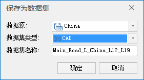

###  使用说明

桌面支持将专题图保存为数据集。目的在于将专题图内容输出为数据集，并保存专题图的风格。例如将标签专题图保存为 CAD 数据集，不仅可以保存标签专题图的文字内容，同时会保存标签专题图的字体风格。

  * 二维矢量专题图均支持保存为 CAD 数据集功能，包括单值、分段、标签、统计、等级符号、点密度和自定义专题图。
  * 二维矢量标签专题图支持保存为文本数据集。
  * 仅支持保存当前比例尺下地图窗口中的可见专题图图层，若当前比例尺图层不可见则会保存失败。
  * 对于使用条件表达式过滤掉的专题对象，以及自动避让未显示的专题对象不会保存到数据集中。

###  操作步骤

1. 在图层管理器中，选中要保存的专题图图层。
2. 单击鼠标右键，在弹出的右键菜单中执行“保存为数据集”；或者，点击“专题图”选项卡“工具”分组中的“保存为数据集”。
3. 在弹出的“保存为数据集”对话框中设置 CAD 或文本数据集要保存的数据源，并输入数据集的名称。<!--    -->
 4. 单击“确定”按钮，将专题图保存为数据集。