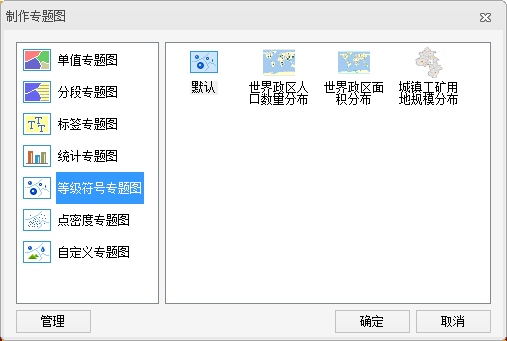

###  使用说明

通过新建等级符号专题图功能，可基于模板制作等级符号专题图。这种制图方式比较快捷，但是距离用户的实际需求会有差距，需要再进行修改才能得到满意的专题图效果。基于专题图模板制作等级符号专题图，不仅操作方便快捷，而且容易满足批量制图的需求，从而实现专题图模板的重用。

在使用专题图模板的时候，需要保证专题图的字段表达式存在。如果当前图层不存在专题图模板中的专题图字段，则会弹出如下图所示的提示对话框，用户需重新指定字段。

###  操作步骤

  1. 在图层管理器中选中一个要制作等级符号专题图的矢量图层。
  2. 在图层管理器中选中一个矢量图层，右键单击，在弹出的右键菜单中选择“ **制作专题图...** ”，在弹出的对话框中单击“等级符号专题图”，在右侧列表框中选择一种等级符号专题图模板，即可创建一幅等级符号专题图。  <!--    -->
  3. 基于模板创建的等级符号专题图将自动添加到当前地图窗口中作为一个专题图层显示，同时在图层管理器中也会相应地增加一个专题图层。

###  注意事项

  * “等级符号专题图”窗口显示了制作当前专题图的默认设置信息，如用于制作等级符号专题图的专题变量，等级符号的风格，以及相关参数设置。用户可以在此基础上对等级符号专题图的风格进行重新设置，获得更符合需要的专题图效果。
  * 关闭“等级符号专题图”窗口后，可在“图层管理器”双击该图层或者单击右键，选择“修改专题图”，打开“等级符号专题图”窗口，对专题图进行修改。

###  相关主题

<!--   -->
[修改等级符号专题图](GraduatedSymbolMapGroupDia.html)
