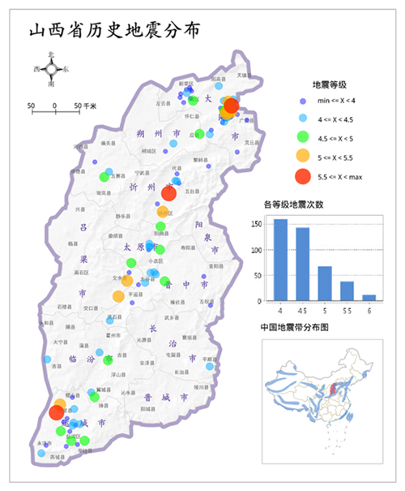

等级符号专题图与分段专题图类似，同样将矢量图层的某一属性字段信息映射为不同等级，每一级分别使用大小不同的点符号表示，符号的大小与该属性字段值成比例，属性值越大专题图上的点符号就越大，反之亦同。等级符号专题图多用于具有数量特征的地图上，例如不同地区的粮食产量、GDP、人口等的分级。

点击“ **专题图**
”选项卡中的“等级符号专题图”按钮，生成系统默认风格的等级符号专题图。用户可以通过等级符号专题图的窗口设置各个参数，自定义制作等级符号专题图。下图所示为等级符号专题图的示意图，是基于山西省历史地震等级建立的等级符号专题图，点符号越大表示该震级越高。。

  
---  
  
等级符号专题图可基于任一点、线、面矢量图层制作。在制作等级符号专题图时，首先将要制作专题图的矢量图层设置为当前图层，即在图层管理器中选中该矢量图层。

### 制作等级符号专题图的两种途径

 [新建等级符号专题图](GraduatedSymbolMapDefault)

 [修改等级符号专题图](GraduatedSymbolMapGroupDia)
