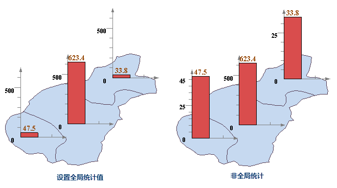

用于对当前统计专题图中的统计图进行高级参数设置。在该选项卡中的所有设置都会实时反映到当前统计标签专题图中，即所见即所得。

1.**“选项”区域：** 该区域用来调整和控制统计专题图中统计图的显示。 
* **流动显示：** 选中该复选框，则专题图的渲染风格可以流动显示，即统计图会随着地图窗口的变化而移动以达到全部显示的优化效果。当开启流动显示效果时，请勿使用局部刷新功能，否则会导致局部刷新效果显示不正确。
* **自动避让：** 选中该复选框，可以使地图上的统计图在一定范围内自动调整，达到使统计图同时显示而不互相重叠和影响。 
* **显示负值数据：** 选中该复选框，可以在地图上显示显示属性为负值的对象对应的统计图。
* **统计符号随图缩放：** 选中该复选框，可以使统计符号随着地图的缩放而放大或缩小；否则所有统计符号都会按照对话框的参数设置固定显示大小，不随着地图的缩放改变大小。
* **显示牵引线：** 可设置当专题图偏移其所表达的对象时，将两者之间用牵引线连接。若勾选“流动显示”复选框，则“显示牵引线”复选框为可勾选状态。选中该复选框，右侧的“线型风格”按钮为可用状态，点击该按钮，可在弹出的“符号库管理”窗口中设置牵引线的风格。 
* **全局统计值：** 选中该复选框，当前统计专题图会判断所有统计值来确定统计值符号的显示尺度，各统计图之间是按照同一显示尺度显示统计符号大小。如下左图，三个统计值是按照相同坐标尺度显示柱状图的高低。适用于表现各统计值之间的对比关系，通过统计符号的显示即可看出统计值之间的比例关系。 

不选中该复选框，程序会根据当前统计范围的属性值确定显示尺度范围，统计值之间不存在比例关系。如下右图中，三个统计值柱状统计图之间不相关，各自独立表现当前统计值。

  

2.**“显示大小设置”区域：** 设置统计专题图统计符号显示的基准值，包括最大基准值与最小基准值，所有统计图的显示大小均在最大、最小值之间逐渐变化。应用程序会自动计算合适的最大值和最小值。当选择“随图缩放”时，基准值的单位为与地图单位保持一致；当没有选择“随图缩放”时，基准值的单位为0.01mm。 
* **启用表达式：** 勾选“启用表达式”复选框，可通过字段值控制统计符号显示的大小，也可直接输入数值设置统计符号的大小，单位为米。
* **最大显示值：** 设置最大统计对象的统计符号的显示大小。当专题图类型为饼图、三维饼图、玫瑰图、三维玫瑰图、环状图时，统计图的直径取最大显示值的四分之一；其它类型的统计专题图，如柱状图、面积图等，统计图的高度取最大显示值的四分之一。其它统计符号，依据最大和最小统计符号按比例进行绘制。
* **最小显示值：** 设置最小统计对象的统计符号的显示大小。当专题图类型为饼图、三维饼图、玫瑰图、三维玫瑰图、环状图时，统计图的直径取最小显示值的四分之一；其它类型的统计专题图，如柱状图、面积图等，统计图的高度取最小显示值的四分之一。其它统计符号，依据最大和最小统计符号按比例进行绘制。  

3.**“偏移参数设置”区域：** 用于设置统计专题图中统计图对象的锚点相对于其所标注的对象的内点的偏移程度。 
* **水平偏移量：** 该标签右侧的文本框用来设置统计图对象的锚点相对于其所表达的对象的内点的水平偏移量。可点击文本框右侧的下拉按钮，选择某个数值型字段作为水平偏移量，也可直接在文本框中输入水平偏移的数值。
* **垂直偏移量：** 该标签右侧的文本框用来设置统计图对象的锚点相对于其所表达的对象的内点的垂直偏移量。可点击文本框右侧的下拉按钮，选择某个数值型字段作为垂直偏移量，也可直接在文本框中输入垂直偏移的数值。
* **偏移单位：** 该标签右侧的下拉按钮用来设置偏移量数值的单位。点击该下拉按钮，在弹出的下拉菜单中，系统提供“坐标系单位”和“0.1毫米”两种偏移单位供用户选择。“0.1毫米”，表明符号的偏移量以0.1毫米为单位；“坐标系单位”，则所设置的偏移量与地图坐标系的单位保持一致。   

4.**“统计图注记”区域：** 可设置是否显示统计图上的文本标注。若需要添加统计图注记，选中该复选框，“标注格式”组合框和“标注风格”按钮为可用状态，用户可以设置统计专题图文本显示格式以及文字标注风格。 
* **标注格式：** 系统提供的统计专题图文本显示格式有5种：百分数、真实值、标题、标题 + 百分数、标题 + 真实值。用户可根据需要选择当前统计图上标注的文本格式。
* **标注风格：** 设置当前统计图上标注文本的风格。用户可通过单击该标签右侧的按钮，在弹出的文本风格对话框中设置统计图文本标注的风格。具体参见：[修改统一风格标签专题图的风格](../labelmap/UniformLabelMapDia)。  

5.**“坐标轴”区域：** 可设置是否显示坐标轴，若显示，可勾选该复选框，为统计图添加坐标，并对坐标轴进行丰富。“坐标轴”复选框仅对面积图、阶梯图、折线图、点状图、柱状图、三维柱状图、堆叠柱状图、三维堆叠柱状图可用。 
* **坐标轴颜色：** 设置当前统计专题图的坐标轴颜色。点击该标签右侧的按钮，弹出颜色面板，可以选择和设置合适的坐标轴颜色。
* **标注模式：** 该标签右侧的下拉按钮用于显示和设置当前统计图坐标轴标注的显示模式，分为：不显示、仅显示横轴标注、仅显示纵轴标注、全部显示4种显示模式。默认的标注模式为全部显示。
* **标注风格：** 该标签右侧的文本风格设置按钮用于设置坐标轴标注的文本风格。选中该复选框，右侧按钮为可用状态，单击后可在弹出的文本风格对话框中设置坐标文本的风格。具体参见：[修改统一风格标签专题图的风格](../labelmap/UniformLabelMapDia)。
* **坐标轴格网：** 该复选框可选择是否显示坐标轴格网。 

6.**柱状图风格：**
* **柱宽度系数：** 用于设置柱状统计图每一个柱的宽度，默认值为当前柱状图最大宽度的一半。用户可在该标签右侧的数字显示框中设置所需的柱状图宽度，数值可以在0与最大宽度之间进行，否则设置无效。单位与地图相同。该标签仅对柱状图、三维柱状图、堆叠柱状图、三维堆叠柱状图起效。
* **柱间距系数：** 用于设置柱状图之间的间距。  

7.**玫瑰图、饼图风格：** 用来设置玫瑰图和饼图的起始角度，以及玫瑰图的角度。 
* **起始角度：** 设置饼/玫瑰统计图的起始角度，默认为水平正向。该标签仅对饼图、三维饼图、玫瑰图、三维玫瑰图起效。
* **玫瑰角度：** 设置统计图中玫瑰图或三维玫瑰图分片的角度，默认为0。在角度为 0 或者大于 360 度的情况下均使用360度来等分制作统计图的字段数。  

8.在“统计专题图”窗口中的各项参数设置都会实时反映到当前地图窗口中相应的专题图图层，即实现所见即所得。用户也可以通过取消勾选对话框底部的“启用即时刷新”复选框，不启用实时刷新。若不勾选“启用即时刷新”复选框，则用户完成各项参数设置后，可点击对话框底部的“应用”按钮，将对话框中的参数设置应用于当前专题图。 

### 备注

1. 用户制作和修改的统计专题图都可以保存为模板，以便应用到其它图层的专题图制作中，保存专题图模板具体参见：[保存到专题图模板库](../Methods/DTv2_LoadStyleThemeTempl)。
2. 在使用模板方式制作专题图时，用户可以直接在"模板"下拉按钮的下拉菜单中，选择已保存的模板将其应用到其它专题图的制作中。

### 相关主题

 [修改统计专题图](GraphMapDia)

 [“属性”选项卡](PropertiesDia)

