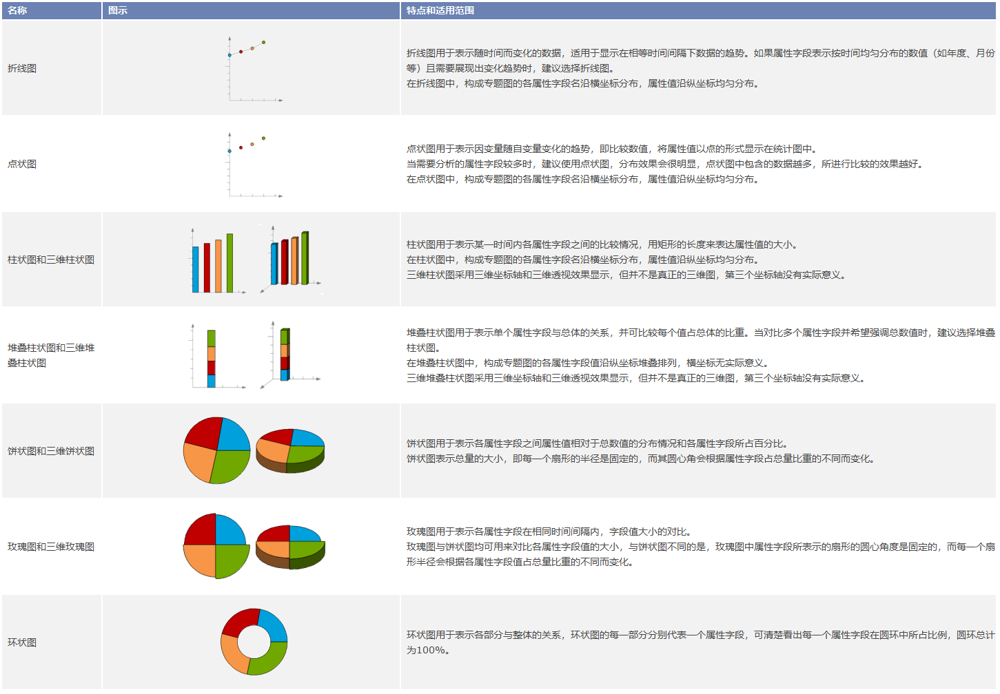

统计专题图是根据地图属性表中所包含的统计数据进行制图，可在地图中形象的反应同一类属性字段之间的关系。借助统计专题图可以更好的分析自然现象和社会经济现象的分布特征和发展趋势，例如研究区植被类型分布变化或城市人口增长比率。

在
中，统计专题图可同时表示多个字段属性的信息，在区域内或各区域之间形成横向和纵向的对比。此外，统计专题图唯一一个可以选择多个专题变量的专题图，且允许一次分析多个数值型变量。

在" **专题图** "选项卡中“ **统计** ”组，单击“ **统计**
”下拉按钮，用户可选的统计专题图类型有柱状图、饼状图、环状图、点状图、玫瑰图、面积图、折线图、阶梯图、堆叠柱状图、三维柱状图、三维饼状图、三维玫瑰图以及三维堆叠柱状图,用户可根据不同需求，选择合适的统计专题图类型，创建不同的统计专题图。

可选的统计专题图模板有：人口密度对比柱状图、城乡建设用地规模对比三维饼状图、年龄结构人口数对比三维玫瑰图、第一产业生产额增加额三维柱状图；用户也可以通过统计专题图的风格设置窗口设置该专题图的各个参数，自定义制作统计专题图。下图所示为统计专题图的示意图，用柱状图的形式表达各省的城镇人均收入、农村人均收入与当地收入水平，与传统的柱状图不同的是柱状图为圆形柱状图，并且使用轻微的颜色渐变制造了立体效果，具体制作方法请参考[示例地图->人口与经济专题图](../../../guides/SampleMap/ThemeMap/PopulationAndEconomy)</a>。

  

  
以下为十一种统计专题图类型的详细说明：    

  

需要注意的是，制作统计图时，单个对象的统计图大小，是由该对象对应的表达式字段值决定的，所以在专题图显示上，会出现不同的对象相同的字段值，但制作的统计图大小不一样的情况。

### 制作统计专题图的两种途径

 [新建统计专题图](GraphMapDefault)

 [修改统计专题图](GraphMapDia)

