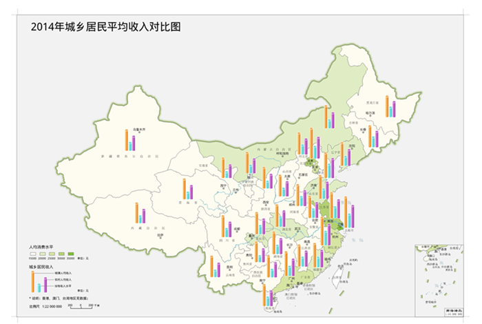
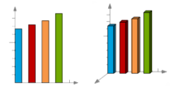

统计专题图是根据地图属性表中所包含的统计数据进行制图，可在地图中形象的反应同一类属性字段之间的关系。借助统计专题图可以更好的分析自然现象和社会经济现象的分布特征和发展趋势，例如研究区植被类型分布变化或城市人口增长比率。

在
中，统计专题图可同时表示多个字段属性的信息，在区域内或各区域之间形成横向和纵向的对比。此外，统计专题图唯一一个可以选择多个专题变量的专题图，且允许一次分析多个数值型变量。

在" **专题图** "选项卡中“ **统计** ”组，单击“ **统计**
”下拉按钮，用户可选的统计专题图类型有柱状图、饼状图、环状图、点状图、玫瑰图、面积图、折线图、阶梯图、堆叠柱状图、三维柱状图、三维饼状图、三维玫瑰图以及三维堆叠柱状图,用户可根据不同需求，选择合适的统计专题图类型，创建不同的统计专题图。

可选的统计专题图模板有：人口密度对比柱状图、城乡建设用地规模对比三维饼状图、年龄结构人口数对比三维玫瑰图、第一产业生产额增加额三维柱状图；用户也可以通过统计专题图的风格设置窗口设置该专题图的各个参数，自定义制作统计专题图。下图所示为统计专题图的示意图，是基于北京市人口变化建立的统计专题图，统计图中的不同颜色代表不同年份的人口数量。

  
---  
  
以下为十一种统计专题图类型的详细说明：

名称 | 图示 | 特点和适用范围  
---|---|---  
折线图 ||折线图用于表示随时间而变化的数据，适用于显示在相等时间间隔下数据的趋势。如果属性字段表示按时间均匀分布的数值（如年度、月份等）且需要展现出变化趋势时，建议选择折线图。 在折线图中，构成专题图的各属性字段名沿横坐标分布，属性值沿纵坐标均匀分布。  
点状图 || 点状图用于表示因变量随自变量变化的趋势，即比较数值，将属性值以点的形式显示在统计图中。   当需要分析的属性字段较多时，建议使用点状图，分布效果会很明显，点状图中包含的数据越多，所进行比较的效果越好。   在点状图中，构成专题图的各属性字段名沿横坐标分布，属性值沿纵坐标均匀分布。  
柱状图和三维柱状图 || 柱状图用于表示某一时间内各属性字段之间的比较情况，用矩形的长度来表达属性值的大小。   在柱状图中，构成专题图的各属性字段名沿横坐标分布，属性值沿纵坐标均匀分布。   三维柱状图采用三维坐标轴和三维透视效果显示，但并不是真正的三维图，第三个坐标轴没有实际意义。  
堆叠柱状图和三维堆叠柱状图 || 堆叠柱状图用于表示单个属性字段与总体的关系，并可比较每个值占总体的比重。当对比多个属性字段并希望强调总数值时，建议选择堆叠柱状图。   在堆叠柱状图中，构成专题图的各属性字段值沿纵坐标堆叠排列，横坐标无实际意义。   三维堆叠柱状图采用三维坐标轴和三维透视效果显示，但并不是真正的三维图，第三个坐标轴没有实际意义。  
饼状图和三维饼状图 || 饼状图用于表示各属性字段之间属性值相对于总数值的分布情况和各属性字段所占百分比。   饼状图表示总量的大小，即每一个扇形的半径是固定的，而其圆心角会根据属性字段占总量比重的不同而变化。  
玫瑰图和三维玫瑰图 || 玫瑰图用于表示各属性字段在相同时间间隔内，字段值大小的对比。   玫瑰图与饼状图均可用来对比各属性字段值的大小，与饼状图不同的是，玫瑰图中属性字段所表示的扇形的圆心角度是固定的，而每一个扇形半径会根据各属性字段值占总量比重的不同而变化。  
环状图 || 环状图用于表示各部分与整体的关系，环状图的每一部分分别代表一个属性字段，可清楚看出每一个属性字段在圆环中所占比例，圆环总计为100%。   统计专题图可基于任意一点、线、面矢量图层制作。在制作统计专题图时，首先将要制作专题图的矢量图层设置为当前图层，即在图层管理器中选中该矢量图层，随后便可基于该图层制作统计专题图。

需要注意的是，制作统计图时，单个对象的统计图大小，是由该对象对应的表达式字段值决定的，所以在专题图显示上，会出现不同的对象相同的字段值，但制作的统计图大小不一样的情况。

### 制作统计专题图的两种途径：

 [新建统计专题图](GraphMapDefault)

 [修改统计专题图](GraphMapDia)

