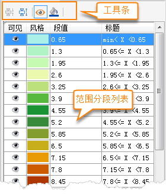

### 使用说明

用户可在" **栅格分段专题图** "设置窗口中，修改栅格分段专题图的各项参数设置，实现更符合需求的专题图效果。在“ **栅格分段专题图**
”窗口中的各项参数设置都会实时反映到当前地图窗口中相应的专题图图层，即实现所见即所得。

### 操作步骤

1. 在图层管理器中选中某一个栅格分段专题图图层，右键单击“修改专题图...”，在弹出的“ **栅格分段专题图** ”窗口中显示了选中的栅格分段专题图的设置信息。
2. **专题图图层** ：显示当前呈现的专题图名称。

基于栅格图层制作栅格分段专题图时，“栅格分段专题图”窗口中显示的参数内容描述如下：

3. **分段方法：** “分段方法:”项右侧的下拉按钮用于设置当前栅格分段专题图中各像元值的分段方法。用户可在该项的下拉列表中选择合适的分段方法。栅格分段专题图不支持标准差分段和等计数分段的分段方法。  
**等距分段：** 根据所有像元值中的最大值和最小值，按照用户设定的“段数”进行相等间距的分段。在等距离分段中，每一段具有相等的长度。  
**平方根分段：** 以所有像元值的平方根为分段数据进行等距离分段。首先取所有像元值的平方根，进行等距离分段，得到处理后数据的分段点，最后将这些分段点的值进行平方得到对应像元值的分段点，从而得到所有像元值的分段方案。  
**对数分段：** 与平方根分段方法基本相同，所不同的是平方根方法是对所有像元值取平方根，而对数分段方法是对像元值取对数，即对像元值的以10为底的对数值进行等距离分段。首先对所有像元值的对数进行等距离分段，得到处理后的分段点，然后以10为底，这些分段点的值作为指数的幂，得到对应像元值的各分段点的值，从而得到分段方案。   
**自定义分段：** 由用户指定各段的长度，即“单段长度”进行分段，“段数”由应用系统根据指定的间隔距离以及所有像元的最大和最小值来计算，用户不可控制。
4. **段数：** “段数:”数字显示框用于显示和设置当前栅格分段专题图对像元值进行分段的分段数，即范围段的个数。
5. **单段长度：** “单段长度:”数字显示框用于显示和设置当前栅格分段专题图分段的间隔距离，即每个范围段的长度，该项的设置只有在分段方法为自定义分段时才有效。
6. **段标题格式：** “段标题格式:”项右侧的下拉按钮用于指定表达每个范围段域范围的格式，主要提供两个格式，通过右侧的组合框进行选择设置。
7. **颜色方案：** “颜色方案:”组合框用于显示和设置当前栅格分段专题图中每个范围段的颜色风格。
8. **特殊值设置** ：即用户需要对某些特定值的栅格像元的显示效果进行设置。   
**特殊值：** 可单击“拾取”按钮 ，在地图窗口的栅格分段专题图层中拾取一个像元值设置为特殊值，也可直接在数值框中输入一个数值作为特殊值。   
**特殊值风格：** 标签用来设置已指定栅格值的显示颜色。可点击“特殊值风格：”标签右侧的下拉按钮，在弹出的颜色面板中选择某一种颜色，则该栅格值的像元将显示为指定的色彩。   
**特殊值透明显示：** 复选框用来设置已指定栅格值是否透明显示。勾选该复选框，即可将指定栅格值像元设置为透明显示；不勾选该项，指定栅格值颜色仍以指定的颜色显示。  
  
  

* **合并或拆分范围段：** 选项卡下部的列表中列出了当前栅格分段专题图的所有范围段，用户可根据需要对各范围段进行合并或拆分。 
  * 合并按钮用于将选中的多个连续的范围段合并为一个范围段，合并后的范围段的值域范围为被合并的所有范围段的值域的并集。如果没有或者只有一个范围段被选中，或者选中的多个范围段不连续，则该按钮都不可用。
  * 拆分按钮用于将选中的某一个范围段拆分为两个新的范围段。
* **可见性设置：** 可通过工具条中的和范围段列表中各项的可见/隐藏图标控制范围段对应像元是否可见。
  * 工具条中的可见/隐藏图标按钮，可以控制范围段列表中所有选中的范围段对应像元的可见性。
  * 每一个范围段项中的可见/隐藏图标，可以控制该范围段对应像元的可见性。
* **各范围段颜色设置：** 用户可以单击工具条上的风格图标 或者单击范围段列表中每一个范围段项中的栅格像元风格图标 ，在弹出的“颜色”面板中设置当前栅格分段专题图中所有选中范围段对应像元的颜色。在“颜色”面板中，用户可以直接选择系统预定义颜色表中的颜色，也可单击“颜色”面板底部的“其它色彩...”按钮，在弹出的“颜色”对话框中编辑获得所需的颜色。
* **段值：** 工具栏下的“段值”数字显示框显示了每个范围段分段点（该段的终止点）的数值（如上图所示），每个数字显示框对应一个分段点，分段点的数值可以通过该数字显示框进行改变，改变后的结果会实时反映到当前分段专题图图层上。
* **范围段标注内容设置：** 上图所示的绿色矩形框中的文字为范围段的标注内容，标注内容可以修改，只需选择要编辑的标注内容，再次单击鼠标，文字内容变可为可编辑状态。
* 在“栅格分段专题图”窗口中的各项参数设置都会实时反映到当前地图窗口中相应的专题图图层，即实现所见即所得。用户也可以通过取消勾选对话框底部的“启用即时刷新”复选框，不启用实时刷新。若不勾选“启用即时刷新”复选框，则用户完成各项参数设置后，可单击对话框底部的“应用”按钮，将对话框中的参数设置应用于当前专题图。

### 备注

1. 用户制作和修改的栅格分段专题图都可以保存为模板，以便应用到其它图层的专题图制作中，保存专题图模板具体参见保存专题图模板具体参见：[保存到专题图模板库](../Methods/DTv2_LoadStyleThemeTempl)。
2. 在使用模板方式制作专题图时，用户可以直接在“模板”下拉按钮的下拉菜单中，选择已保存的模板将其应用到其它专题图的制作中。

