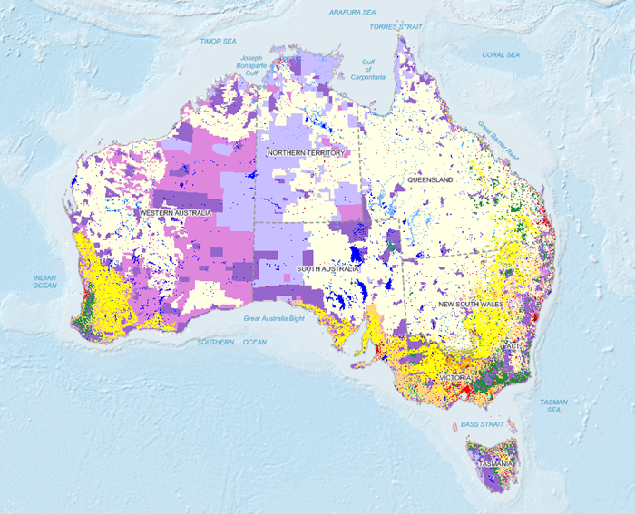

当前图层为栅格图层时，单击 **“专题图”** 选项卡中的 **“栅格分段专题图”**
按钮，可生成默认风格的栅格分段专题图。用户也可以通过栅格分段专题图的风格设置窗口自定义制作栅格分段专题图。

分段专题图可基于任一栅格图层制作。在制作栅格分段专题图时，首先将要制作专题图的栅格图层设置为当前图层。下图是以澳大利亚土地利用栅格图层制作的栅格分段专题图。

  

### 制作栅格分段专题图的两种途径：

 [新建栅分段专题图](GridRangesMapDefault)

 [修改栅格分段专题图](GridRangesMapGroupDia)

