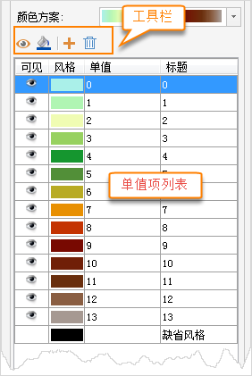
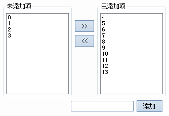

### 使用说明

用户可在“ **栅格单值专题图**
”窗口中，修改栅格单值专题图的各项参数设置，实现更符合需求的专题图效果。在图层管理器中双击某一个栅格单值专题图图层，或单击右键选择“修改专题图”，即可弹出“专题图”参数面板。其参数分为属性和高级两大类，具体说明如下：

###  属性面板

基于栅格图层制作栅格单值专题图时，“栅格单值专题图”窗口中显示的内容如下图所示。

1. **颜色方案：** “ **颜色方案** :”组合框用于显示和设置当前栅格单值专题图中所有像元值的颜色风格。
      * 通过单击该组合框的下拉按钮，在弹出的下拉列表中选中某一个颜色方案，当前栅格单值专题图的不同像元值根据颜色方案的颜色变化模式被赋予不同的颜色。  
  
1. **可见性设置：** 工具条中的可见按钮和专题值项中的可见图标都可用来控制专题值对应的像元是否可见。
    * 单击工具条中的可见图标按钮，可以控制专题值列表中所有选中的专题值对应像元的可见性。
    * 单击每一个专题值项中的可见图标，可以控制该专题值对应像元的可见性。
2. **设置专题值对应像元的显示颜色：** 用户可以单击工具条上的风格按钮，或者单击列表中每一个专题值项中的像元风格图标  ，在弹出的“ **颜色** ”面板中设置当前栅格单值专题图中所有选中专题值对应像元的颜色。在“ **颜色** ”面板中，用户可以直接选择系统预定义颜色表中的颜色，也可单击“ **颜色** ”面板底部的“ **其它色彩**...”按钮，在弹出的“ **颜色** ”对话框中编辑获得所需的颜色。
3. **添加或删除专题值：**
     * 添加按钮：用于管理专题图中的专题值。单击  按钮，会弹出专题值管理界面，可在界面内进行添加、删除专题值操作，也可以在下方对话框中添加新的专题值。添加专题值后，专题值列表会同步更新，与修改后的专题值相对应。    
    * 删除按钮：用于删除专题值列表中所有选中的专题值项。选中专题值列表中待删除的专题值，单击工具条中的  按钮，即可删除所选专题值对应项。删除专题值后，原专题值对应的对象将使用默认风格进行显示。
4. **单值：** 用于显示选中的单值项的值，单值后的编辑框可直接编辑修改，只有在专题值列表中选中一个专题值时有效。若修改后的单值已经存在，则设置无效，恢复原来的值。
5. **专题值标注内容设置：** 上图所示的绿色矩形框中的文字为专题值的标注内容，标注内容可以修改，只需选择要编辑的标注内容，再次单击鼠标，文字内容变可为可编辑状态。
6. 在“栅格单值专题图”窗口中的各项参数设置都会实时反映到当前地图窗口中相应的专题图图层，即实现所见即所得。用户也可以通过取消勾选对话框底部的“启用即时刷新”复选框，不启用实时刷新。若不勾选“启用即时刷新”复选框，则用户完成各项参数设置后，可单击对话框底部的“应用”按钮，将对话框中的参数设置应用于当前专题图。 

###  高级面板

高级参数面板中提供了特殊值和特殊值风格的参数设置，也可设置特殊值透明显示。

  * **特殊值** ：文本框用来输入某一栅格值，即用户需要对某些特定值的栅格像元的显示效果进行设置。
  * **特殊值风格** ：用来设置已指定栅格值的显示颜色。可点击“特殊值风格：”标签右侧的下拉按钮，在弹出的颜色面板中选择某一种颜色，则该栅格值的像元将显示为指定的色彩。
  * **特殊值透明显示** ：复选框用来设置已指定栅格值是否透明显示。勾选该复选框，即可将指定栅格值像元设置为透明显示；不勾选该项，指定栅格值颜色仍以指定的颜色显示。

###  备注

1. 用户制作和修改的栅格单值专题图都可以保存为模板，以便应用到其它图层的专题图制作中，保存专题图模板具体参见：[保存到专题图模板库](../Methods/GURTheme2_SaveThemeTempl.htm)。

 2. 在使用模板方式制作专题图时，用户可以直接在“模板”下拉按钮的下拉菜单中，选择已保存的模板将其应用到其它专题图的制作中。