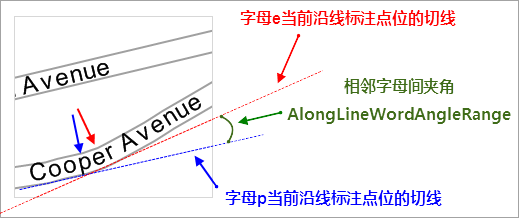
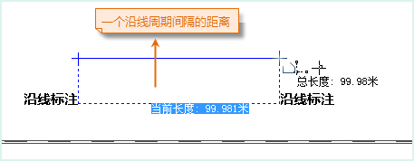
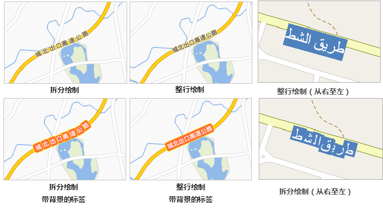
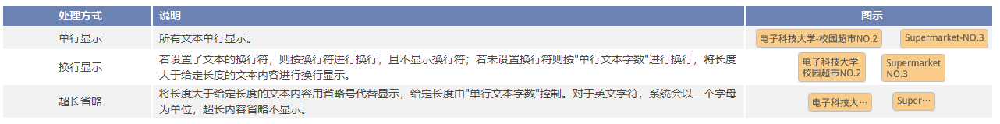

专题图面板中的“高级”选项卡，主要用来对当前标签专题图中的标签对象（文本对象）
进行一些显示上的高级控制，并且在该选项卡中所进行的所有设置都会实时反映到当前标签专题图中，即所见即所得。

* **“沿线标注”区域**
* **沿线标注：** 勾选该复选框，则线图层中对象所对应的标注可以实现沿线对象的线条走向排列标签对象中的文本内容。该复选框只有在当前标签专题图为线图层的标签专题图时才可用。 

勾选“沿线标注”复选框，是以下各项可设置的前提。

* **固定文本角度：** 若勾选“固定文本角度”复选框，则标签专题图中标签对象中的文字总是保持竖直方向。
* **沿线显示方向：** 用于设置标签中的文本沿线标注的方向，应用系统提供了五种方式： 

**沿线的法线方向放置标签** ，即沿着线的方向从起点到终点标注。其他四个选项：“ **从上到下，从左至右放置** ”，“ **从上到下，从右到左放置**
”、“ **从下到上，从左到右放置** ”、“ **从下到上，从右到左放置** ”。

应用程序首先判断线的走向是水平的还是竖直的。判断标准：连接线的起点和终点，若此线与水平方向的夹角小于60度，则认为此线的走向是水平的，否则是竖直的。对于水平走向的线，则按照选项从左到右或者从右到左进行标注（即选项中的从上到下或者从下到上设置不予考虑），反之对于竖直走向的线，则按照选项从上到下或者从下到上进行标注（即选项中的从左到右或者从右到左设置不予考虑）。

**注意**：若选择了“固定文本角度”复选框，则“沿线显示方向:”标签控件右侧下拉按钮的设置无效；若勾选了“固定文本角度”或者修改了“沿线显示方向”，可能会因为字间距的问题出现字压盖的情况，导致部分标签不显示。

* **沿线字间距：** 用于设置沿线标注的标签文本中文字间的间隔距离，单位为字高的倍数。取值范围为[1,8]。沿线字间距从文字的中心点起算。沿线字间距”设置为1时，沿线字体是紧贴在一起的。注意：对于英文单词和数字，应用程序会做特殊处理。英文单词和数字，均以空格来控制是否是一个词或一个数。 比如“SuperMapDesktop”和“12325”，无论“沿线字间距”设置为多少，实际都是在作为一个字来显示的。但如果是“SuperMap Dekstop”和“123 25”，中间存在空格，则沿线标注时会在空格处分割，并按照指定的沿线字间距显示。
* **沿线字相对角度：** 设置相邻字或者字母夹角的最大值，用以保证沿线标注的美观性。取值范围为[0,90]。夹角容限值越小，标签越紧凑，但弯度大的地方可能就无法进行标注；夹角容限值越大，弯度大的地方也能显示标注，但是沿线标注的美观性就会降低，所以，从地图美观性方面考虑，在设置此值时，建议先初步计算出合适的角度值。沿线标注中字与字或者字母与字母间相对角度，如下图中所示。  

  

* **周期间距单位** ：用于设置沿线标注周期间距数值的单位。点击右侧的下拉按钮，在弹出的下拉菜单中可选择"坐标系单位"或"0.1毫米"作为周期间距单位。"0.1毫米"表明标注的周期间距以0.1毫米为单位；"坐标系单位"指设置的标注周期间距与地图的坐标系的单位保持一致。
* **沿线周期间距：** 当线对象过长时，可以隔一段距离对其进行标注一次，该标签控件右侧的文本框用来设置重复标注的距离。需要注意的是，此处设置的周期长度是指从前一个标签文本的结束到下一个标签文本的开始之间的距离。如下图所示，对一段铁路进行标注，沿线字间距为1倍，沿线周期间距为100。则量算任意一个标签文本的结束到下一个标签文本开始之间距离，恰好为一个沿线周期间隔，长度为100。单位与地图的单位一致。

* **绘制类型：**设置沿线绘制的绘制策略，提供了五种绘制方式： 
* **兼容绘制：** 从SuperMap GIS 8C(2017)版本开始，调整了沿线标准的绘制策略，如果专题图是用之前的版本制作，要显示出原来的专题样式，建议选择“兼容绘制”选项。
* **整行绘制：** 将标签作为一个整体绘制，一般应用于带背景标签的沿线标注。
* **拆分绘制：** 将标签中的文字和字母拆分绘制。采用拆分绘制，标签将与被标注的线走势吻合。
* **整行绘制（适用于“右->左”）阅读的文字：** 将标签作为一个整体绘制从右至左显示，适用于从右至左显示的文字，例如阿拉伯语言。使用该绘制方式时需要将标签字体设置为西方字体，例如Times New Roman，并且沿线显示方向设置为“ **沿线的法线方向** ，否则标签在该绘制方式下会造成显示效果不正确”。
* **拆分绘制（适用于“右->左”）阅读的文字：** 将标签中的文字拆分绘制，适用于从右至左显示的文字，例如阿拉伯语言。使用该绘制方式时需要将标签字体设置为西方字体，例如Times New Roman，并且沿线显示方向设置为“ **沿线的法线方向** ，否则标签在该绘制方式下会造成显示效果不正确”。

整行绘制、拆分绘制的效果如下图所示。

  

* **“文本字符设置”区域：**
* **超长处理方式：** 用于设置文本过长时标签的显示方式，系统提供了三种处理方式：单行显示、换行显示、超长省略。具体说明见下表，其中图示中换行符设置为 “-”，“单行文本字数”设置为5，即当超长处理方式设置为换行或省略时，中文字符和西文字符均显示5个字符。

    

注意：以换行的方式进行显示，为了显示美观，这种方式会自动调整每行文本字数，尽量使每一行的字符个数相近，故每一行显示的字符个数小于等于设置的“单行文本字数”，其中英文单词和数字，均以空格来判定是否是一个词或一个数，每一行都会完整显示一个英文单词或数字。目前复合标签专题图只支持默认和省略两种处理方式，暂不支持换行的处理方式。如果设置了"沿线标注"功能，则该功能不起效果。

* **指定换行字符：** 单击标签控件右侧下拉按钮，选择一个符号作为换行符，或在文本框中输入一个字符或文字，将其指定为换行符，文本标签会在换行字符处换行显示。
* **显示换行符** ：若超长处理方式设置为换行显示，则支持设置是否显示换行符。若勾选该复选框，则换行符会显示在前一行的末尾，下图的换行符为“-”，显示换行符的效果如下。

* **单行文本字数：** 标签控件右侧的文本框用来设置标签对象（文本对象）中每行最多显示的字符个数（英文单个字母、中文单个字、空格等都被视为一个字符），超出此长度，文本对象中的内容会换行显示或者省略不显示超出部分的内容。对于英文单词，若在换行的位置处碰巧需要将一个单词分两行显示，这时系统会做特殊处理，将该单词在前一行显示完全。该参数仅在“超长文本处理方式”设置为省略或换行显示时生效。

* **文本对齐方式：** 若文本的“超长处理方式”设置为换行，可设置文本对齐方式，支持设置的对齐方式有：居中、左对齐、右对齐、分散对齐。
* **避让后多行文本自动对齐：** 勾选该复选框，则避让后的文本会自动对齐显示。
* **“文本高度限制”区域**
* **最大文本高度：** 放大地图时，当标签对象的文字字体的高度超过了此处设置的最大值，标签对象中的文本高度就不再随地图的放大而放大。
* **最小文本高度：** 缩小地图时，当标签对象的文字字体的高度超过了所设置的最小值，标签对象中的文本高度就不再随地图的缩小而缩小。

注意，在设置最大、最小文本高度时，需要取消勾选文本的“固定大小”，否则，设置的文本高度限制无效。

**“文本宽度限制”区域**
* **最大文本宽度：** 放大地图时，当标签对象（文本对象）中的文字字体的宽度超过了此处设置的最大值，标签对象中的文本宽度就不再随地图的放大而放大。
* **最小文本宽度：** 缩小地图时，当标签对象中的文字字体的宽度超过了所设置的最小值，标签对象中的文本宽度就不再随地图的缩小而缩小。
* **文本避让的缓冲范围**
* **横向：** 根据设定的缓冲范围大小，将位于横向缓冲范围内的文本进行过滤，不予显示。文本避让的缓冲范围与“属性”选项卡中的偏移量单位一致。偏移量单位如果“以0.1毫米为单位”，则文本避让的缓冲半径是以0.1毫米为单位；“和地图距离单位保持一致”，则所设置的文本避让的缓冲范围的单位与图上单位保持一致。
* **纵向：** 根据设定的缓冲范围大小，将位于纵向缓冲范围内的文本进行过滤，不予显示。偏移量单位如果“以0.1毫米为单位”，则文本避让的缓冲范围是以0.1毫米为单位；“和地图距离单位保持一致”，则所设置的文本避让的缓冲范围的单位与图上单位保持一致。
