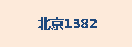

标签专题图主要用于对地图进行标注说明。可以用图层属性中的某个字段（或者多个字段）对点、线、面等对象进行标注。制图过程中，常使用文本型或者数值型的字段，如地名、道路名称、河流宽度、等高线高程值等对进行标注。

地图注记有助于为当前地图对象描述性的说明，增加地图承载的信息量。通过制作标签专题图可以快速地为地图中的对象进行标注，避免了手工增加注记的麻烦。在制作标签专题图的过程中，应用程序会根据一个或者多个字段的属性信息自动生成文本标签，并将这些标签放置到合适的位置上。考虑到多个图层叠加的情况下，注记之间容易发生重叠可以通过“移动标签”功能对单个标签的位置手动进行调整。

应用程序可创建的标签专题图分为四种类型：统一风格、分段风格、复合风格、矩阵风格同时程序还提供了四种标签专题图的模板。在图层管理器中选中一个矢量图层，右键单击，在弹出的右键菜单中选择“制作专题图...”，弹出如下图所示的“制作专题图”对话框，用户可以通过选择某种类型的标签专题图模板，制作该类型的标签专题图。

<!--    -->
 
* [统一风格标签专题图](UniformLabelMap.html)使用一种风格对所有的对象进行标注，在配图过程中较为常用，例如全国地图中的各省级、地级行政区进行标注。特别的，统一风格中支持标签的字体类型、大小、旋转角度和字体颜色通过选择属性字段进行设置，实现自定义标签设置，满足不同的标签显示需求。 
* [单值风格专题图](UniqueLabelMap.html)对对象标签基于指定字段表达式的值进行分类，值相同的对象标签为一类使用相同的风格显示，不同类的标签使用不同风格显示；其中，一个单值对应一个单值标签专题图子项。
* [分段风格标签专题图](RangesLabelMap.html)必须指定一个分段字段，按照指定的分段范围，对同一分段范围的标签采用一种风格表示，不同分段范围的标签采用不同的风格表示，即标签专题图按照分段范围采用多种风格显示。
* [复合风格标签专题图](MixedLabelMap.html)可以实现属性字段中的内容，通过指定的分割方法（按照字符位置分割或者使用分隔符分割）将标签分割为多个组，分割后的每个组按照不同的风格显示。例如，某一字段的属性内容为“湖北 3028”，可以按照字符位置分割为2组，“湖北”为一组，“3028”为一组，显示效果为：  
  
  
  * 按照字符位置分割：此方法按照当前指定的字符位置进行分割，分割段数为2，第一段的字符分割位置为2，则表示第一段包括前2个字符（单个汉字按照一个字符计算），从第3个字符以后，即第3个字符开始到整个字符串结束，均为第2段，每一段标签可以设置不同的显示风格。  
    
  * 使用分隔符分割：此方法按照指定的分隔符，从分隔符所在的位置将标签分为指定的段数，属性字段中必须包含此分隔符。分隔符可以使数字、字符、汉字以及下划线、空格等特殊字符。当属性字段中存在多个分隔符时，可以将标签分割为多段，最多支持将标签分割为5段，分割后的每一段标签可以设置不同的显示风格。  
    
  * [矩阵风格标签专题图](LabelMatrixMap.html)采用矩阵式的结构组织标签内容，能够将符号、图片、文本集合于一个标签矩阵中，对地图中的对象进行标注。而且矩阵单元格中可以嵌套一个标签矩阵。因此标签矩阵专题图非常适合于表达复杂的专题图信息，例如天气预报专题图和旅游专题图等。如下图所示，标签专题图中显示了地图对象的中文名称、英文名称以及当地著名景点的照片。  
    
  
单击“ **专题图** ”组的“ **新建**
”按钮，在弹出对话框中选择“标签专题图”，来制作标签专题图，可基于任一点、线、面矢量图层制作标签专题图。程序不仅提供了制作默认风格标签专题图的功能，还提供了基于模板制作标签专题图的功能；用户也可以通过双击”图层管理器“内的标签专题图图层，在出现的“标签专题图”窗口上设置各个参数，自定义制作标签专题图。在制作标签专题图时，首先将要制作专题图的矢量图层设置为当前图层，即在图层管理器中选中该矢量图层。

根据当前生成的标签专题图的不同，"标签专题图"窗口可以是"统一风格标签专题图"、"分段风格标签专题图"、"复合风格标签专题图"或"矩阵风格标签专题图"窗口，用户可对已生成的各个标签专题图的显示风格进行修改，同时也可以修改其它已生成的专题图的风格。

### 标签专题图标注表达式说明

符号 | 含义 | 支持的引擎 | 实例 | 效果  
---|---|---|---|---  
/+ | 连接符 | 支持UDB、SQL数据源 |格式：字段名1 + 字段名2 + 字段名3 + ...&#10;字段类型:文本型、字符型&#10;示例：NAME + ENAME |   
\|\| | 连接符 | 支持UDB、Oracle数据源 | 格式：字段名1 \|\| 字段名2 \|\| 字段名3 \|\|...&#10;字段类型:文本型、字符型或数值型等&#10;示例：NAME \|\| GDP_2000 |   
[/] | 分数符 | 支持UDB、Oracle数据源 |格式：字段名1 [/] 字段名2&#10;字段类型:文本型、字符型或数值型等&#10;示例：NAME [/] POP_1990 \|\| '万人'|   
chr(10) | 换行符 | 支持UDB、Oracle数据源 |格式：字段名1 \|\| chr(10) \|\| 字段名2...”&#10;字段类型:文本型、数值型、字符型&#10;示例：BaseMap_R.NAME \|\| Chr(10) \|\| BaseMap_R.POP_1999|   
char(10) | 换行符 | 支持SQL数据源 |格式：字段名1 + char(10) + 字段名2...”&#10;字段类型:文本型&#10;示例：NAME + Char(10) + POP_1999|   
chr(45) | 间隔符 | 支持Oracle数据源 |格式：字段名1 \|\| chr(45) \|\| 字段名2...”&#10;字段类型:文本型&#10;示例：NAME \|\| Chr(45) \|\| NAME|   
char(45) | 间隔符 | 支持SQL数据源 |格式：字段名1 ＋ char(45) + 字段名2...”&#10;字段类型:文本型&#10;示例：NAME + Char(45) + NAME|   
str() | 将数值转为字符串 | 支持SQL数据源 |格式：str(字段名)&#10;字段类型:文本型、字符型或数值型等&#10;示例：NAME + ':' + Str(POPU) + '万人'|   
to_char() | 将数值转为字符串 | 支持Oracle数据源 |格式：to_char(字段名)&#10;字段类型:文本型、字符型或数值型等&#10;示例：NAME [/] '面积:' \|\| to_char( SMAREA)|   
  
###  制作标签专题图的两种途径：

<!--  -->
[新建标签专题图](LabelMapDefault.html)

<!--  -->
[修改标签专题图](LabelMapDia.html)
