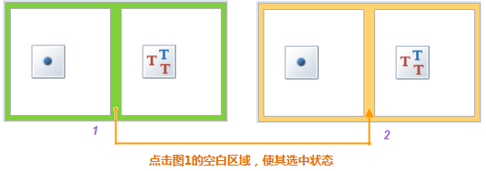
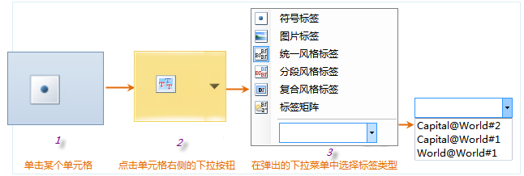

### 使用说明

用户可在“标签矩阵专题图”窗口中，修改标签矩阵专题图的各项参数设置，实现更符合需求的专题图效果。

### 操作步骤

1. 在图层管理器中双击某一个标签矩阵专题图，在弹出的“标签矩阵专题图”窗口中显示了选中的标签矩阵专题图的设置信息。
2. **专题图图层** ：显示当前呈现的专题图名称。

未选中标签矩阵时，“标签矩阵专题图”窗口组织为一个选项卡：“属性”选项卡。该选项卡用于设置标签矩阵的行列数。

* **标签矩阵行列数的设置：** 默认生成的标签矩阵标签专题图中，每个矩阵式标签对象的矩阵大小为2列1行，用户可以根据需要修改矩阵的行列数。   
   

* 单击如上图的绿色覆盖的区域（图1），使矩阵变为选中的状态（图2），“风格”选项卡上的“标签矩阵列数”和“标签矩阵行数”标签控件右侧的两个文本框变为可用状态。
* 用户可以根据需要在文本框中直接输入数值输入矩阵的行列数来重新构建矩阵的格式，单击 Enter（回车）键或者当文本框失去焦点时，应用矩阵行列数的设置。用户也可以通过文本框中的微调按钮改变文本框中的数值，改变的结果会实时显示在专题图上。

当矩阵变为选择状态后，“标签矩阵专题图”窗口中标签矩阵下方的区域会出现两个选项卡：“属性”和“高级”选项卡，并且默认显示“属性”选项卡页中的内容。用户可在“属性”和“高级”选项卡中设置当前标签矩阵的各项属性和高级显示参数。

* **“属性”选项卡：** 用于设置组当前选中的矩阵式标签的显示参数。

 [“属性”选项卡的设置方法](PropertiesDia)

* **“风格”选项卡：** 用于设置组当前选中的矩阵式标签的显示参数。

 [“风格”选项卡的设置方法](LabelMatrixMapSty)

* **“高级”选项卡：** 用于设置当前选中的矩阵式标签的高级显示参数。

 [“高级”选项卡的设置方法](AdvancedDia)

选中“标签矩阵专题图”窗口中标签矩阵中的每一个矩阵单元格，标签矩阵下方的会显示设置所选矩阵单元格风格和参数的相应选项卡。不同类型的矩阵单元格，可供设置参数的选项卡也不同。

* **标签矩阵单元格显示信息的设置：** 选择标签矩阵中的某个单元格（图1），使该单元格处于选中状态（图2），此时单元格的右侧会出现下拉按钮，单击下拉按钮弹出下拉列表，在下拉 列表中列出了矩阵单元格能够显示的所有类型，包括：符号标签、图片标签、统一风格标签、分段风格标签、复合风格标签、标签矩阵；同时，在该下拉列表底部，可单击另一个下拉按钮，弹出的下拉列表中列出了当前工作空间已生成的所有标签专题图（图3）。用户既可选择某种标签类型，也可以直接选择某个标签专题图作为选中的矩阵单元格显示的内容。 
  

**各类型的标签矩阵单元格如下：**

**符号标签**

若选择下拉列表中的“符号标签”项，当前专题图中矩阵单元格对应位置将显示为符号。同时，选项卡下方将出现参数选项，用户可输入相关参数获得所需的符号标签。

设置符号标签类型的标签矩阵单元格可以看作是标签专题图所显示的标签对象内容为符号，所有专题值为符号在符号库中的ID值。

* **符号ID：** 标签控件右侧的组合框用来设置符号类型的标签矩阵专题图的专题变量，即属性字段。组合下拉列表中列出了 用于制作当前标签矩阵专题图的矢量数据集中所有属性字段名称。 
        * 用户可以选择某一个字段，也可以手动输入字段名作为符号ID，该字段名必须在组合框下拉列表中存在，并且该字段值的内容必须为符号的 ID 值。
        * 用户也可以在组合框中输入某个符号的ID值，则该标签矩阵单元格位置所显示的符号统一为指定ID值的符号。
* **符号大小：** 标签控件右侧的文本框用来设置单元格所显示的符号的显示大小，输入数值为整数，单位为毫米，用户输入数值后，按 Enter（回车）键或者当该文本框失去焦点时即可应用所做的设置；用户也可以使用文本框中的微调按钮来改变文本框中的数值，改变后的结果会实时应用。
* **符号颜色：** 标签控件右侧的按钮用来设置单元格所显示的符号的颜色，单击该按钮弹出颜色对话框，用户可以选择和设置所需要的颜色。
* **旋转角度：** 标签控件右侧的文本框用来设置单元格所显示的符号的旋转角度，输入数值为整数，单位为度。用户输入数值后，按 Enter（回车）键或者当该文本框失去焦点时即可应用所做的设置；用户也可以使用文本框中的微调按钮来改变文本框中的数值，改变后的结果会实时应用。

**图片标签**

若选择下拉列表中的“图片标签”项，当前专题图中矩阵单元格对应位置将显示为图片。同时，选项卡下方将出现参数选项，用户可输入相关参数获得所需的图片标签。

设置图片标签类型的标签矩阵单元格可以看作是标签专题图所显示的标签对象内容为图片，且所有专题值为图片所在相对路径。

* **图片路径：** 标签控件右侧的组合框用来设置图片类型的标签专题图的专题变量，即属性字段。组合下拉列表中列出了用于制作当前标签矩阵专题图的矢量数据集中所有属性字段的名称。  
    用户可以选择某一个字段，也可以手动输入字段名，该字段名必须在组合框下拉列表中存在，且该字段值的属性内容为图片保存的相对路径。例如：Capital_P数据集所在的数据源存储在E:\SampleData\China文件夹下，图片保存在E:\SampleData\China\WeatherForecast文件夹中，则Path_1字段中直接写图片的相对路径即可，如：WeatherForecast\a4.bmp
* **大小单位：** 标签控件右侧的组合框用来指定图片大小数值的单位，分为地理坐标单位（以当前地图坐标的单位为图片大小数值的单位）和毫米单位。
* **旋转角度：** 标签控件右侧的文本框用来设置单元格所显示的图片的旋转角度，输入数值为整数，单位为度。用户输入数值后，按 Enter （回车）键或者当该文本框失去焦点时即可应用所做的设置；用户也可以使用文本框中的微调按钮来改变文本框中的数值，改变后的结果会实时应用。
* **保存原始大小：** 勾选该复选框，则指定路径的图片以原始大小显示于矩阵单元格中。“图片宽度”和“图片高度”标签右侧的数字显示框为不可用状态，即此时不能设置图片宽度和高度。
* **图片宽度：** 当不勾选“保持原始大小”复选框时，该标签右侧的数字显示框用来设置单元格所显示的图片的宽度，输入数值为整数，用户输入数值后，按 Enter （回车）键或者当该数字显示框失去焦点时即可应用所做的设置；用户也可以使用数字显示框中的微调按钮来改变数字显示框中的数值。
* **图片高度：** 当不勾选“保存原始大小”复选框时，该标签右侧的数字显示框用来设置单元格所显示的图片的高度，输入数值为整数，用户输入数值后，按 Enter （回车）键或者当该数字显示框失去焦点时即可应用所做的设置；用户也可以使用数字显示框中的微调按钮来改变数字显示框中的数值。

**统一风格标签**

若选择下拉列表中的“统一风格标签”项，当前专题图中矩阵单元格对应位置将显示为统一风格的标签内容。同时，选项卡下方将出现参数选项，用户可输入相关参数获得所需的统一风格标签。

选择“统一风格标签”项后，选项卡下方出现“风格”、“属性”、“高级”三个选项卡， 其内容和使用方法与“统一风格标签专题图”窗口相同，具体请参见：

[“统一风格标签专题图”窗口](UniformLabelMapDia)。

**分段风格标签**
若选择下拉列表中的“分段风格标签”项，当前专题图中矩阵单元格对应位置将显示为分段风格的标签内容。同时，选项卡下方将出现参数选项，用户可输入相关参数获得所需的分段风格标签。

选择“分段风格标签”项后，选项卡下方出现“属性”、“风格”、“高级”三个选项卡， 其内容和使用方法与“分段标签专题图”窗口相同，具体请参见：

[“分段标签专题图”窗口](RangesLabelMapDia)。

**复合风格标签**

若选择下拉列表中的“复合风格标签”项，当前专题图中矩阵单元格对应位置将显示为复合风格的标签内容。同时，选项卡下方将出现参数选项，用户可输入相关参数获得所需的复合风格标签。

选择“复合风格标签”项后，选项卡下方出现“属性”、“风格”、“高级”三个选项卡， 其内容和使用方法与“复合标签专题图”窗口相同，具体请参见：
[“复合标签专题图”窗口](MixedLabelMapDia)。

**标签矩阵**

若选择下拉列表中的“标签矩阵”项，当前专题图中矩阵单元格对应位置将显示为矩阵式的标签内容。同时，选项卡下方将出现“属性”和“高级”选项卡，用户可入相关参数获得所需的标签矩阵。
具体操作请参见[“属性”选项卡](PropertiesDia)和[“高级”选项卡](AdvancedDia)。

**某个标签专题图图层**

若选择下拉列表底部的下拉按钮，在弹出的下拉列表中显示出当前工作空间中已创建的所有标签专题图图层，选择某个标签专题图图层，即可在标签矩阵单元格对应位置显示出所选标签专题图的内容。同时，选项卡下方将出现与所选标签专题图图层相对应的选项卡，用户可对所选标签专题图的风格和属性等参数进行调整。

在“标签矩阵专题图”窗口中的各项参数设置都会实时反映到当前地图窗口中相应的专题图图层，即实现所见即所得。用户也可以通过取消勾选对话框底部的“启用即时刷新”复选框，不启用实时刷新。若不勾选“启用即时刷新”复选框，则用户完成各项参数设置后，可单击对话框底部的“应用”按钮，将对话框中的参数设置应用于当前专题图。 

### 备注

1. 用户制作和修改的标签矩阵专题图都可以保存为模板，以便应用到其它图层的专题图制作中，保存专题图模板具体参见[保存到专题图模板库](../Methods/DTv2_LoadStyleThemeTempl)。
2. 在使用模板方式制作专题图时，用户可以直接在“模板”下拉按钮的下拉菜单中，选择已保存的模板将其应用到其它专题图的制作中。
3. 设置图片标签的图片路径字段时，该字段值的属性内容为图片的相对路径，不支持绝对路径。
4. 矩阵标签专题图支持显示上下标。对矩阵标签专题图矩阵单元格类型为统一风格标签、分段风格标签时，显示上下标功能可用。具体用法请参照[统一风格标签专题图](../LabelMap/PropertiesDia)和[分段风格标签专题图](../LabelMap/PropertiesDia)属性选项卡的介绍内容。

