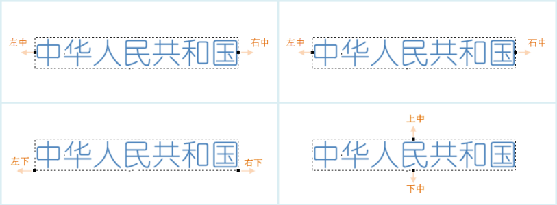

“标签专题图”窗口的“属性”选项卡页，主要用来对当前标签专题图中的标签对象（文本对象）进行显示参数的设置。需要说明一下，统一风格标签专题图、分段风格标签专题图、复合风格标签专题图和自定义风格标签专题图的“属性”选项卡参数设置一样。

* **标签表达式**

用来指定当前标签专题图所使用的专题变量，该专题变量确定了标签专题图上所显示的标签对象的文本内容。专题变量可以为单个属性字段或者字段的数学表达式。

* 组合框的下拉列表中列出了用于制作当前标签专题图的矢量数据集所有的属性字段的名称，用户可以选择任意一个字段来改变当前标签专题图所使用的专题变量，用户也可以在该组合框中输入字段名，但该字段必须在组合框的下拉列表中存在，当确定了字段后，当前标签专题图便使用新的专题变量重新对图层中的对象进行标注。 
* 如果用户想使用属性字段的数学表达式作为标签专题图的专题变量，就要选择组合框下拉列表中的“表达式...”项，在弹出的“[SQL 表达式](../../Query/SQLDia)”对话框中构建属性字段的数学表达式，字段表达式构建完成后，当前标签专题图便使用新的专题变量重新对图层中的对象进行标注。
* 如果用户想使用连接符实现多个字段的显示，就要选择组合框下拉列表中的“表达式...”项，在弹出的“SQL表达式”对话框中构建属性字段的表达式，字段表达式构建完成后，当前标签专题图便使用新的专题变量重新对图层中的对象进行标注。

标签专题图标注表达式说明

<table class="normaltable" width="85%">
      <thead>
        <tr class="normaltableTitle">
          <td width="10%">符号</td>
          <td width="15%">含义</td>
          <td width="20%">支持的引擎</td>
          <td width="32%">实例</td>
          <td width="23%">效果</td>
        </tr>
      </thead>
      <tr class="normaltablecontent1">
        <td>+</td>
        <td>连接符</td>
        <td>支持UDB、SQL数据源</td>
        <td>
格式：字段名1 + 字段名2 + 字段名3 + ...

			
字段类型:文本型、字符型

			
示例：NAME + ENAME
</td>
        <td>&nbsp;&nbsp;</td>
      </tr>
      <tr class="normaltablecontent2">
        <td>||</td>
        <td>连接符</td>
        <td>支持UDB、UDBX、Oracle数据源</td>
        <td>
格式：字段名1 || 字段名2 || 字段名3 ||...

			
字段类型:文本型、字符型或数值型等

			
示例：NAME || GDP_2000</td>
        <td>&nbsp;&nbsp;</td>
      </tr>
	    <tr class="normaltablecontent1">
        <td>[/]</td>
        <td>分数符</td>
        <td>支持UDB、UDBX、Oracle数据源</td>
        <td>
格式：字段名1 [/] 字段名2 

			
字段类型:文本型、字符型或数值型等

			
示例：NAME [/]  POP_1990 || '万人'
</td>
        <td>&nbsp;&nbsp;</td>
      </tr>
      <tr class="normaltablecontent2">
        <td>chr(10)</td>
        <td>换行符</td>
        <td>支持UDB、Oracle数据源</td>
        <td>
格式：字段名1 || chr(10) || 字段名2...”

			
字段类型:文本型、数值型、字符型

			
示例：BaseMap_R.NAME || Chr(10) || BaseMap_R.POP_1999
</td>
        <td>&nbsp;&nbsp;</td>
      </tr>
      <tr class="normaltablecontent1">
        <td>char(10)</td>
        <td>换行符</td>
        <td>支持SQL数据源</td>
        <td>
格式：字段名1 + char(10) + 字段名2...”

			
字段类型:文本型

			
示例：NAME + Char(10) + POP_1999
</td>
        <td>&nbsp;&nbsp;</td>
      </tr>
      <tr class="normaltablecontent2">
        <td>chr(45)</td>
        <td>间隔符</td>
        <td>支持Oracle数据源</td>
        <td>
格式：字段名1 || chr(45) || 字段名2...”

			
字段类型:文本型

			
示例：NAME || Chr(45) || NAME
</td>
        <td>&nbsp;&nbsp;</td>
      </tr>
      <tr class="normaltablecontent1">
        <td>char(45)</td>
        <td>间隔符</td>
        <td>支持SQL数据源</td>
        <td>
格式：字段名1 ＋ char(45) + 字段名2...”

			
字段类型:文本型

			
示例：NAME + Char(45) + NAME
</td>
        <td>&nbsp;&nbsp;</td>
      </tr>
	  <tr class="normaltablecontent2">
        <td>str()</td>
        <td>将数值转为字符串</td>
        <td>支持SQL数据源</td>
        <td>
格式：str(字段名)

			
字段类型:文本型、字符型或数值型等

			
示例：NAME + ':' + Str(POPU) + '万人' 
</td>
        <td>&nbsp;&nbsp;</td>
      </tr>
	  <tr class="normaltablecontent1">
        <td>to_char()</td>
        <td>将数值转为字符串</td>
        <td>支持Oracle数据源</td>
        <td>
格式：to_char(字段名)

			
字段类型:文本型、字符型或数值型等

			
示例：NAME [/] '面积:' || to_char( SMAREA)
</td>
        <td>&nbsp;&nbsp;</td>
      </tr>
	  </table>

**注意：**

* 若字段表达式是通过 SQL 表达式连接多个字段显示，且参与连接的表达式字段有文本型字段时，当文本型字段值为空值(null)，设置的专题图标签将视为无效标签不能正常显示，因为 SQL 表达式不支持空值(null)的运算。如下图所示：连接的两个字段为Name(文本型字段)和 GDP_2000，由于对象2 的Name 字段值为空值，因此该对象的标签没有正常显示，如图1所示。 
* 当存在如上述文本型字段为空值标签无法正常显示时，建议用户在构建SQL 表达式时，先对字段值做是否为空值的判断，若为空值(null)返回空字符串，标签即可正常显示。例如在MySQL 数据库中， 使用ifnull 函数做空值的判断：ifnull(Name,"") || GDP_2000 ,如果Name 不为null，则ifnull 函数返回 Name; 否则返回""字符串的结果。得到如图2 的标签专题图。不同数据库判断字段值是否为空的函数有所不同，请根据使用数据库的具体情况，输入正确的判断函数。  

  

* Oracle Plus、SQL Plus 引擎类型的数据制作专题图时，字段表达式只能为字段值或者字段运算式，如（SmID） 或者 （SmID + 1） 等。目前不支持通过条件表达式设置专题图字段的方式。如果设置的字段表达式是条件表达式，如：“SmID > 100”，那么制作的专题图会失败。
* **“背景设置”区域**
用来为标签专题图中的标签对象（文本对象）添加一个指定形状，指定风格的背景，该背景为文本对象的背景，不同于文本对象中文字的背景。

**背景形状：** 用来控制文本对象的背景形状，通过选择组合框下拉列表中的项目即可为文本对象添加背景修饰，背景形状主要的形式有：

* **默认：** 标签专题图中的文本对象没有任何背景形状修饰。
* **矩形、圆角矩形、椭圆、菱形、三角形：** 采用这五种形状之一，将以相应的图形作为标签专题图中文本对象的背景形状，同时下面背景风格的“设置”按钮变为可用状态，用来设置标签专题图中文本的背景风格。
* **点符号：** 标签专题图中的文本对象使用使用点符号作为标签专题图中文本对象的背景。

**背景风格：**
用来控制文本对象背景形状的风格，通过点击右侧的“设置”按钮来设置标签专题图中文本的背景风格。当背景形状为矩形、圆角矩形、椭圆、菱形、三角形时，弹出[填充符号风格设置](../../Visualization/LayerStyle/FillSymStyle)对话框；当背景形状为点符号时，弹出[点符号风格设置（地图和布局）](../../Visualization/LayerStyle/PointSymStyle)对话框。

**背景边距：** 用来设置文本与标签背景边框的距离，直接在数值框中输入数值即可，单位为像素。 **注意**
：只有当背景形状设置为矩形或圆角矩形，且背景风格设置为 System 0 或 System 1 时，才可设置背景边距。

* “ **标签偏移量”区域**

用于设置标签专题图中标签对象的锚点相对于其所标注的对象的内点的偏移程度。

* **偏移单位：** 用于设置偏移量数值的单位。点击右侧的下拉按钮，在弹出的下拉菜单中，系统提供“坐标系单位”和“0.1毫米”两种偏移单位供用户选择。“0.1毫米”，表明符号的偏移量以0.1毫米为单位；“坐标系单位”，则所设置的偏移量与地图的坐标系的单位保持一致。
* **水平偏移量：** 用于设置标签相对于其表达对象的水平偏移量。可以直接输入数值设置偏移量；也可以选择该图层的一个数值型的字段，使用字段值作为偏移量。
* **垂直偏移量：** 用于设置标签符号相对于其表达对象的垂直偏移量。可以直接输入数值设置偏移量；也可以选择该图层的一个数值型的字段，使用字段值作为偏移量。

**注意** ：通过指定字段的方式设置偏移量时，只对点标签专题图有效。

* **"效果设置"区域**

用于调整和控制标签专题图中标签对象（文本对象）的显示效果。

* **流动显示：** 勾选该复选框，则专题图的渲染风格可以流动显示，即标签会随着地图窗口的变化而移动以达到全部显示的优化效果。当开启流动显示效果时，请勿使用局部刷新功能，否则会导致局部刷新效果显示不正确。注：点图层创建标签专题图时不支持流动显示功能。
* **显示上下标** ：勾选该复选框，根据标签表达式中设置的规则，实现上下标的显示效果。在使用上下标时，需要注意以下问题： 
      * 上下标功能暂不支持沿线标注、旋转角度、换行显示等参数设置。
      * 上下标功能暂不支持带分隔符的标签表达式。
      * 删除线、下划线等字体效果不支持上下标功能。
关于显示上下标的更多介绍内容，请参见[ **显示上下标**](../TextExpression)页面。

* **显示小对象标签：** 勾选该复选框，可以显示标签专题图中小对象的对应的标签，否则，将根据比例尺的大小情况，忽略部分小对象对应的标签，即小对象的标签不显示。
* **竖排显示标签：** 勾选该复选框，可以将标签竖排显示。 **注意** ：若勾选了“沿线标注”复选框或设置了字体的“旋转角度”，则设置“竖排显示标签”不生效。
* **标签置顶显示：** 勾选该复选框，标签将置顶显示。主要应用于使用了图层分组时，分组内的标签图层可能被位于上层图层分组中的其他普通图层（例如面图层）掩盖，为了既保持图层分组状态，又要使标签不被掩盖，可以勾选此属性。如果多个标签图层都设置了该属性，标签之间的显示顺序，将由图层顺序决定。  
* 自动避让：勾选该复选框，可以使地图中的标签对象在一定范围内自动调整，达到使标签同时显示而不互相重叠和影响。    
     * **两方向文本避让：** 可以使地图中的标签在其标注对象周围的几个方位上进行调整，对象的对齐关系如下图所示。例如：如果标签专题图层设置的对齐方式为左上角对齐，那么如果发生压盖时，自动避让功能会计算其对称点（右上角点）是否会发生压盖，即标签文本的外接矩形的右上角点与被标注对象的描点对齐时是否会压盖，如果不压盖则避让的结果采用该对齐方式。  
         
     * **四方向文本避让：** 可以使地图中的标签在其标注对象外接矩阵的四个方位上按照一定的次序(左下、左上、右下、左下)进行调整，选择不会发生压盖的对齐方式，最终使标签同时显示而不互相重叠和影响。  

  

四方向自动避让示意图  
* **八方向文本避让：** 可以使地图中的标签在其标注对象外接矩阵的八个方位上按照一定的次序(左下、左中、左上、上中、下中、右下、右中、右上)进行调整，选择不会发生压盖的对齐方式，最终使标签同时显示而不互相重叠和影响。  

  
 
八方向自动避让示意图  
 * **环绕文本避让：** 可以使地图中的标签在其标注对象的外接矩阵的环绕方向进行调整，选择不会被压盖的方向进行显示。
* **显示牵引线：** 如果勾选该复选框，则当标签偏移其所标注的对象时，两者之间可以用牵引线连接；同时标签右侧的“线型风格”按钮为可用状态，点击该按钮，弹出“风格设置”窗口，用户可设置牵引线的符号样式，具体请参见：[线符号风格设置](../../Visualization/LayerStyle/LineSymStyle)。
* **数值文本精度：** 用于设置数值型文本在标签上显示的精度。当标签中的内容为数值时，该标签右侧的下拉按钮可用，用户可在下拉按钮中进行设置。系统提供从0.00000001到1共9种精度，默认为无精度。例如假设精度为1，则字段值为178.5的对象在标签专题图中显示为179；如果为默认值即无精度，则各个对象的字段值直接显示在专题图中。

### 注意事项

* 当标签专题图图层属性处，勾选了流动显示、自动避让、显示牵引线复选框中任意一个属性时，不建议用户使用“局部刷新”功能，若启用“局部刷新”可能会出现地图边缘标签显示不完整的情况。 

