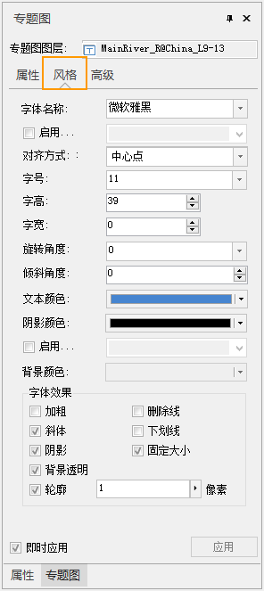

**“风格”选项卡：**
用于设置当前统一风格标签专题图中的标签对象（文本对象）所使用的统一字体风格。特别的，统一风格中支持标签的字体类型、大小、旋转角度和字体颜色通过选择属性字段进行设置，实现自定义标签设置，满足不同的标签显示需求。

<!--    -->

* **字体名称** ：用于设置标签专题图中标签文本所使用的字体，该标签控件右侧的组合框下拉列表中提供了丰富的字体供用户选择，同时提供了“最近使用的字体”分组，方便选择最近使用的字体名称。系统支持键盘快速首字母定位字体。例如在键盘上单击字母“T”，则在下拉列表框内会显示以字母"T"开头的字体。单击该标签控件右侧的组合框下拉列表，选择一种字体。默认字体为微软雅黑。  
当勾选了 **启用表达式**，字体名称将通过选择属性字段的方式设置，字体将根据设定的属性值来展示，实现同一专题图中标签字体不同的自定义标签效果。关于自定义标签的设置，请参见：[自定义标签设置说明](CustomLabelMapDefault.html)。  
* **对齐方式：** 用于通过设置标签专题图中文本对象与其锚点的相对位置来确定文本对象的摆放位置。该标签控件右侧的组合框下拉列表中列出了 12 种对齐方式，对齐方式的详细说明情参阅[文本对齐方式说明](../../Visualization/Interaction/TextAlignDirection.html)。  
**注意** ：若对齐方式选择“ **中心点** ”，专题图中的文字没有显示在点的中心，是由于地图显示默认开启了 **点随标签显隐**，若要文字在点的中心，请在 **地图属性** 面板中 **压盖设置** 中取消 **点随标签显隐** 的设置。  
* **字号：** 用于设置标签专题图中标签文本字体的大小，用户既可以输入字体大小的数值，也可以从该标签控件右侧的组合框下拉列表中选择合适的字体大小。字号也可以选择该图层的一个字段，使用字段值作为字体大小，数值精度为0.5。 
* **字高：** 用于设置标签专题图中标签文本字体的高度，可以通过该标签控件右侧的文本框中输入数值也可以使用文本框中的上下微调按钮来调整文本框中的数值，数值精度为0.5。
* **字宽：** 用于设置标签专题图中标签文本字体的宽度，可以通过在该标签控件右侧的文本框中输入数值也可以使用文本框中的上下微调按钮来调整文本框中的数值。默认情况下，字宽为0.0，表示使用当前字号和字高下，相应的字宽。字宽单位为0.1毫米。
* **旋转角度：** 用于设置标签专题图中标签对象（文本对象）的旋转角度，可以通过在该标签控件右侧的文本框中输入数值，也可以使用文本框中的上下微调按钮来调整文本框中的数值，也可以选择该图层的一个字段，使用字段值作为旋转的角度值，数值单位为度，逆时针方向为正方向。关于自定义标签的设置，请参见：[自定义标签设置说明](CustomLabelMapDefault.html)。
* **倾斜角度：** 勾选该选项卡中“字体效果”设置区域的“斜体”复选框，即可将标签专题图中标签对象（文本对象）中的字体设置为斜体。“倾斜角度:”项用于控制字体的倾斜程度，可以通过该标签控件右侧的文本框中输入数值，也可以使用文本框中的上下微调按钮来调整文本框中的数值，数值可以为正数也可以为负数，单位为度，当倾斜角度为 0 时，为系统默认的字体倾斜风格。如果 选项卡中的“斜体”复选框没有勾选，该项不可用。
* **文本颜色：** 用于设置标签专题图中标签对象（文本对象）中文本的颜色，单击该标签右侧的按钮，弹出“颜色”对话框，可以选择和设置合适的颜色。  
当勾选了 **启用表达式**，文本颜色将通过选择属性字段的方式设置，颜色将根据设定的属性值来显示，实现同一专题图中标签颜色不同的自定义标签效果。关于自定义标签的设置，请参见：[自定义标签设置说明](CustomLabelMapDefault.html)。  
* **阴影颜色：** 用于设置标签专题图中标签文本的阴影颜色，单击该标签右侧的按钮，弹出“颜色”对话框，可以选择和设置合适的颜色。需要注意的是只有在字体效果处勾选了复选框“阴影”设置，阴影颜色才可用。
* **背景颜色：** 用于设置标签专题图中标签对象（文本对象）中文本的轮廓或背景颜色，单击该标签右侧的按钮，弹出“颜色”对话框，可以选择和设置合适的颜色。只有勾选“文字效果”设置区域的“轮廓”复选框或不勾选“背景透明”复选框时，标签对象的“背景颜色”按钮才为可用状态。勾选“轮廓”按钮时，才会显示文本的轮廓颜色，否则文本无轮廓；不勾选“背景透明”按钮时，才会显示文本的背景颜色，否则，文本背景透明，所设置的背景颜色效果不可见。
* **加粗：** “字体效果”设置区域的“加粗”复选框用于控制标签专题图中标签对象（文本对象）中的字体是否使用粗体。当勾选该复选框时，表示字体为粗体显示；若不勾选该复选框，则字体不以粗体显示。
* **斜体：** “字体效果”设置区域的"斜体"复选框用于控制标签专题图中标签对象（文本对象）中的字体是否使用斜体。当勾选该复选框时，表示字体采用斜体显示，若不勾选该复选框时，则字体不以斜体显示。
* **删除线：** “字体效果”设置区域的“删除线”复选框用于控制标签专题图中标签对象（文本对象）中的文字是否添加删除线。当勾选该复选框时，表示文字有删除线；若不勾选该复选框时，文字没有删除线。
* **下划线：** “字体效果”设置区域的“下划线”复选框用于控制标签专题图中标签对象（文本对象）中的文字下方是否添加下划线。当勾选该复选框时，表示文字下方有下划线；若不勾选该复选框时，文字下方没有下划线。
* **阴影：** “字体效果”设置区域的“阴影”复选框用于控制标签专题图中标签对象（文本对象）中的文字是否有阴影。当勾选该复选框时，文字有阴影；若不勾选该复选框时，文字没有阴影。
* **轮廓：** “字体效果”设置区域的“轮廓”复选框用于控制标签专题图中标签对象（文本对象）中的文字是否有轮廓线，即文字采用描边修饰。当勾选该复选框时，表示文字有轮廓线，同时支持设置轮廓宽度，单位为：像素，值域为[1，5]；若不勾选该复选框时，文字没有轮廓线， 并且文字轮廓线修饰与文字背景修饰互斥，两者对于文字的修饰不能同时存在，文字轮廓线的颜色为“背景颜色:”标签后的按钮所设置的颜色。
* **固定大小：** “字体效果”设置区域的“固定大小”复选框用于控制文本图层中文本对象是否固定大小。当勾选该复选框时，表示文字大小（包括字号、字高、字宽等）不随地图的缩放而改变大小；若不勾选该复选框时，表示文字大小（包括字号、字高、字宽等）随地图的缩放而缩放。
* **背景透明：** “字体效果”设置区域的“背景透明”复选框用于控制标签专题图中标签对象（文本对象）中的文字是否有背景修饰。当勾选该复选框时，表示文字无背景；若不勾选该复选框时，文字有背景， 并且文字轮廓线修饰与文字背景修饰互斥，两者对于文字的修饰不能同时存在，文字背景所使用的颜色为“背景颜色:”标签后的按钮所设置的颜色。

###  注意事项

点、线、面数据集均支持制作自定义标签，但线数据集的自定义标签不支持沿线标注，通过指定字段的方式控制标签的字体、文字大小、文字旋转角度、文字颜色，只对点标签专题图有效。

###  相关主题

<!--   -->
[自定义标签设置说明](CustomLabelMapDefault.html)

