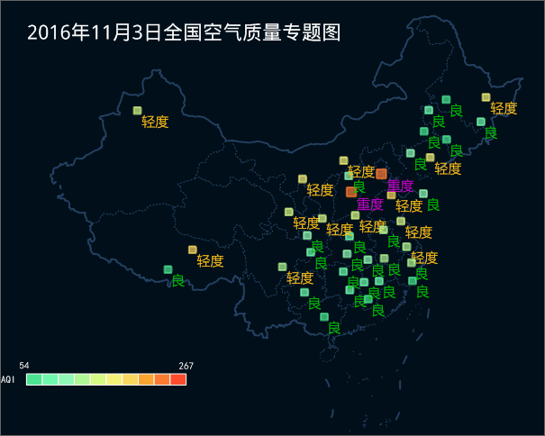

**“风格”选项卡：** 用来设置当前单值标签专题图中的标签对象（文本对象）所使用的字体风格。

1. **表达式：** 组合框用于显示和设置当前单值专题图的专题变量，即当前图层的某个属性字段或属性字段的数学表达式。字段中相同单值的对象所对应的标签对象采用同样的文本风格显示，不同单值对象所对应的对象的文本风格不同。 
* 组合框的下拉列表中列出了可制作单值标签专题图的矢量数据集的数值型属性字段的名称，用户可以选择任意一个字段来改变当前单值所使用的专题变量，或者在该组合框中输入字段名，但该字段必须在组合框的下拉列表中存在。用户也可以选择组合框下拉列表中的“表达式...”项，在弹出的“SQL 表达式”对话框中构建属性字段的数学表达式。
* **更改表达式后重置单值** ：若勾选该复选框，字段表达式更新后，当前单值标签专题图便使用新的专题变量重新对标签对象（文本对象）进行风格配置并刷新显示效果。
2. **颜色方案：** 标签右侧的组合框用来设置单值标签专题图中每种单值标签对象所使用的文字颜色风格，组合框的下拉列表中提供了一系列的颜色方案，当选择某一个颜色方案后，每个范围段的标签对象的文字根据颜色方案的颜色变化模式被赋予不同的颜色，当前单值标签专题图便使用新的颜色方案重新进行配置标签对象中的文字颜色并刷新显示效果。 
3. **标签旋转角度** ：若勾选该复选框，用户可在右侧的组合框设置用于旋转标签角度的字段。用户可将每个标签需要旋转的角度存储在某个特定的字段属性中，该字段类型支持数值型和文本型。
4. **标签单值列表：** “风格”选项卡的底部区域为当前单值标签专题图中所有单值的列表，该列表主要用以显示每项单值和各类单值对象所采用的文本风格以及其他显示控制。列表中的每一项对应一类单值。 
  * **设置专题值对应的单值是否可见：** 可见按钮用于控制单值标签专题图层中对应的单值是否显示，单击该图标进行显示的控制。
    * **单值：** 用于显示子项的单值，该单值即为专题图中显示的单值属性值。若用户需要修改已有单值内容，需要在对应属性表中修改属性值，此处修改无效 。
    * **标题：** 用于显示和修改子项的标题，可直接在“标题”列的单元格中编辑修改。单值标题是用来辅助理解单值的具体含义，并不会影响专题图中的单值显示内容。
5. 可见按钮用来控制当前单值标签专题图中属于选中的单值项的标签对象的可见性，可以同时选中多个标签范围段项。单击该按钮进行可见性控制， 当按钮为按下状态时，属于选中的标签范围段的标签对象可见，当按钮为非按下状态时，则不可见。
6. 文本风格按钮用来设置选中单值的文本风格，即属于选中的单值的标签都将采用所设置的文本风格进行显示。选中一个或多个标签范围段项（辅助 shift 键选择多个项）后，单击该按钮，用户可在弹出的文本风格对话框中设置选中单值标签的文本标注风格。同时单击保存按钮，可保存色带至颜色方案管理器。 
7. **添加或删除专题值：** 添加按钮用于管理专题图中的专题值。有关专题值的详细描述可参看[修改单值专题图](../UniqueValueMap/PropertiesDia)。 
8. **子项排序和颜色方案反序：** 升序按钮根据子项值按照升序排列，降序按钮根据子项值按照降序排列；反序 按钮，可将颜色方案按照相反的顺序进行调整。 

下图是以SampleData 示例数据中PM2.5.smwu 数据为例，以矢量点数据集PM25_20161103中的 Airlevel
作为单值字段值制作的单值标签专题图：

  

###  相关主题

 [修改单值专题图](../UniqueValueMap/PropertiesDia)
