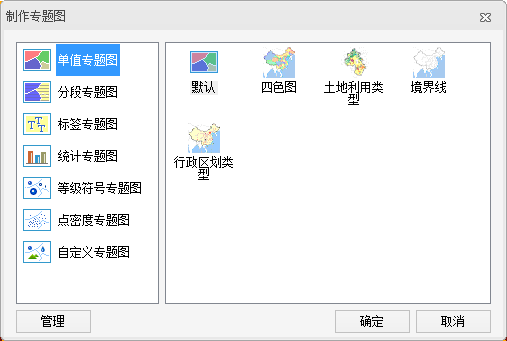

### 使用说明

通过单击某一个专题图组（如“单值”组）的“模板”下拉按钮，基于专题图模板制作相应的专题图。

### 操作步骤

1. 在图层管理器中选中一个矢量图层，以激活专题图组的“模板”下拉按钮。下图以单值专题图为例：<!--    -->
2. 单击“模板”下拉按钮，在弹出的下拉菜单中选择一个单值专题图模板，即可应用模板中的风格创建一幅单值专题图。
3. 基于模板创建的单值专题图将自动添加到当前地图窗口中作为一个专题图层显示，同时在图层管理器中也会相应地增加一个专题图层。
4. 系统自带的专题图模板和用户自定义的专题图模板都会出现“模板”下拉菜单下，可以通过模板管理器统一进行管理，请参见：[“管理专题图模板”](TemplateManager.html)。

###  注意事项

使用“模板”下拉按钮创建一幅单值专题图后，同时会弹出“单值专题图”窗口。窗口中显示了制作当前专题图的设置信息：如单值专题图的颜色方案以及所有专题值的列表等，用户可以在此基础上，对专题值的风格进行重新设置，通过局部修改基于模板生成的单值专题图获得更符合用户需要的专题图效果。
