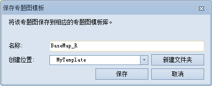
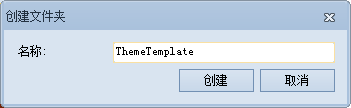

###  使用说明

应用程序提供了专题图模板功能，用户可以将自己制作的专题图作为模板保存到专题图模板库中，以备再次使用。

“保存到专题图模板库”命令，用来将专题图输出为专题图模板并保存到专题图模板库中。专题图模板实质是一个记录了专题图信息的 *.xml 文件。

###  操作步骤

1. 右键点击选中图层管理器中的某个专题图图层结点，在弹出右键菜单中点击选择“保存到专题图模板库”命令；
2. 弹出“保存专题图模板”对话框，输入专题图模板的名称。
3. 用户可以通过点击“创建位置”右侧的下拉按钮选择模板的保存位置。默认的专题图模板的位置为该专题图对应的模板库。点击“添加”按钮，当前对话框自动关闭，同时该模板将被保存在系统的专题图模板库中。模板库存放在："安装目录\Templates\Theme"下的相应专题图类型的子文件夹中。  
<!--    -->
4. 也可以点击“新建文件夹”按钮，创建新的文件夹保存专题图模板。点击“添加”按钮，关闭当前对话框自动，即可完成专题图模板库的保存工作。新建的模板库存放位置为："安装目录\Templates\Theme"下的相应专题图类型的子文件夹中，例如 MyTemplate 文件夹。
<!--    -->
5. 保存成功后，点击“专题图”选项卡相应的专题图组的“模板”下拉按钮，可以查看或者应用保存的专题图模板。

###  注意事项

1. 应用程序提供了专题图模板库，放置了丰富的专题图制作模板；同时，用户可以将自己制作的专题图作为模板保存到专题图模板库中。
2. 模板库存放在:"安装目录\Templates\Theme"下的相应专题图类型的子文件夹中。子文件夹名称与功能区上“专题图”选项卡中的“点密度”组、“统计符号”组和“标签”组等相对应，不同类型专题图的“模板”下拉按钮将从对应的子文件里获取模板信息。