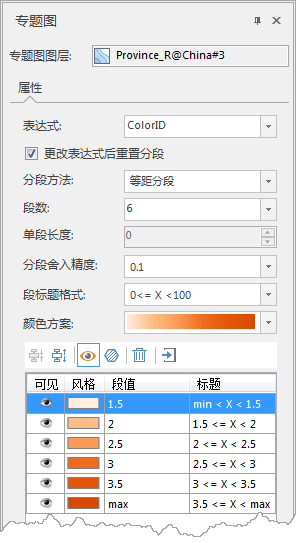
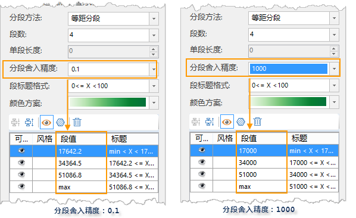

###  使用说明

用户可在“分段专题图”窗口中，修改分段专题图的各项参数设置，实现更符合需求的专题图效果。

###  操作步骤

1. 在图层管理器中选中某一个分段专题图图层，右键单击“修改专题图”按钮，在弹出的专题图属性窗口中显示了选中的分段专题图的设置信息。不同类型的矢量图层制作分段专题图时的设置相同，以基于面图层制作分段专题图属性窗口为例：<!-- 2.    --> 
3. **专题图图层** ：显示当前呈现的专题图名称。
4. **表达式：** “表达式:”组合框用于显示和设置当前分段专题图的专题变量，即当前图层的某个属性字段或属性字段的数学表达式。
  * 单击“表达式:”组合框的下拉按钮，弹出的下拉列表中列出了用来制作当前分段专题图的矢量数据集的所有属性字段；
  * 在下拉列表中，选择当前分段专题图图层的专题变量（单个属性字段）；用户也可以单击下拉列表中的“表达式...”项，在弹出的“[SQL 表达式](../../Query/SQLDia.html)”对话框中构建字段表达式，作为分段专题图的专题变量。
  * 当前分段专题图将实时根据修改后的专题变量重新进行配图，并刷新显示效果。  
**注意：** 对于 Oracle Plus、SQL Plus 引擎类型的数据制作专题图时，字段表达式只能为字段值或者字段运算式，如（SmID） 或者（SmID + 1） 等。目前不支持通过条件表达式设置专题图字段的方式。如果设置的字段表达式是条件表达式，如：“SmID >
100”，那么制作的专题图会失败，输出窗口会提示“专题图更新失败”。

4. **分段方法：** “分段方法:”项右侧的下拉按钮用于显示和设置当前分段专题图中专题变量的分段方法。用户单击该组合框的下拉列表选择合适的分段方法。
   * **等距分段：** 根据专题变量所确定的所有专题值中的最大值和最小值，按照用户设定的“段数”进行相等间距的分段。在等距离分段中，每一段具有相等的长度。
   * **平方根分段：** 对专题变量所确定的专题值的平方根为分段数据进行等距离分段。首先取所有专题值的平方根，然后进行等距离分段，得到处理后数据的分段点，然后将这些分段点的值进行平方得到对应专题值的分段点，从而得到专题值的分段方案。
   * **标准差分段：** 反映各对象的某属性值对其平均值的偏离。首先计算出专题变量所确定的专题值的平均值和标准偏差，在此基础上进行分段。标准差分段的每个分段长度都是一个标准差，最中间的那一段以平均值为中心，左边分段点和右边分段点分别与平均值相差0.5个标准差。标准差分段方法所得的“段数”由计算结果决定，用户不可控制。
   * **对数分段：** 与平方根分段方法基本相同，所不同的是平方根方法是对专题值取平方根，而对数分段方法是对专题值取对数，即对专题值的以10为底的对数值进行等距离分段。首先对所有专题值的对数进行等距离分段，得到处理后数据的分段点，然后以10为底，这些分段点的值作为指数的幂，得到对应的专题值的各分段点的值，从而得到分段方案。
   * **等计数分段：** 每个范围段中具有相等数目的对象个数，“相等的个数”是由用户指定的“段数”以及用来制作分段专题图图层中实际的对象个数来决定的，在可以均分的情况下，每段中对象数目应该是一样的，但是当对象数目不可均分时，分段结果在最后一段内会有出入。
   * **自定义分段：** 由用户指定各段的长度，即“单段长度”进行分段，“段数”由应用系统根据指定的间隔距离以及专题值的最大和最小值来计算，用户不可控制。
5. **段数：** “段数:”数字显示框用于显示和设置当前分段专题图对专题值进行分段的分段数，即范围段的个数。
6. **单段长度：** “单段长度:”数字显示框用于显示和设置当前分段专题图分段的间隔距离，即每个范围段的长度，该项的设置只有在分段方法为自定义分段时才有效。
7. **分段舍入精度：** ”分段舍入精度“：项右侧的下拉按钮用于设置段值的舍入精度，程序提供15种舍入精度，分别是10000000、1000000、100000、10000、1000、100、10、1、0.1、0.001、0.0001、0.00001、0.000001、0.0000001、0.00000001。如下图所示：当分段舍入精度设置为0.1时，分段段值舍入保留小数点位后一位；当分段舍入精度设置为1000，分段段值舍入小数点前三位。  
  
1. **段标题格式：** “段标题格式:”项右侧的下拉按钮用于指定表达每个范围段的值域范围的格式，系统提供了两种段标题格式，可通过该下拉按钮进行选择。
1. **颜色方案：** “颜色方案:”组合框用于显示和设置当前分段专题图中每个范围段的颜色风格。
    * 单击“颜色方案:”组合框右侧的下拉按钮，在弹出的下拉列表中选中某一个颜色方案，即可根据选择的配色方案对当分段专题图的每个范围段赋予不同的颜色。
1. **合并或拆分范围段：** 选项卡下部的列表中列出了所有范围段，可根据需要对各范围段进行合并和拆分。 
    * 合并按钮：用来将选中的多个连续的范围段（可配合使用 Ctrl 或 Shift 键）合并为一个范围段，合并后的范围段的值域范围为被合并的所有范围段的值域的并集。如果没有或者只有一个范围段被选中，或者选中的多个范围段不连续，则该按钮都不可用。
    * 拆分按钮：用来将选中的某一个范围段拆分为两个新的范围段。
2. **可见性设置：**
    * 单击工具条中的可见图标按钮，可以控制范围段列表中所有选中的范围段对应对象的可见性。
    * 单击每一个范围段项中的可见图标，可以控制该范围段对应对象的可见性。
3. **符号风格设置：** “分段专题图”窗口中部的工具条，可用于设置分段范围段列表中选中范围段的显示风格， 用户也可以通过单击每一个范围段项中的符号风格图标，在弹出的资源列表中可设置范围段对应地图对象的风格。不同类型矢量数据集创建的分段专题图，符号风格设置按钮的功能有所差异。 
    * 填充风格按钮：用于设置当前分段专题图中所有选中范围段项对应对象的填充风格。单击该按钮，或单击每一个范围段项中的面符号风格图标，弹出“风格设置”窗口（具体操作可参见[填充符号风格设置](../../Visualization/LayerStyle/FillSymStyle.html)），用户可根据需要设置选中范围段对应面对象的填充风格。
    * 线风格按钮：用于设置当前分段专题图中所有选中的范围段对应线对象。单击该按钮，或每一个范围段项中的线符号风格图标，弹出“风格设置”窗口（具体操作可参见[线符号风格设置](../../Visualization/LayerStyle/LineSymStyle.html)），用户可根据需要设置选中范围段对应的线对象的符号风格。 
    * 点风格按钮：用来设置当前分段专题图中所有选中的范围段对应对象的的点状符号风格。单击该按钮，或每一个范围段项中的点符号风格图标，弹出“风格设置”窗口（具体操作可参见[点符号风格设置](../../Visualization/LayerStyle/PointSymStyle.html)），用户可根据需设置选中范围段对应点对象的符号风格。 
    * 当需要修改多个专题图子项的风格时，可以按住 Shift 键选择要修改风格的专题图子项，然后单击工具条中“风格”设置按钮，弹出“修改专题图项风格”对话框，可在此选择要修改的项，进行批量修改具体操作请参见：[修改专题图项风格](../ThematicStyle.html)。
4.  **子项定位** ：在专题图子项列表中选中一个或多个专题图子项，单击鼠标右键，选择“定位”选项，即可在地图中高亮显示对应的对象。若定位对象在当前地图显示范围内，则对象直接高亮显示；若定位对象不在当前地图窗口中，则会保持地图比例尺，居中显示定位对象。 **注意** ：使用专题图子项定位功能时，需设置图层为可选择状态。
5.  **段值：** 范围段列表中的“段值”列用于显示和设置每个范围段分段点（该段的终止点）的数值（如上图所示），每个数字显示框对应一个分段点，分段点的数值可以通过该数字显示框进行改变，改变后的结果会实时反映到当前分段专题图图层上。
6.  **标题：** 范围段列表中的“标题”列用于显示和设置每个范围段的标题。
7.  在“分段专题图”窗口中的各项参数设置都会实时反映到当前地图窗口中相应的专题图图层，即实现所见即所得。用户也可以通过取消勾选对话框底部的“启用即时刷新”复选框，不启用实时刷新。若不勾选“启用即时刷新”复选框，则用户完成各项参数设置后，可单击对话框底部的“应用”按钮，将对话框中的参数设置应用于当前专题图。 

### 备注

1. 用户制作和修改的分段专题图都可以保存为模板，以便应用到其它图层的专题图制作中，保存专题图模板具体参见：[保存到专题图模板库](../Methods/GURTheme2_SaveThemeTempl.html)。
2. 若表达式处选择的字段为空值，也可设置相关的段数、范围、子项风格等参数，适用于输出为专题图模板。
3. 在使用模板方式制作专题图时，用户可以直接在“模板”下拉按钮的下拉菜单中，选择已保存的模板将其应用到其它专题图的制作中。