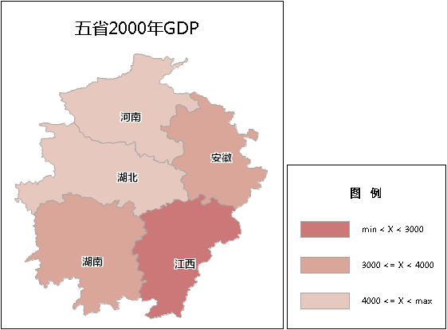

分段专题图是利用图层的某一字段属性，将属性值划分为不同的连续段落（分段范围），每一段落使用不同的符号（线型、填充或者颜色）表示该属性字段的整体分布情况，从而体现属性值和对象区域的关系。分段专题图表示了某一区域的数量特征，如不同区域的销售数字，家庭收入，GDP，或者显示比率信息如人口密度等。分段专题图支持对
DEM 图层和 GRID 图层制作分段专题图。

点击“ **专题图**”选项卡中的“分段专题图”按钮，直接生成系统默认的分段专题图，用户可以在此基础上修改参数设置，制作符合制图需要的分段专题图。下图所示为分段专题图的示意图。利用河南（5137）、湖北（3028）、湖南（4276）、江西（2003）和安徽（3691）五省2000年 GDP 数值制作的分段专题图。按照 GDP 数值的分布情况，分为三段，最小值~3000,3000~4000,4000~最大值。每一段用不同的颜色表示。

  

从上图可以看出，江西位于第一分段（<3000），湖北和安徽位于第二分段范围（3000~4000），河南和湖南位于第三分段范围内（>4000）。

分段专题图可基于任一点、线、面矢量图层制作。在制作分段专题图时，首先将要制作专题图的矢量图层设置为当前图层，即在图层管理器中选中该矢量图层。同时制作好的专题图可以进行编辑。更多有关专题图编辑的内容，请参见[编辑专题图](../EditingMap/EditingMap.html)。

###  制作分段专题图的两种途径：

<!--   -->
[新建分段专题图](RangesMapDefault.html)

<!--   -->
[修改分段专题图](RangesMapGroupDia.html)

###  相关主题

<!--   -->
[编辑专题图](../EditingMap/EditingMap.html)