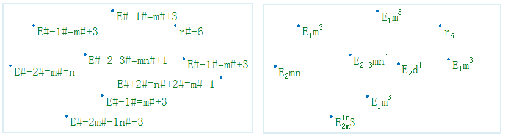

在制作标签专题图时，通过标签表达式可以实现上下标注的功能。当标签专题图的字段为文本类型，而文本中需要使用上下标时，通过满足特定规则的表达式，结合使用“显示上下标”功能，可以实现上下标注的显示。

目前支持上下标功能的标签专题图类型为统一风格标签专题图、分段风格标签专题图和标签矩阵专题图。

上下标功能在地图进行标注时经常会用到，例如在对面积进行标注时，需要标注面积的单位：km2，此时就需要用到上下标功能。对各个行政区的面积进行完整标注，单位为：km2。在
UDB 数据源中，标签表达式为：Provinces_R.AREA||"km#+2" 或 Provinces_R.AREA||'km#+2'；若在
Oracle 数据源中，则标签表达式为：Provinces_R.AREA||'km#+2'。其中 Provinces_R.AREA
字段记录了各个行政区的面积值，为双精度字段。标注的时候，将数值型字段转为文本型，然后再连接面积单位（km2）进行显示。注意：UDB 或 Oracle
数据源中文本的连接符号为“||”。效果如下图所示：

  

###  标签表达式规则

为了实现上下标的效果，标签表达式书需要按照一定的规则：

1. 含有上下标的文本表达式中，#+ 表示上标；#- 表示下标，#= 表示分割一个字符串为两个上下标部分。   
   
2. 设置了支持标签表达式的文本标签，如果以"#+"、"#-"、"#="开始，则整个字符串原样输出。    
  
3. 遇到#+或者#-，后边紧挨着的字符串都当成上下标内容、当第三次遇到#+或#-时采用新串规则。  
   
4. 含有上下标的文本表达式中，两个连续的"#+"的效果同一个"#-"，两个连续的"#-"的效果同一个"#+"。  
  

###  注意事项

  * 具有上下标的标签的对齐方式只能显示为“左上角”效果，不具有上下标的文本的标签的对齐方式与文本风格中设置的对齐方式相同。
  * 不支持有旋转角度的文本标签，及文本标签的旋转角度不为0时，上下标功能无效。
  * 当地图有旋转角度时，设置了上下标文本标签不随地图的旋转而旋转。