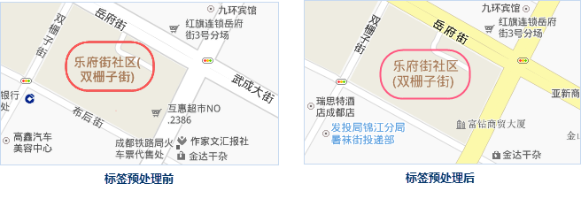
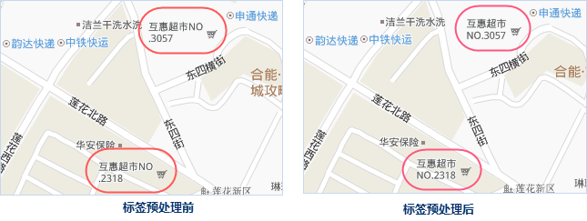

在制作标签专题图时，设置自动换行之后常常会出现换行文本显示不合理、不美观的现象，
提供的“标签预处理”功能可根据相关的分割原则，在指定的文本字段信息中添加分隔符，用预处理的结果字段来制作标签专题图。

**标签的预处理原则有以下几点** ：

  * 保持和保证换行的多行文本对齐；
  * 优先考虑两行对齐显示；
  * 每行文字尽量控制在4-8个字；
  * 标签换行后，若最后一行仅剩下一个文本，则将其提到上一行显示；
  * 使“(” 不单独显示在上一行结尾处，“)”不单独显示在下一行的开头处；
  * 完整的数据、单词连续显示，不拆分为两行；
  * 使缩写的“.”号紧跟被缩写的词汇。

**标签预处理可解决以下几种标签显示不美观的问题：**

1. 应该完整显示的数字、英文单词被拆开成多行；

    

2. 换行处出现半个括号，即行末尾最后是“（”，或者行开头是“）”；

     

3. 英文单词中缩写的“.”号没有紧跟被缩写词汇；

     

4. 每行文本字数差别太大不美观，或最后一行仅剩下一个字；

      

5. 数字和短横线连接的词组被拆成多行显示。

     

###  操作步骤

  1. 若地图中制作的标签专题图设置自动换行后，文本的显示不能满足用户需求，可在“专题图”选项卡的“标签”分组中，单击“标签与处理”按钮，对待制作标签专题图数据集的指定字段进行预处理。
  2. 在弹出的“标签预处理”对话框中，指定了待处理的数据集和字段信息之后，再设置以下参数： 
    * **结果保存** ：预处理后的结果信息可以保存在新建字段中，也可以在原字段上更新。
    * **标签字体** ：建议设置为与标签专题图一样的字体类型，标签字体会影响标签换行的宽度。
    * **分割符号** ：选择或输入一个英文字符作为分隔符，即在适当位置插入指定字符作为换行符。
    * **分割最大长度** ：设置每行字符最大显示长度，建议最大长度为 4-8。该参数的优先级排在处理原则之后，即在满足处理原则的情况下每行文本不超过标签最大长度。
  3. 标签预处理成功之后，结果字段的字段值会在换行处加上指定的换行符，如下图所示，左侧是原字段信息，右侧是加上换行符后的标签预处理结果。    
   
  4. 标签预处理结果需要通过标签专题图实现更好的展示，将标签专题图的表达式设置为预处理的结果字段，并在专题图属性的“高级”面板中，将“ **指定换行字符** ”设置为预处理时设置的分割符号，标签即可根据预处理结果换行显示。  
  