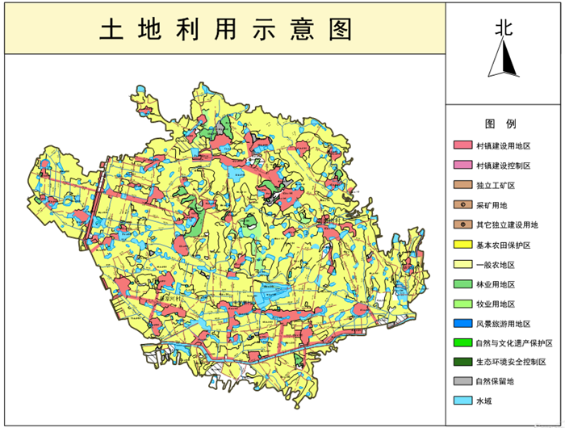

单值专题图是利用图层的某一字段（或者多个字段）的属性信息通过不同的符号（线型或者填充符号）表示不同属性值之间的差别。单值专题图支持对 DEM 图层和
GRID
图层创建单值专题图。单值专题图有助于强调数据的类型差异，但是不能显示定量信息。因此单值专题图多用于具有分类属性的地图，比如土地利用类型、境界线、行政区划图等。

点击“ **专题图**
”选项卡中的“单值专题图”按钮，直接生成系统默认的单值专题图，用户可以在此基础上修改参数设置，制作符合制图需要的单值专题图。下图所示为单值专题图的示意图，是基于土地利用类型属性字段建立的单值专题图，不同颜色的填充区域代表了不同的土地利用类型。

  
---  
  
单值专题图可基于任一点、线、面矢量图层制作。在制作单值专题图时，
首先将要制作专题图的矢量图层设置为当前图层，即在图层管理器中选中该矢量图层，同时制作好的专题图可以进行编辑。

特别的，点数据集的单值专题图，如果单值风格选用的是符号，符号大小、旋转角度支持选择属性字段，进行自定义的单值风格设置。

更多有关专题图编辑的内容，请参见[编辑专题图](../EditingMap/EditingMap)。

### 制作单值专题图的两种途径：

 [新建单值专题图](UniqueValuesMapDefault)

 [修改单值专题图](UniqueValuesMapGroupDia)

### 注意事项

只有当图层的专题值项不超过 3000 条时，才可通过以上途径制作单值专题图。若图层的专题值项大于 3000 项时，应用程序不执行创建单值专题图的操作。

###  相关主题

 [编辑专题图](../EditingMap/EditingMap)

