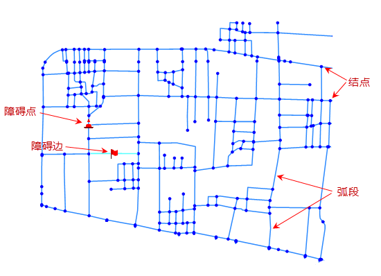
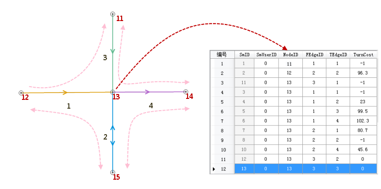

###  概述

交通网络分析为商业、公共服务业以及日常生活带来便利，分析结果可提供有效的执行方案帮助用户做出更合理的决策。交通网络分析可以帮助解决以下实际问题：

1. 从 A 点到 B 点的最短路线是什么？
2. 去一个景点旅游，如何选择一条路线，一次走完尽可能多的景点？
3. 一家新开张超市的顾客覆盖区域是多大，进货量应该如何确定？
4. 发生火灾后，如何调度最近的消防车进行抢救？
5. 东城区的一个配送员，如何在最短时间内完成所有的快递任务？

在地理信息世界中，公共基础设施（电力设施、电信与有线电视网络、道路交通、水网等）被抽象为“网络系统”。网络系统是指有许多相互连接的线段构成的网状系统，网络模型是对现实世界中网络系统的抽象表达。例如在城市交通网中，道路等线状地物被抽象为线段，在网络中称为网络弧段；而十字路口、公交站点等点状地物被抽象为点，在网络中称为网络结点。在网络模型中，资源和信息能够沿着弧段，从一个结点到达另外一个结点。可以这么理解，网络就是边（线）和交汇点（结点）等元素共同组成的，表示了从一个位置到另外一个位置的可能路径。

###  基本概念

**网络** 是由一组相互关联弧段、结点和它们的属性所组成的模型。网络用于表达现实世界中的道路、管线等。

  
  
如上图所示，网络不仅具有一般网络的弧段与结点间的抽象拓扑关系，还具有 GIS
空间数据的几何定位特征和地理属性特征（拓扑关系时地理对象在空间位置上的相互关系，如结点与线、线与面之间的连接关系）。

下面主要介绍网络模型中涉及的基本概念：

* **结点**

结点是网络中弧段相连接的地方，如上图所示。结点可以表示现实中的道路交叉口、河流交汇点等点要素。结点和弧段各自对应一个属性表，它们的邻接关系通过属性表的字段来关联。

* **弧段**

弧段就是网络中的一条边，弧段通过结点和其它的弧段相连接。弧段可用于表示现实世界运输网络中的高速路、铁路、电网中的传输线和水文网络中的河流等。弧段之间的相互联系是具有拓扑结构的。

* **网络阻力**

现实生活中，从起点出发，经过一系列的道路和路口抵达目的地，必然会产生一定的花费。这个花费可以用距离、时间、货币等度量。在网络模型中，把通过结点或弧段的花费抽象成网络阻力，并将该信息存储在属性字段中，称为阻力字段。

* **中心点**

中心点是网络中具有接受或提供资源能力，且位于结点处的离散设备。设施是指地理信息系统所需的物质、资源、信息、管理和文化环境等。例如学校里有教育资源，学生必须到校学习；零售仓储点，储存了零售点所需要的货物，每天需要向各个零售点配送发货。中心点实质上也是网络上的结点。

* **障碍边和障碍点**

城市中的交通堵塞问题随处可见，交通拥堵是没有规律可循、随机且动态变化的过程。为了实时地反映交通网络的现状，需要让交通堵塞的弧段具有暂时禁止通行的特性，同时在交通恢复正常后，弧段属性也能实时恢复正常。障碍边、障碍点概念的提出可以很好地解决上述问题。障碍边、障碍点引入的好处是障碍设置与否与现有的网络环境参数无关，具有相对独立的特性。

* **转向表**

转向是从一个弧段经过中间结点抵达邻接弧段的过程。转弯耗费是完成转弯所需要的花费。转向表用来存储转弯耗费值。转向表必须列出每个十字路口所有可能的转弯，一般有起始弧段字段（FromEdgeID）、终止弧段字段（ToEdgeID）、结点标识字段（NodeID）和转弯耗费字段（TurnCost）四个字段，这些字段与弧段、结点中的字段相关联，表中的每条记录表示一种通过路口的方式所需要的弧段耗费。转弯耗费通常是有方向性的，转弯的负耗费值一般为禁止转弯。

例如，在对道路进行网络分析的时候，我们经常会遇到十字路口、三岔口等情况，如图示，右面为一个十字路口的示意图，左面的表格即为该十字路口所对应的转向表，转向表中记录了该十字口处车辆的转向和转弯所需的耗费等信息。

  