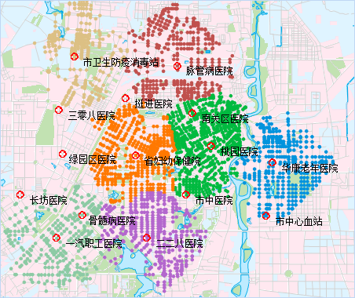

###  概述

位置选择是商业或非商业机构取得成功的先决条件。选址分区，是指为一个或者多个服务设施点在一定区域内的选定最佳或最优的位置，使得设施可以用一种最经济有效的方式为需求者提供服务或者商品。选址分区不仅仅是一个选址问题，还需要将需求点的需求量分配到相应的设施服务区中。

###  应用实例

零售商要新开连锁店，需要每天从不同的制造商处接收货物，很大一部分预算是花费在运输货物上的。因此零售商在为新的连锁店选址时，需要考虑原有连锁店的位置，同时也要保证所有连锁店总的运输成本最低。从消费者的角度，连锁店必须建在他们情愿前往的最大距离范围内。基于以上多种因素综合考虑，新的连锁店要开几家，建在何处。

###  选址分区中涉及的重要概念

* **选址分区类型**
   - **最少中心点模式**：要求分析结果要满足将尽可多的请求点分配给最大阻力范围内的资源供给中心点。此种模式使用范围比较多，如在超市选址的问题，如零售商想减少新开的连锁超市的数目；学校班车路线确定时，需要尽可能少的班车站数目。要求分析结果要满足将尽可多的请求点分配给最大阻力范围内的资源供给中心点。
   - **最大覆盖模式**：即非最少中心点模式，根据设置的分析参数，新的选址点数目由用户决定，但是得到选址位置要将尽可能多的资源中心点分配给相应的资源供给中心点。此种模式适用于消防站、警察局、医院等服务设施的选址。

* **资源供给中心点** ：资源供给中心点是提供资源和服务的设施点，对应了网络结点。每个设施点具有最大阻力值、中心点类型、中心点在网络中所处的结点的 ID 等信息。 
   - **最大阻力值**：用来限制资源供给中心的花费。如果需求点到此资源供给中心点的花费大于最大阻力值，则该需求点将被过滤掉，即该资源供给中心点不能服务此需求点。
   - **中心点类型**：分为三种：固定中心点、可选中心点和非中心。固定中心点表示原有的，已建成的服务提供点，如应用案例中已有的旧的连锁店为固定中心点；可选中心点表示需要增加的候选服务提供点，如应用案例中新的连锁店候选位置；非中心在分析时不予考虑，在实际问题中表现为不允许建立服务设施点或已经存在其他设备设施的位置。
   - **资源分配方向** ：在解决选址问题时，需要考虑资源中心点的分配方向问题。有两种方向，从中心点开始分配或者不从中心点开始分配。

例子：某市有15医院，分布情况如下图所示。现在想从这15个医院中选择7个医院作为全市高考集中体检医院，要求尽可能覆盖多的区域，方便各个区的考生体检。这个15个医院待选地点（如左图所示，红色符号代表15个候选医院），将在这些待选点中选择7个最佳位置作为体检医院。体检医院需满足：考生步行或者乘车去体检医院的时间要控制在30分钟以内，选址分区分析会根据这一条件给出最佳的选址位置，并且圈出每个医院的服务区域（如右图所示，不同颜色的点表示最后选出的7个体检医院的最佳位置）。

   
