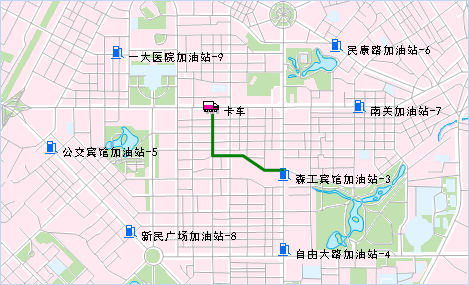

### 最近设施查找

最近设施分析指在网络中给定一组事件点和一组设施点，为每个事件点查找耗费最小的一个或者多个设施点，结果显示从事件点到设施点（或从设施点到事件点）的最佳路径、耗费以及行驶方向。同时还可以设置查找阈值，即搜索范围，一旦超出该范围则不再进行查找。

* 设施点：最近设施分析的基本要素，如学校、超市、加油站等服务设施。
* 事件点：最近设施分析的基本要素，需要设施点需要提供服务的事件位置。

网络分析中的查找最近设施点主要应用在汽车油量不足，需要找到最近的加油站；突发疾病，需要查找最近的急救中心的救护等类似事件。例如事件点是一起发生交通事故的现场位置，要求查找10分钟内能到达的最近的医院，超过10分钟才能到达的都不予考虑。此例中，事故发生点就是一个事件点，周边的医院都是设施点。查找设施点实际上也是一种路径分析，因此，同样可以设置障碍边和障碍点，在行驶路线上存在障碍时将不能通行，这些情况需要在分析过程中予以考虑。

### 应用实例

已知某城区有多个加油站和一个卡车的位置，卡车需要寻找一个在20分钟内能到达的加油站，以尽快把油加满，而不至于耽搁送货行程。下面以最近加油站查找为例讲解最近设施查找的步骤：

  1. 设置网络分析基本参数，将正向/反向权重字段设置为时间字段。
  2. 导入加油站点作为设施点。
  3. 导入卡车位置作为事件点。
  4. 在最近设施查找方向设置为“事件点->设施点”；卡车需要20分钟内到达加油站，因此查找半径设为20；将设施点的个数设为1。
  5. 指定结果数据集，执行分析以及查看分析结果。

如下图所示，为查找最近设施的结果。卡车周围共有9个加油站，则最终分析获得卡车到最近一个加油站的路线如下图绿色线所示。

  

### 操作说明

1. 打开用于分析的网络数据集。
2. 在“ **交通分析** ”选项卡的“ **路网分析** ”组中，选中“ **环境设置** ”复选框，弹出“ **环境设置** ”窗口。在此窗口中设置网络分析基本参数（如权重字段、结点/弧段标识字段等)、分析结果参数以及追踪分析的参数（设施网络分析需要设置）。关于环境设置窗口的介绍，请参见[网络分析环境设置窗口](NetAnalystEnvironmentWIN)页面。
3. 新建最近设施查找的实例。在“ **交通分析** ”选项卡的“ **路网分析** ”组中，单击Galley下拉按钮，在弹出的下拉框中选择“ **最近设施查找** ”项。成功创建实例后，会自动弹出实例管理窗口。关于实例管理窗口的介绍，请参见[实例管理窗口](InstanceWIN)页面。
4. 在当前网络数据图层中添加事件点。有两种方式添加事件点，一种是在网络数据图层中单击鼠标完成站点的添加；另外一种是导入点数据的方式，将点数据集中的点对象导入作为事件点，具体操作请参见[添加站点](ImportLocations)页面描述。<br\>
一个最近设施查找实例只能添加一个事件点，添加一个事件点后，鼠标状态会自动切换为添加“设施点”状态。**注意**：需要设置合适的结点捕捉容限。如果鼠标点击位置超出结点捕捉容限，则可能导致站点添加失败。
5. 同样的方式在网络图层中添加设施点和障碍点，添加完成后，单击鼠标右键结束操作。关于障碍点管理的相关内容，请参见[障碍点管理](BarrierManagement)页面。<br\> 注意：应用程序在进行最近设施查找时，分析结果与导入的设施点的顺序无关。若需要删除设施点，可选中“设施点”目录结点，在弹出的右键菜单中选择“移除”或者选中要删除的设施点按住 Delete 键即可。
6. 在网络分析实例管理窗口中单击“参数设置”，弹出“最近设施查找设置”对话框，对最近设施查找分析参数进行设置。 
     * **查找设置**
       * **查找方向**：指定查找最近设施点的方向，是从事件点到设施点还是从设施点到事件点。不同的查找方向对分析结果会产生影响。例如，从事件点到设施点需要行驶15分钟，而相反方向行驶则需要20分钟。
       * **查找半径**：最大查找半径。以事件点为中心，以输入的半径为搜索范围查找最近的设施点。一旦查找到满足条件的设施点或者超出查找半径都会停止查找。半径的单位与网络分析环境中权重字段的单位保持一致。如果要查找整个网络，可将该值设为0。
       * **设施点的个数** ：期望查找到的距离事件点最近的设施点个数。如在发生灾害事件时，需要把事件发生地的伤员送往一个或多个最近的医院进行救治。
    * **结果设置**
      * **保存结点信息**：选择是否将分析结果中事件点到设施点（或设施点到事件点）经过的所有结点信息都保存下来。如果选中“保存结点信息”将结点保存为点数据集并为其命名。该数据集将保存至网络数据集所在的数据源下。其中字段 NodeID 表示分析结果过经过的设施点的结点标识，字段RouteID 表示分析结果中事件点到设施点（设施点）的路由线标识。
      * **保存弧段信息**：选择是否将分析结果中的事件点到设施点（或设施点到事件点）经过的所有弧段信息都保存下来。如果选中“保存弧段信息”复选框，将保存为线数据集并为其命名，该数据集将保存到网络数据集所在的数据源。其中字段 EdgeID 表示分析出的事件点到设施点（设施点到事件点）的路由线标识。
      * **开启行驶导引**：选择分析时是否生成行驶导引。行驶导引记录了交通网络分析结果中的路径信息，一个行驶导引对象对应着一条从起点到终点的行驶路线。勾选“开启行驶导引”复选框，则表示在行驶导引窗口中输出分析结果的路径信息。关于行驶导引的介绍，请参见[行驶导引](PathGuide)页面。
    * **启用转向表**：该复选框可选择是否启用转向表。关于转向表的介绍，请参见[转向表](TurnTable)页面。
7. 所有参数设置完毕后，单击" **交通分析** "选项卡中" **路网分析** "组的" **执行** "按钮或者实例管理窗口中“ **执行** ”按钮 ，操作完毕。分析结果会即时显示在地图窗口中。分析结果可以保存为数据集，以便在其他地方使用。

### 注意事项

  * 对于设施点和事件点信息，可以将其导出成点数据集，以便以后进行类似分析时，直接导入使用。
  * 设施点和事件点可以在网络弧段和网络结点上或在捕捉容限范围内的附近区域。
  * 如果在网络分析图层中设置了障碍点，则障碍点信息在网络分析管理窗口中显示，并可以在该窗口中对障碍点进行管理。关于如何添加障碍点请参阅[障碍点管理](BarrierManagement)。
  * 由于受查找半径的影响，查找到的设施点数目并不总是等于要查找的设施点数目（可能少于）。