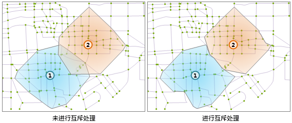
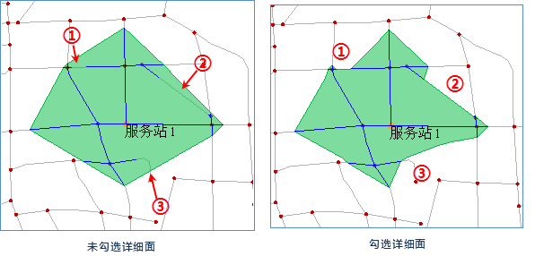

###  概述

服务区分析指在满足某种条件的前提下，查找网络上指定的服务站点能够提供服务的区域范围。

首先需要理解两个基本概念：

  * **服务站** ：即服务中心点，提供某种特定服务的位置，如某一超市、邮局、社区医院等。
  * **服务区** ：以指定点为中心点，在一定的阻力范围内，包含所有可通达边的一个区域。简单的说就是提供某种特定服务的位置按一定的条件所服务的区域，如某一社区派出所按行政区划所管辖的社区范围。

进行网络分析时，网络上拥有资源量的结点被抽象成服务站点，服务站点的最大范围距离被抽象为服务半径，分析成功后得到服务站点的服务网络和服务区域（多边形）。服务区分析可以理解为不考虑中心资源供给量和需求量，而只考虑供给方和需求方之间网络弧段阻力的资源分配。这类分析一般用于评估分析在某一位置邮局、医院、超市等公共设施的服务范围，从而为选择公共设施的最佳位置提供参考。

###  服务区分析参数

在进行服务区分析时，需要对发生重叠的服务区域的处理方式以及分析的方向进行设置。

* **从服务站开始分析** ：对服务区分析的方向进行设置。从服务站开始分析和不从服务站开始分析，体现了服务中心和需要该服务的需求地的关系模式。从服务站开始分析，是一个服务中心向服务需求地提供服务；而不从服务站开始分析，是一个服务需求地主动到服务中心获得服务。例如：某个供奶站向各个居民点送牛奶，如果要对这个奶站进行服务区分析，看这个供奶站在允许的条件下所能服务的范围，那么在实际分析过程中就应当使用从中心点开始分析的模式；另一个例子，如果想分析一个区域的某个学校在允许的条件下所能服务的区域时，在现实中，都是学生主动来到学校学习，接受学校提供的服务，那么在实际分析过程中就应当使用不从中心点开始分析的模式。
* **服务站互斥** ：各个服务区之间发生重叠时，需要设置对重叠的服务区是否进行互斥处理。按照中心点的距离进行判断是否要进行互斥处理。若分析出的相邻服务区有重叠的部分，则会互斥处理。如图所示左图未进行互斥处理，右图进行了互斥处理。
  
 
* **生成详细面** ：服务区分析支持生成详细面。如若选择不生成详细面，分析结果会根据节点简单勾勒面轮廓，面轮廓内包含未生成的路由线段。如下图未勾选详细面图中的①②③处。如果选择生成详细面，程序会严格按照生成路由生成面轮廓结果，分析结果会更准确。如下图勾选详细面生成结果。
  
