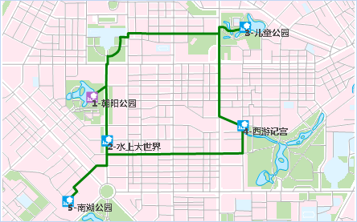

###  概述

路径分析是常用的网络分析功能之一。在现实生活中，我们常常需要找出两点间的最短路径，此问题的解决对交通、消防、信息传输、抢险救灾都具有十分重要的意义。在运输过程中，我们需要寻找运输费用最小的路径；在抢险救灾过程中，我们需要找到花费时间最短的路径。

###  旅行商分析

旅行商分析是无序的路径分析。旅行商可以自己决定访问结点的顺序，目标是旅行路线阻抗总和最小（或接近最小）。其与最佳路径分析的区别就在于遍历网络所有结点的过程中对结点访问顺序的处理方式不同。最佳路径分析必须按照指定顺序对结点进行访问，而旅行商分析可以自己决定对结点的访问顺序。

如下图所示，在采用相同的站点，分别进行最佳路径分析和旅行商分析的结果。  
   
  
SuperMap GIS 的旅行商分析，必须指定开始结点，默认第一个结点为起点。如果选择指定终止结点，则旅行商必须最后一个访问终止结点；若开始结点与终止结点为同一点，即旅行商旅行结束必须回到开始结点，则把这点设为起止点即可。

在旅行商分析中，结点分为4类：起点、终点、中间点、起止点。根据结点的设置不同，其结果可以分为以下几种情况：

  * 仅指定起点：应用程序从起点出发按照代价最小的原则迭代得到旅行的最佳路线。如图2所示，指定站点1为起点。分析结果将从站点1出发，按照路线耗费最小的原则依次经过其他中间点。
  * 指定起点和终点：应用程序从起点出发至终点结束，中间分析按照代价最小的原则迭代得到旅行的最佳路线。 如下图所示，分别指定站点1（朝阳公园）为起点，站点5（南湖公园）为终点。分析结果从站点1出发，最终要回到站点5所在的位置。
  * 指定起止点：所谓起止点即起点和终点为同一点。指定起止点的分析是系统从起点出发至其点结束，中间分析按照代价最小的原则迭代得到旅行的最佳路线。如图4所示，指定站点1（朝阳公园）为起止点，分析结果从站点1出发，最后要回到站点1所在位置。

  